# VizVid Documentation
Welcome! VizVid is a general-purpose video player wrapper for use in VRChat. It aims to cover many use cases, from watch-together video/live stream player in lounges, to large event venue for music performances, or even booths for exhibitions or showcases. Due to its target customers, it has a flexible architecture, just like a factory made electronic but with a easy to open back lid, make it easier to let users mess them around for their needs.

## How to install?
In the package, we have provide 2 pre-configurated prefabs: On-Screen Controls and Separated Controls:  
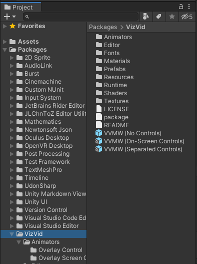

These can just drag to your world screen and start using it.  

Alternatively, the playlist attached on separated controls can be moved or disabled like this:  

### How to Add Extra Screen?
To add an extra screen, it is very stright forward.
1. Go to `Packages > VizVid > Prefabs` folder, drag the Default Screen to your scene.
2. Click on the video player you previously put on the scene in hierarchy.
3. Drag the newly added screen game object from the hierarchy to "Add Video Screen Target" field in inspector.
- Extra: If your screen has special configuration such as using a custom shader, you may need to change the values in the inspector. If you are adopting shaders that designed to work with [iwaSync3](https://hoshinolabs.booth.pm/items/2666275), you could leave it as-is, VizVid defaults to a configuration which compatible with those shaders.

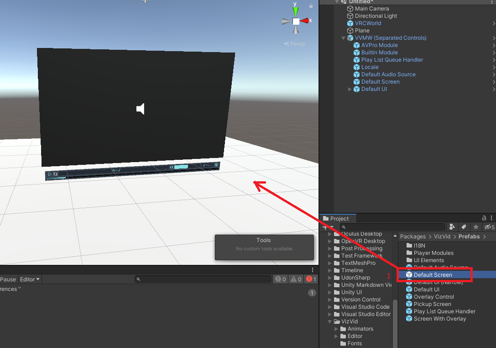
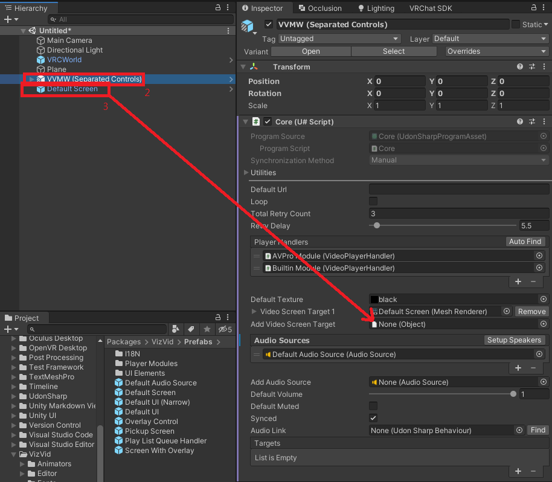

### How to Add Extra Audio Source?
You can add more audio sources (speakers) to make something like multi-channel surrounded audio, but these extra audio sources only works with AVPro player but not Built-in Unity video players.
1. Go to `Packages > VizVid > Prefabs` folder
2. Drag the Default Aduio Source to your scene.
3. Click on the video player you previously put on the scene in hierarchy.
4. Drag the newly added audio source game object from the hierarchy to "Add Audio Source" field in inspector.
5. Click "Setup Speakers" button
6. You may want to change the configuration, select the audio source object, and...
7. adjust the value you want.

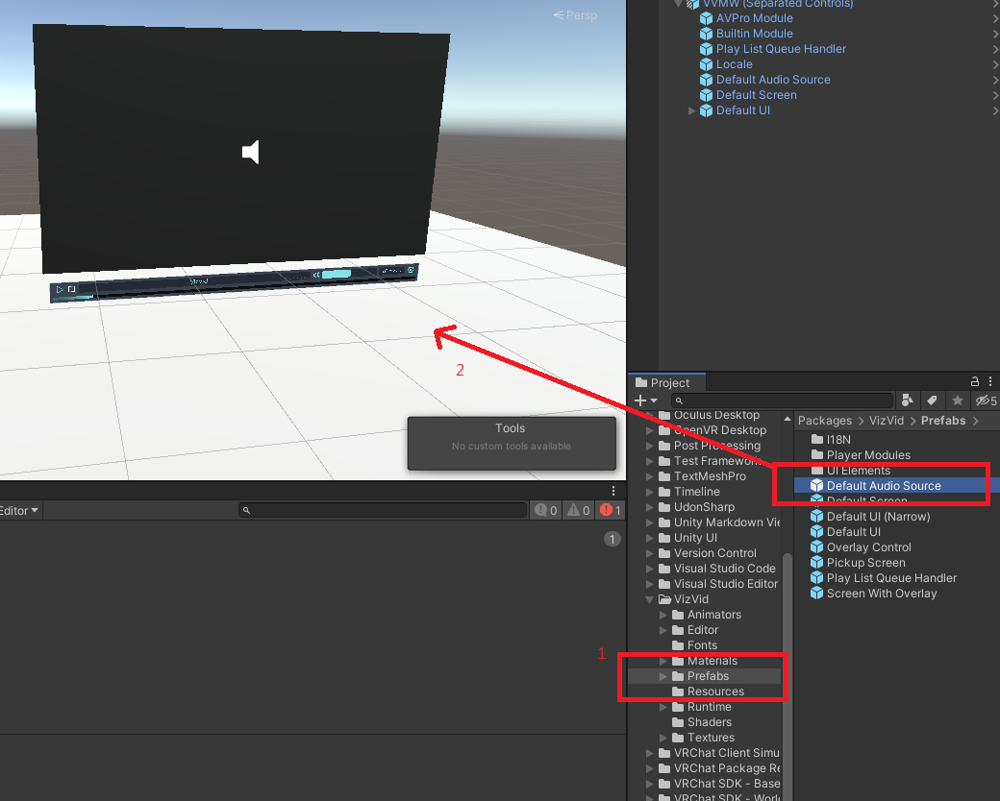
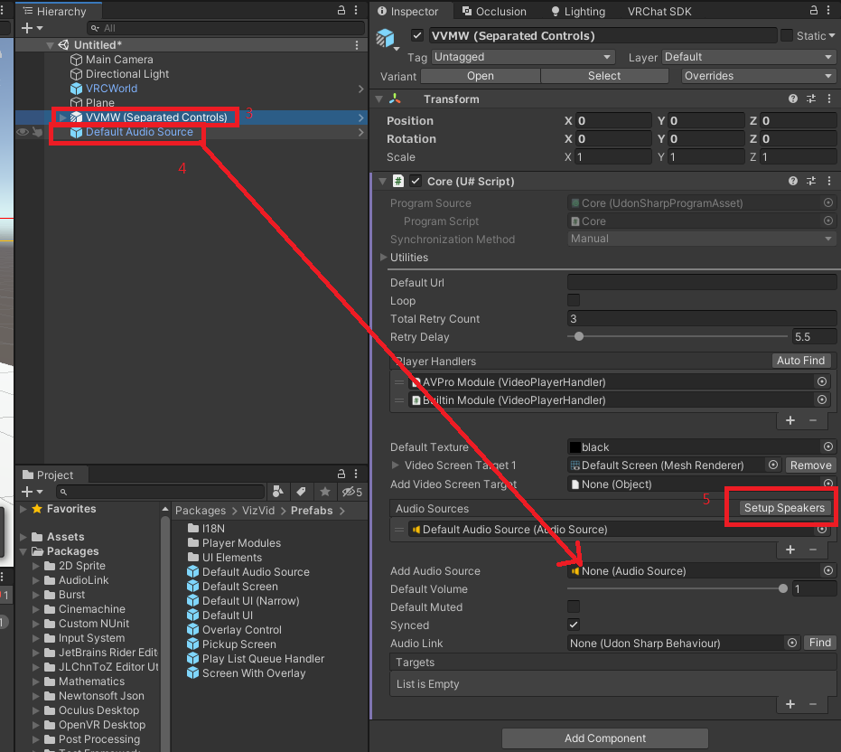
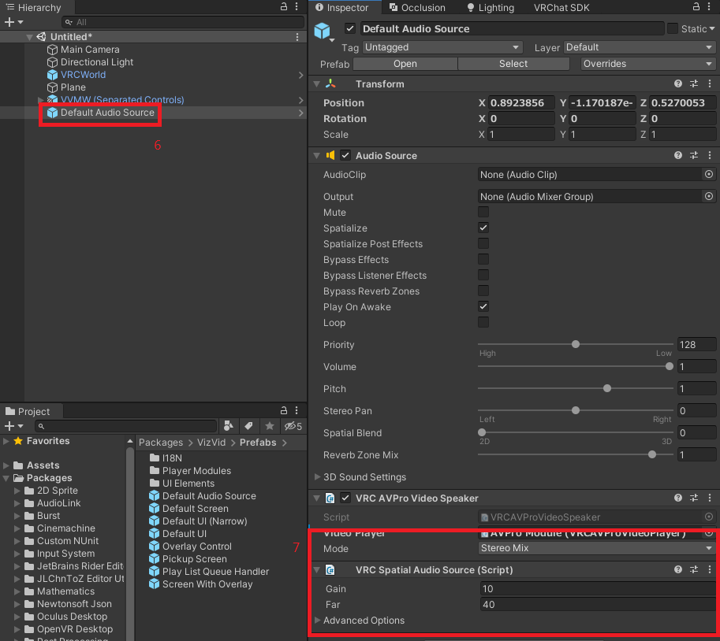

### How to Add Extra Controllers?
VizVid is aim to be flexible, so do the controllers. We have provide 3 variants to fit in different cases, and these controllers can be linked to one single core. Before we started, let me introduce these 3 variants:
- On-screen: Don't require extra spaces to put the controls, suitable for chilling worlds.  
  The prefab name is `Screen With Overlay`.
  
- Separated: Good alternative if you don't want to interact on the screen, but require some spaces under the screen.  
  The prefab name is `Default UI`.
  
- Narrow: Suitable for the controls don't come along with the screen (or even without any screen).  
  The prefab name is `Default UI (Narrow)`.
  

To add them, follow these steps:
1. Go to `Packages > VizVid > Prefabs` folder, drag the controller prefabs to your scene.
2. Click on the prefab instance you added to the scene in hierarchy.
3. Click the "Find" button on the handler field. If you have more than 1 video player core, you may need to manually drag it to that field (It is `Play List Queue Handler` game object instide the prefab bundles).
4. The following steps are only for the overlay one. Select the video player object.
5. Drag the newly added screen game object from the hierarchy to "Add Video Screen Target" field in inspector. (Just like adding a new screen)

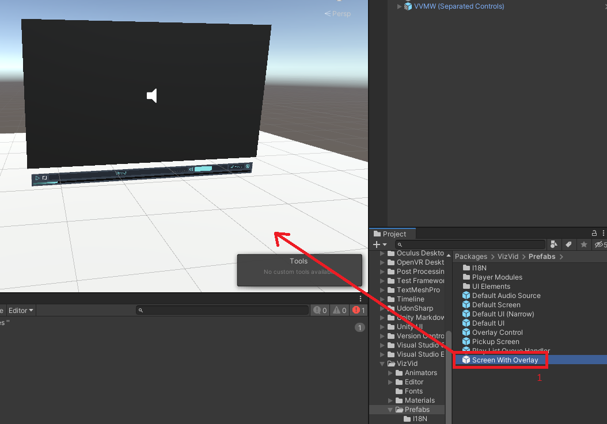
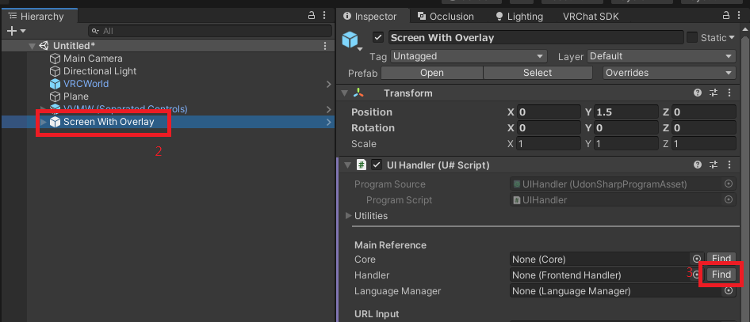
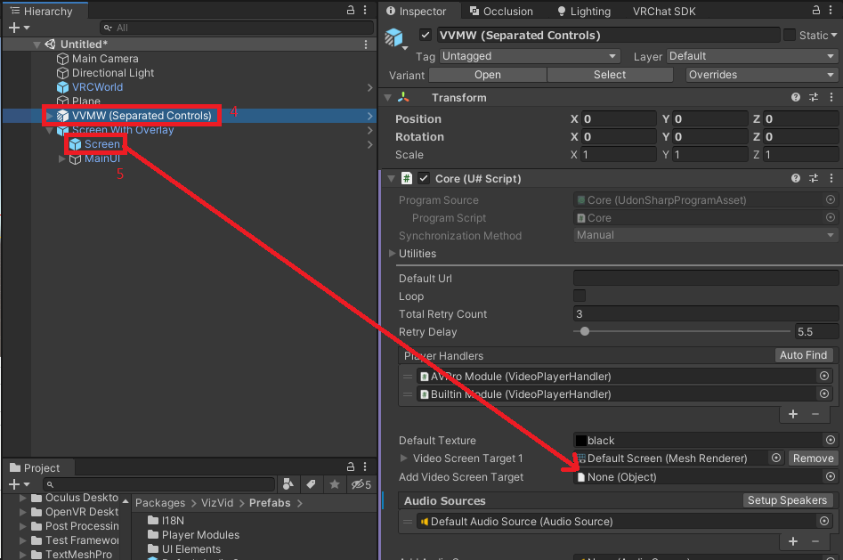

### How to Add a New Play List?
Play lists are pre-defined lists that the player will plays. All play lists associated to a video player instance are defined and controlled in a "Play List Queue Handler" game object, unlike how some other video player designs, whatever amount of controllers you added for a player, you are still interacting with the same list of the queued videos. Here is how you can create play lists:
1. Select "Play List Queue Handler" game object in hierarchy.
2. Click on "+" button at the corner of play lists field.
3. Name your play list.
4. Click on the "+" button at the corner of the field named with your playlist to add links.
5. Click save after you have added links to it.

For documentation on each fields, please refer to [Play List Queue Handler](#play-list-queue-handler) section.

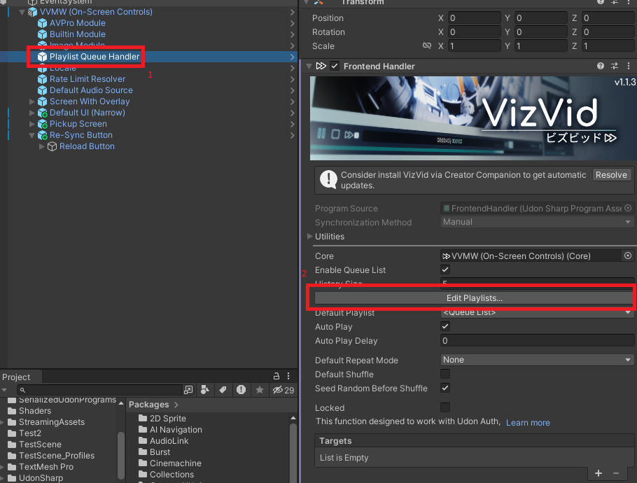
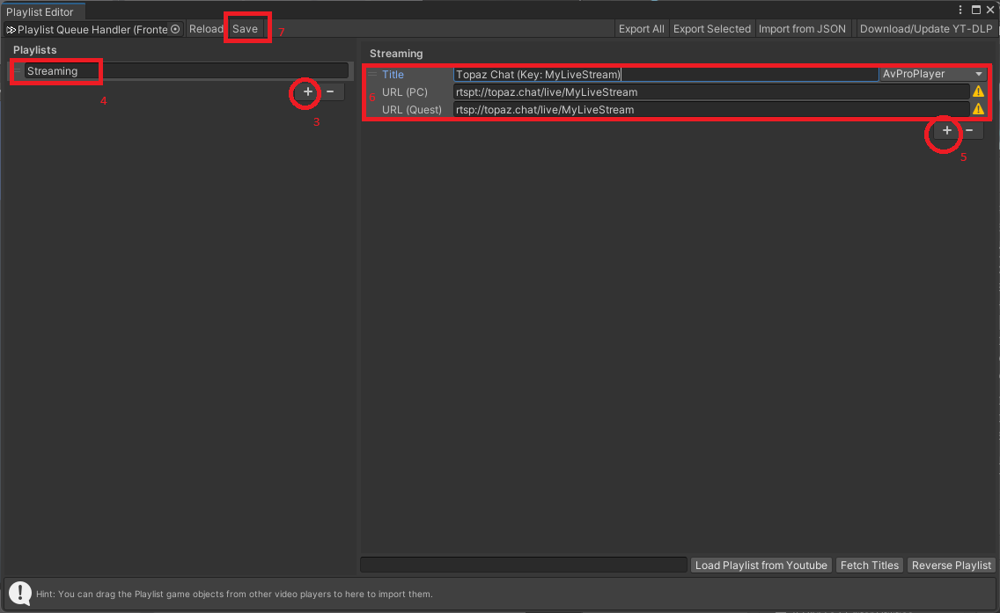

### How to Add a Pickupable Screen?
This component was [originally created by Yama Buta](https://yamabuta.booth.pm/items/4189997), which is a local-only pickupable screen with scaling feature, and it is rewrited to use with VizVid.
1. Go to `Packages > VizVid > Prefabs` folder, drag the Pickup Screen to your scene.
2. Select the video player object.
3. Find the "Screen" object under "Pickup_ScalingPanel" > "ScreenScaling" in hierarchy, drag to "Add Video Screen Target" field in inspector.

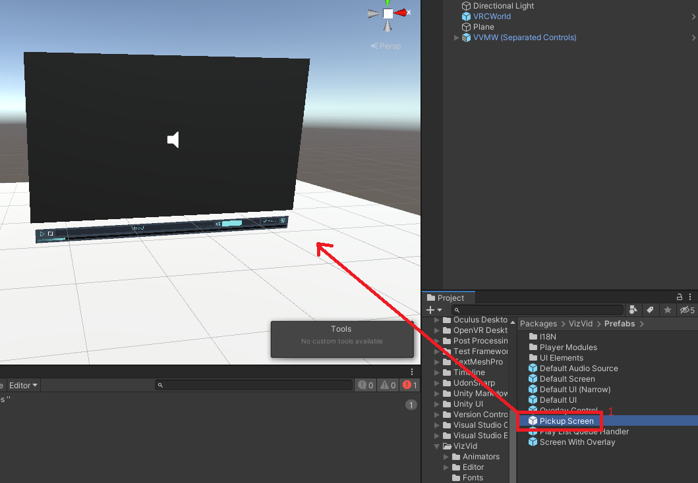
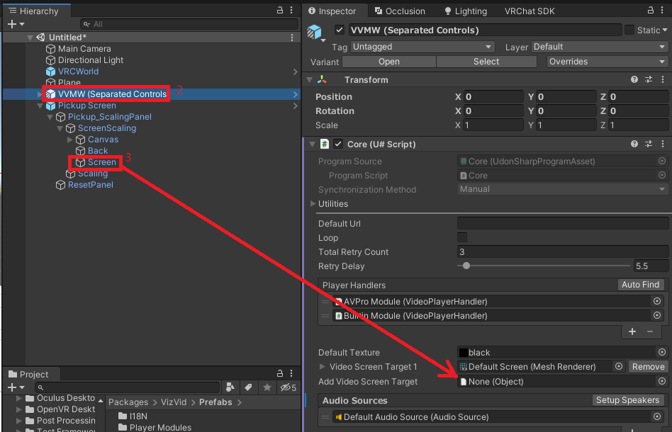

### How to Add an Overlay Control?
This is a component that spawns a mini controller on every user's wrist (VR mode) or a overlay UI on screen (PC mode). User can adjust the players volume and reload current video using laser pointer (VR) or keyboard input (PC).

1. Go to `Packages > VizVid > Prefabs` folder, drag the Overlay Control prefab to your scene.
2. In inspector, click the "Find" button beside the core field.

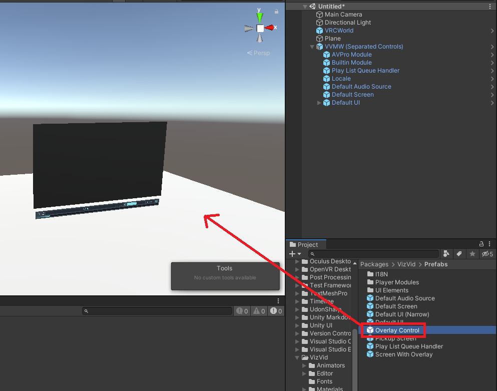
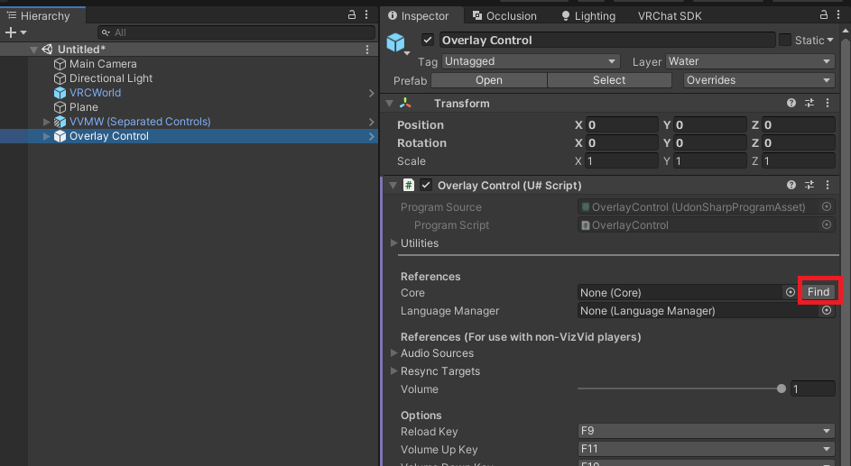

## Details in the Bundle
In the prefab, it should look like this in hierarchy:
- VVMW
    - Builtin Module
    - AVPro Module
    - Play List Queue Handler
    - Locale
    - *(Not exists in Overlay Version)* Default Screen
    - Default Audio Source
    - Default UI / Screen With Overlay
        - *(Only in Overlay Version)* Screen

Let me explain one by one.

### VVMW (Game Object)
This is the "brain" of the system, it controls and synchronizes the player (if enabled) between users within the same world instance. If you open the inspector, you will find theres many options that let you to fiddle around:

- **Default URL**: The URL will be played automatically when user joins your world.
- **Default Quest URL**: The optional alternative URL will be played for Quest/Android clients. Leave empty to use default URL.
- **Auto Play Player Type**: The "module" to use to play the above URL.
- **Loop**: Is default the player loops (can be toggled via UI)
- **Player Handlers**: The "modules" of actual the player components.
  You usually don't need to change this, unless you want to disable unused player systems. See "Builtin Module" and "AVPro Module" for the modules.
- **Default Texture**: The default texture displays when the player is not playing anything. You can change to any texture here, but if you want it to be simple, just leave it in default value.
- **Video Screen Target X**: Components that will receives the video screen texture. It can be any material, renderer, UI raw image components.
  The options collapsed with the triangle are advanced options, you usually don't need to change them unless you are using third-party shaders to receive video screen textures.
- **Add Video Screen Target**: Drag any accepted components to here for additional video screen targets.
- **Audio Sources**: List of audio sources that plays the audio from the playing video, also they will be controlled by the player's volume control.
  For built-in video player, it only supports 1 audio source output, and the system will uses the first entry to play its audio.
  For AVPro player, it supports by-channel audio sources up to 8 channels, which means you can put multiple audio sources on the scene but playing independent audio channel, such as the left one playing left channel, vice versa.
  Unless you have multiple AVPro player handlers (which required to manually set up the audio sources), you can click on the "Setup Speakers" after you change the audio source layout to auto setup the speakers.
- **Default Volume**: Default audio volume level.
- **Synced**: Whether the player should be synced. For some cases, you may want the player not to synchronized between users (such as in a exhibition booth).
  If this option is turned off, every users in the instances can control the playback by their own (unless you removed the UI).
- **Audio Link**: [Audio Link](https://github.com/llealloo/vrc-udon-audio-link) support. It will wire the audio to provided Audio Link instance when the player is playing.
- **Targets**: For integration to custom scripts, it will sends out events to any Udon (sharp) behaviours assignaed here.
  I don't provide source-code level documentation so please read the source code if you want to integrate with your scripts.

### Builtin Module / AVPro Module
These are the video player modules. The purpose of these game objects are interfaces from the undely video player components to the core.
The following are the options could be changed here:

- **Player Name**: The video player name to be displayed in UI, you can put literal name or just a key mapped inside a file called **lang.json** for localized.
- **Materials**, **Texture Property Name**: You usually don't need to change these values, these are for fetching video screen from the undely video player component.
- **Maximum Resolution**: Maximum resolution to be loaded if the video has this option to select, it is the height of the video. Default is `1080`.
- **Use Low Latency**: AVPro module only option. If you need to use this player for live streaming, this option could lower the latency between server and client.
- **Primary Audio Source**: The audio source that the player primary outputs.
  If it is built-in player module, this will be the only audio output.
  If you have Audio Link set up, this audio source will be sent to Audio Link when playing.

### Play List Queue Handler
This is an optional component that manages the queue of the playback. You can pre-define playlist and/or enabling player queue options here.

- **Core**: Reference to the VVMW main component. If it is empty, you can click the "Find" button to resolve it.
- **Enable Queue List**: If enabled, while user want to play a video and it is playing other video, the video url will be queued.
  Recommend as this is more polite to everyone.
- **Play Lists**: The list of pre-defined play lists. You can add/remove/reorder them here.
  The radio button on the left indicates if the play list plays automatically when user joins.
- **&lt;Your Play List Name&gt;**: When you selects a play list, you can edit the play list here.
    - **Title**: The title to be displayed.
    - **URL (PC)**: The url to the video, can be YouTube, Twitch, SoundCloud, RTSP, RTMP links.
    - **URL (Quest)**: The url to be loaded on Quest/Android clients, useful when RTSP/RTMP links won't work and need an alternative to those clients.
    - **&lt;Builtin / AVPro Player&gt;**: The player module to play this link.
      If it is a live stream or soundcloud, it is required to use AVPro player module.
- **Reload**: Discard any changes to the playlist and reload to inspector.
- **Save**: Save changes to the component. **REQUIRED TO CLICK AFTER EDIT OR YOUR CHANGES WILL BE LOST!**
- **Default Loop**: Is default the player loops (can be toggled via UI).
  The difference to loop option in VVMW (Core) is this option will loop over whole play list / user queue list.
- **Default Shuffle**: Is default the player plays randomly instead of the queued order (can be toggled via UI).
- **Locked**: Is default the player locked up.
  This feature is designed to use with [Udon Auth](https://xtl.booth.pm/items/3826907) (paid asset) or other compatible scripts.
- **Targets**: Same as above, it is for integration to custom scripts.

On tutorial on how to add playlist, plese see [How to Add a New Play List?](#how-to-add-a-new-play-list) section.

### Locale
The locale manager, it referenes to a JSON file called "langs.json". You can add/modify the texts in it.
Do not add other components / child game objects to this game object, as it will be manupulated on build, and might cause unexpected behaviours.

### Default Screen / Screen
This is the default screen, you can resize and move it to anywhere you want. For details and guides, please see [How to Add Extra Screen](#how-to-add-extra-screen) section above.

### Default Audio Source
This is the default audio source. For details and guides, please see [How to Add Extra Audio Source](#how-to-add-extra-audio-source) section above.

### Default UI / Screen with Overlay
This is default UI, it provides all basic interface of the player to let user interact with it. For details and guides, please see [How to Add Extra Controllers](#how-to-add-extra-controllers) section above.

## Third Party Support

### Audio Link
This player provides basic integration to Audio Link, basic setup please refer to the "Audio Link" option above.  

Additionally, if you want to use together with multiple channel audio sources provided from AVPro, you will need an audio source that don't controlled by the player, which will emits basic stereo output.

You have 2 ways to do this:
1. Use the provided "Audio Input" in Audio Link:
    - Drag the AVPro player module to the Video Source property in VRC AVPro Video Speaker component in "Audio Input" under AudioLink game object.
    - Select the AVPro player module, set the Primary Audio Source to "Audio Input".
2. Use an additional audio source:
    - Duplicate or drag Default Audio Source object to the scene.
    - Remove VRC Spatial Audio Source component.
    - Set volume to `0.01`.
    - Set the position to very far away from origin, something like `-999999`.
    - Set Video Source property in VRC AVPro Video Speaker component to AVPro player module.
    - Select the AVPro player module, set the Primary Audio Source to this newly created audio source.

### LTCGI
This player provides basic integration to [LTCGI](https://ltcgi.dev/). To use with LTCGI, use the provided "VideoCRT" CustomRenderTexture in Materials folder as video texture input inside LTCGI controller, then assigns this CustomRenderTexture to "Add Video Screen Target" option in the VVMW core, other then that just follow LTCGI documentation ([this](https://ltcgi.dev/Getting%20Started/Setup/Controller) and [this](https://ltcgi.dev/Getting%20Started/Setup/LTCGI_Screen)).  

