# VizVid Documentation

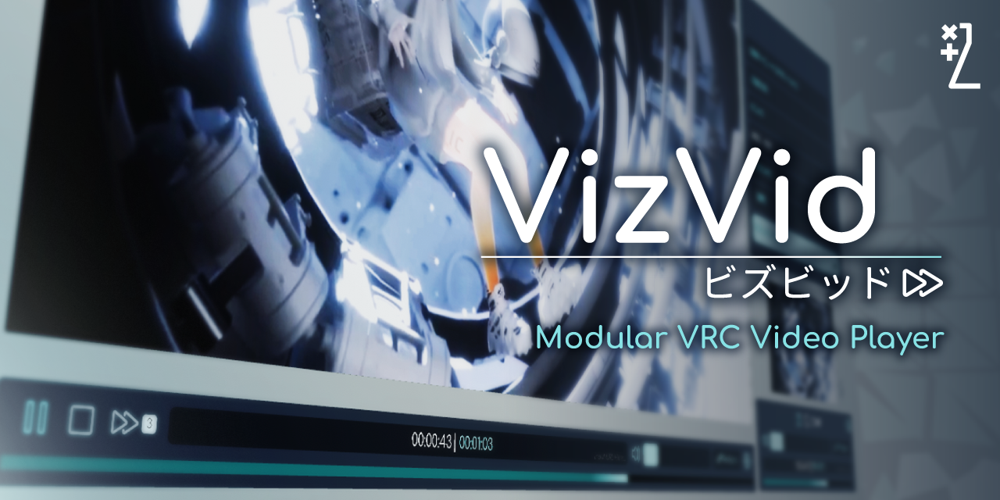

Welcome! VizVid is a general-purpose video player frontend for use in VRChat. It aims to cover many use cases, from watch-together video/live stream player in lounges, to large event venue for music performances, or even booths for exhibitions or showcases. Due to its target customers, it has a flexible architecture, just like a factory made electronic but with a easy to open back lid, make it easier to let users mess them around for their needs.

> [!NOTE]
> This documentation is for V1.0.34 or later, some guidelines are different to older versions.

## Table of Contents
* [How to install?](#how-to-install)
	* [How to Add Extra Screen?](#how-to-add-extra-screen)
	* [How to Add Extra Audio Source?](#how-to-add-extra-audio-source)
	* [How to Add Extra Controllers?](#how-to-add-extra-controllers)
	* [How to Add/Import/Export a Playlist?](#how-to-add-import-export-a-playlist)
	* [How to Add a Pickupable Screen?](#how-to-add-a-pickupable-screen)
	* [How to Add an Overlay Control?](#how-to-add-an-overlay-control)
	* [How to Add a Resync Button?](#how-to-add-a-resync-button)
	* [How to Change color?](#how-to-change-color)
    * [How to Setup Auto Plays When a User Goes Nearby?](#how-to-setup-auto-plays-when-a-user-goes-nearby)
    * [How to Make Background Music Fade Out When Video is Playing?](#how-to-make-background-music-fade-out-when-video-is-playing)
    * [How to Upgrade to Text Mesh Pro?](#how-to-upgrade-to-text-mesh-pro)
* [Details in the Bundle](#details-in-the-bundle)
	* [VVMW (Game Object)](#vvmw-game-object)
	* [Builtin Module / AVPro Module](#builtin-module--av-pro-module)
	* [Playlist Queue Handler](#playlist-queue-handler)
	* [Locale](#locale)
	* [Default Screen / Screen](#default-screen--screen)
	* [Default Audio Source](#default-audio-source)
	* [Default UI / Screen with Overlay](#default-ui--screen-with-overlay)
* [Third Party Support](#third-party-support)
	* [Udon Auth](#udon-auth)
	* [Audio Link](#audio-link)
	* [LTCGI](#ltcgi)
	* [YTTL](#yttl)

## How to install?
You may just right-click anywhere in hierarchy, and select `VizVid > Video Player`.
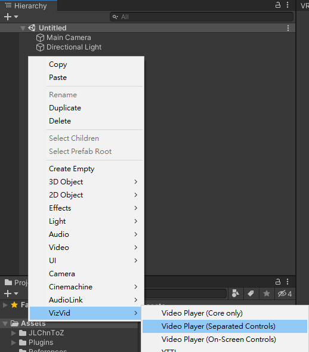

Here is a glance of the difference between the variants:
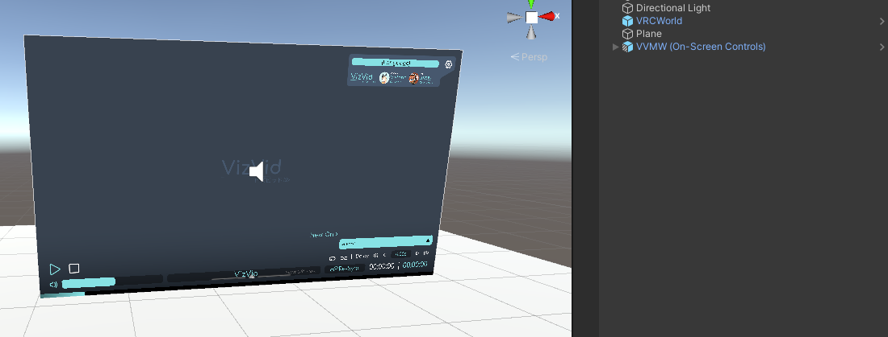
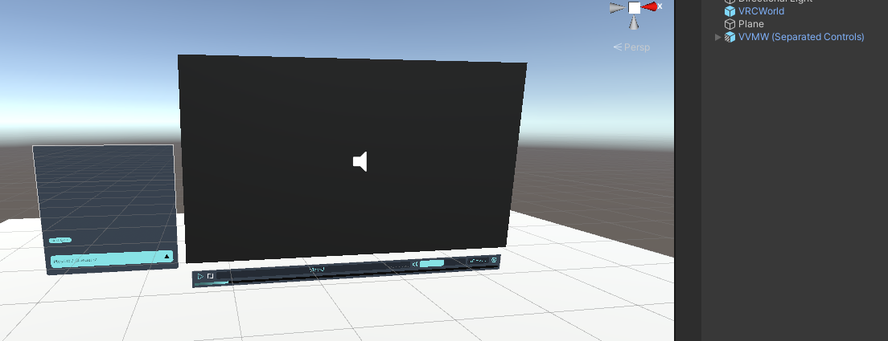

Alternatively, the playlist attached on separated controls can be moved or disabled like this:  
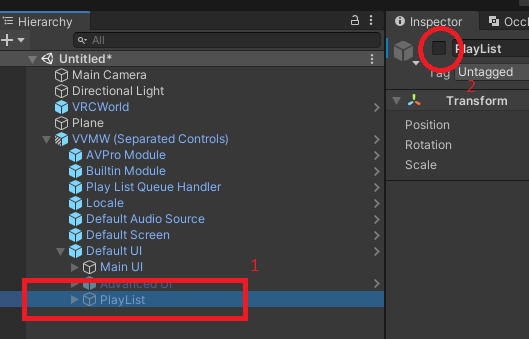

### How to Add Extra Screen?
You may just right-click on the player object in hierarchy, and select `VizVid > Additional Controls > Screen`.
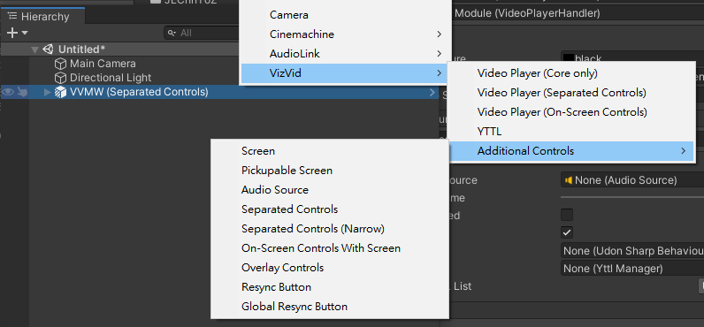

- Extra: If your screen has special configuration such as using a custom shader, you may need to change the values in the inspector. If you are adopting shaders that designed to work with [iwaSync3](https://hoshinolabs.booth.pm/items/2666275), you could leave it as-is, VizVid defaults to a configuration which compatible with those shaders.

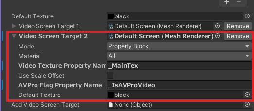

### How to Add Extra Audio Source?
You can add more audio sources (speakers) to make something like multi-channel surrounded audio, but these extra audio sources only works with AVPro player but not Built-in Unity video players.

To add it, right-click on the player object in hierarchy, and select `VizVid > Additional Controls > Audio Source`.

Then, click the "Setup Speakers" button on the player component inspector.
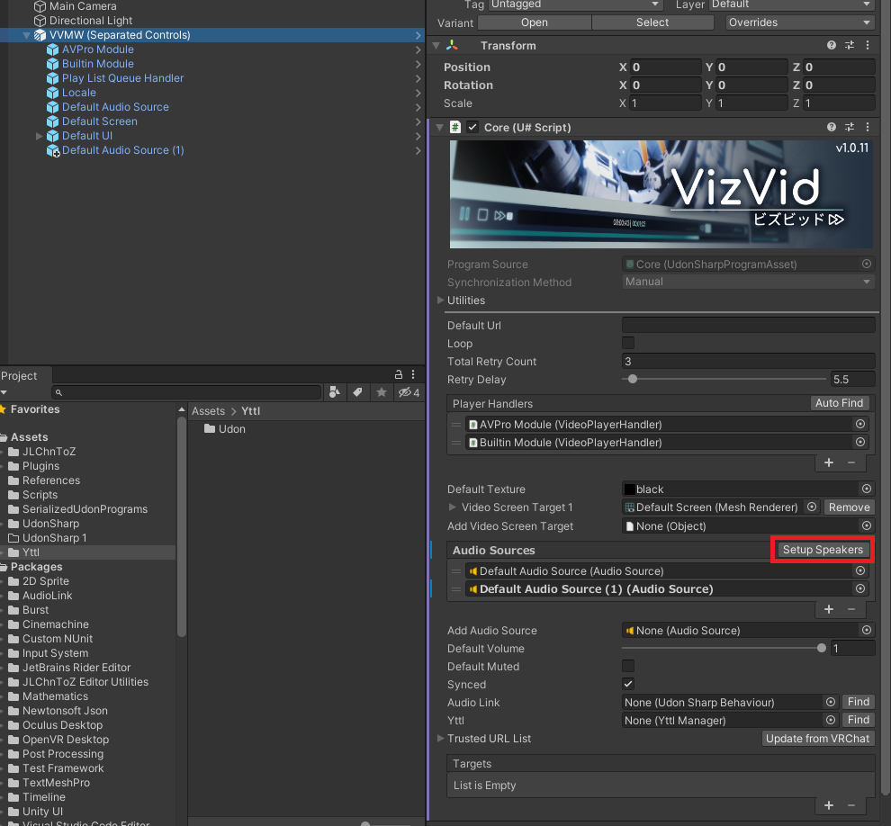

### How to Add Extra Controllers?
VizVid is aim to be flexible, so do the controllers. We have provide 3 variants to fit in different cases, and these controllers can be linked to one single core. Before we started, let me introduce these 3 variants:
- On-screen: Don't require extra spaces to put the controls, suitable for chilling worlds.  
  The prefab name is `Screen With Overlay`.
  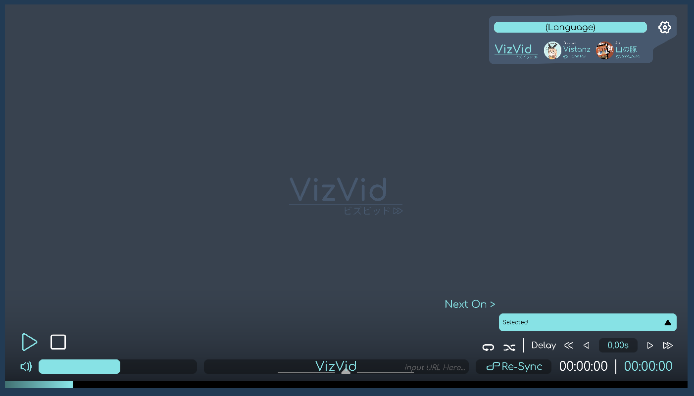
- Separated: Good alternative if you don't want to interact on the screen, but require some spaces under the screen.  
  The prefab name is `Default UI`.
  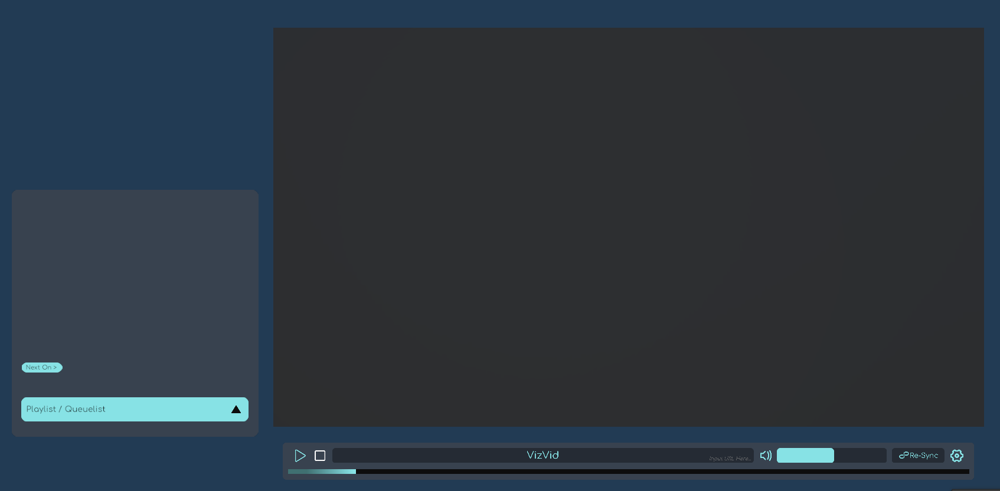
- Narrow: Suitable for the controls don't come along with the screen (or even without any screen).  
  The prefab name is `Default UI (Narrow)`.
  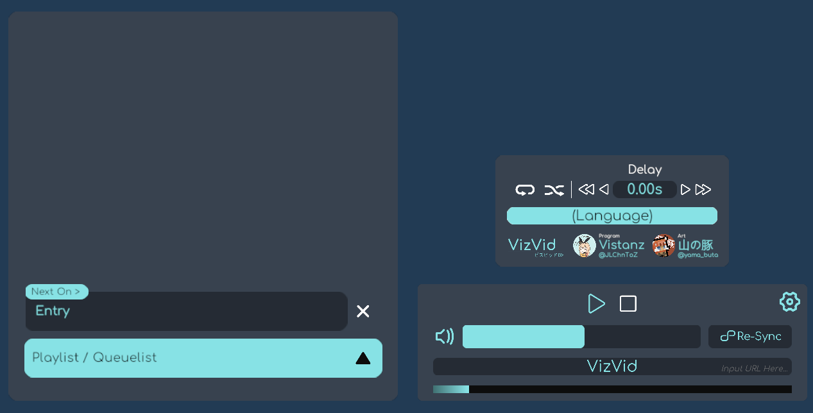

To add them, right-click on the player object in hierarchy, and select one of these depends which type of controls you want to add:
- `VizVid > Additional Controls > On Screen With Controls with Overlay`
- `VizVid > Additional Controls > Separated Controls`
- `VizVid > Additional Controls > Separated Controls (Narrow)`

### How to Add/Import/Export a Playlist?
Playlists are pre-defined lists that the player will plays. All playlists associated to a video player instance are defined and controlled in a "Playlist Queue Handler" game object, unlike how some other video player designs, whatever amount of controllers you added for a player, you are still interacting with the same list of the queued videos. Here is how you can manipulate Playlists:
1. Select "Play List Queue Handler" game object in hierarchy.
2. Click "Edit Playlists..." button.
3. In the new popup window, you can:
    a. Create/remove a Playlist
    b. Import Playlist from other video players and YouTube
    c. Import/Export Playlist to/from JSON file
4. After editing, remember to click the "save" button on the top of the window.

Current supported Playlists / video players to be imported directly:
- VizVid (Yes, you can pour the Playlists from other instances within the world as well)
- USharp Video
- Yama Player
- KineL Video Player
- iwaSync 3
- JT Playlist
- ProTV by ArchiTech
- VideoTXL

To import above listed Playlists, drag the game object containing their Playlists to this Playlist editor. Beware it is sightly different when you drop it between the left panel and the right: If you dropped on the left, new Playlists will be added; and if you dropped on the right, it will append to current selected Playlist if applicable.

### How to Add a Pickupable Screen?
This component was [originally created by Yama Buta](https://yamabuta.booth.pm/items/4189997), which is a local-only pickupable screen with scaling feature, and it is rewrited to use with VizVid.

To add it, right-click on the player object in hierarchy, and select `VizVid > Additional Controls > Pickupable Screen`.

### How to Add an Overlay Control?
This is a component that spawns a mini controller on every user's wrist (VR mode) or a overlay UI on screen (PC mode). User can adjust the players volume and reload current video using laser pointer (VR) or keyboard input (PC).

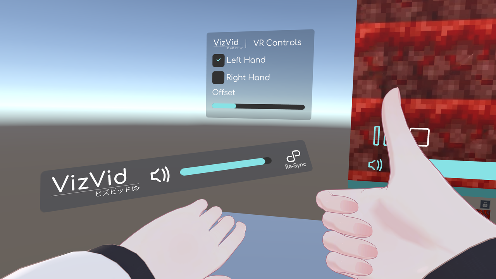

To add it, right-click on the player object in hierarchy, and select `VizVid > Additional Controls > Overlay Controls`.

### How to Add a Resync Button?
This component is an alternative to the wrist / overlay UI screen resync button control, to let users resyncs your live stream in an event venue. There are 2 variants: `Re-Sync Button` and `Global Sync Button`, the difference is one is local only and another one is a global trigger.

To add it, right-click on the player object in hierarchy, and select `VizVid > Additional Controls > Resync Button` or `Global Resync Button`.

### How to Change color?
Yes, you can change the UI color in nearly one-click. Every UI components comes with VizVid has attached a component called `Color Config`, what you have to do is change the color you like in this component, and click the `Apply` or `Apply to All` button below. The `Apply` button only applies the color to current selected UI, and `Apply to All` will copy the settings to other VizVid UIs and apply to them as well.

### How to Setup Auto Plays When a User Goes Nearby?
VizVid built-in supports auto plays when a user goes into a specific region and stops when exits, it is for video playback in exhibition venues.

To enable this feature, right-click on the player object in hierarchy, and select `VizVid > Additional Controls > Auto Play On Near (Local Only)`. You can then either set the distance (if you don't want to use the collider), or adjust the size of the collider to match your needs.

### How to Make Background Music Fade Out When Video is Playing?
As we all know, leaving background music playing in the world while watching/listening other video/music within the player is not a good experience. To solve this problem, we introduce BGM Volume Control component. This component is designed to attach to any background music audio source in your world.

To add this, select your existing background music audio source game object, then click "Add Component" in inspector, select `VizVid > Components > BGM Volume Control`.
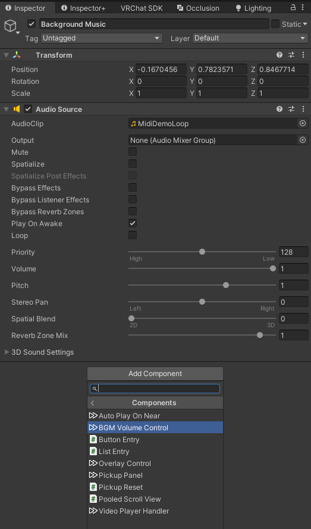

Next, click on the "Find" button next to the core field, or drag your video player to here. And you may want to change the volume and/or other settings here.
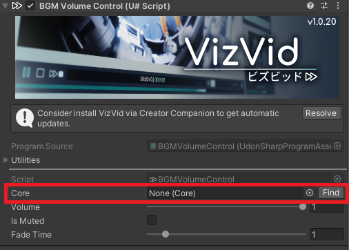

And thats it!

### How to Upgrade to Text Mesh Pro?

Both Unity and VRChat SDK encourages to use TextMeshPro (TMPro) instead of legacy Text components for all UIs in your scene for readability and aesthetics in VR. To upgrade VizVid to use TMPro instead of legacy Text, starting from v1.0.32, you can do the following:

1. Select the outermost UI game objects of VizVid you want to migrate, such as Default UI, Overlay Control, Re-Sync Button.
2. Select `Tools > VizVid > Migrate TMPro Components` in menu, the script will do the thing.
3. That's it!

Please note this only applies to currently what you have on the scene, if the player is upgraded in the future and new UI components are added, or you have added/replaced any UIs of the player afterwards, you will have to do this again.

If you want to test the player within Unity Editor but find out all non-English text become tofu after migration, you may refer to this article: [TextMeshPro in VRChat](https://hai-vr.notion.site/TextMeshPro-in-VRChat-91561782adea47a78569cec641fd5ee9#88dd13b80e4d4caeafc00f26b4aa2ae1).

## Details in the Bundle
In the prefab, it should look like this in hierarchy:
- VVMW
    - Builtin Module
    - AVPro Module
    - Play List Queue Handler
    - Locale
    - *(Not exists in Overlay Version)* Default Screen
    - Default Audio Source
    - Default UI / Screen With Overlay
        - *(Only in Overlay Version)* Screen

Let me explain one by one.

### VVMW (Game Object)
This is the "brain" of the system, it controls and synchronizes the player (if enabled) between users within the same world instance. If you open the inspector, you will find theres many options that let you to fiddle around:

- These options only appears when you are not using with Playlist queue handler and unlinked it:
  - **Default URL**: The URL will be played automatically when user joins your world.
  - **Default Quest URL**: The optional alternative URL will be played for Quest/Android clients. Leave empty to use default URL.
  - **Auto Play Player Type**: The "module" to use to play the above URL.
  - **Loop**: Is default the player loops (can be toggled via UI)
- **Auto Play Delay Time**: The delay to start playing the default video when the scene is loaded.
  This is to prevent rate limit between video players in same instance.
  If you have multiple video players (not limited to VizVid) which will auto plays in the same world
  you should set this to a value at least in multiple of `5` to stagger the loading time.
- **Total Retry Count**: How many times should retry when video failed to load.
- **Retry Delay**: Delay to retry when video failed to load.
- **Time Drift Detect Threshold**: The player will adjust the time to sync with the owner's time when the time drift is greater than this value.
  Recommend keep this value not too low or too high, as it may cause the video to jump back and forth,
  or timing between players may drift too far.
- **Player Handlers**: The "modules" of actual the player components.
  You usually don't need to change this, unless you want to disable unused player systems. See "Builtin Module" and "AVPro Module" for the modules.
- **Default Texture**: The default texture displays when the player is not playing anything. You can change to any texture here, but if you want it to be simple, just leave it in default value.
- **Video Screen Target X**: Components that will receives the video screen texture. It can be any material, renderer, UI raw image components.
  The options collapsed with the triangle are advanced options, you usually don't need to change them unless you are using third-party shaders to receive video screen textures.
- **Add Video Screen Target**: Drag any accepted components to here for additional video screen targets.
- **Audio Sources**: List of audio sources that plays the audio from the playing video, also they will be controlled by the player's volume control.
  For built-in video player, it only supports 1 audio source output, and the system will uses the first entry to play its audio.
  For AVPro player, it supports by-channel audio sources up to 8 channels, which means you can put multiple audio sources on the scene but playing independent audio channel, such as the left one playing left channel, vice versa.
  Unless you have multiple AVPro player handlers (which required to manually set up the audio sources), you can click on the "Setup Speakers" after you change the audio source layout to auto setup the speakers.
- **Default Volume**: Default audio volume level.
- **Synced**: Whether the player should be synced. For some cases, you may want the player not to synchronized between users (such as in a exhibition booth).
  If this option is turned off, every users in the instances can control the playback by their own (unless you removed the UI).
- **Audio Link**: [Audio Link](https://github.com/llealloo/vrc-udon-audio-link) support. It will wire the audio to provided Audio Link instance when the player is playing.
- **Targets**: For integration to custom scripts, it will sends out events to any Udon (sharp) behaviours assignaed here.
  I don't provide source-code level documentation so please read the source code if you want to integrate with your scripts.
- **Realtime GI Update Interval**: The interval to update realtime GI, set to 0 to disable realtime GI update.
  This features requires setup the light probes and realtime GI in the scene and the screen renderers.

### Builtin Module / AVPro Module
These are the video player modules. The purpose of these game objects are interfaces from the undely video player components to the core.
The following are the options could be changed here:

- **Player Name**: The video player name to be displayed in UI, you can put literal name or just a key mapped inside a file called **lang.json** for localized.
- **Materials**, **Texture Property Name**: You usually don't need to change these values, these are for fetching video screen from the undely video player component.
- **Maximum Resolution**: Maximum resolution to be loaded if the video has this option to select, it is the height of the video. Default is `1080`.
- **Use Low Latency**: AVPro module only option. If you need to use this player for live streaming, this option could lower the latency between server and client.
- **Primary Audio Source**: The audio source that the player primary outputs.
  If it is built-in player module, this will be the only audio output.
  If you have Audio Link set up, this audio source will be sent to Audio Link when playing.
- **Use Flicker Workaround**: This option is only for AVPro video player.
  It will use a workaround with a little performance cost to attempt to fix the screen flickering issue.
  Technically speaking, this will also fix the flipped upside-down and colorspace of the output video screen texture,
  make it be able to display correctly even no proper shader support.
- **Blit Material**: This material will be used to blit the screen to a temporary render texture for the flickering workaround. Don't change it unless needed.

### Playlist Queue Handler
This is an optional component that manages the queue of the playback. You can pre-define playlist and/or enabling player queue options here.

- **Core**: Reference to the VVMW main component. If it is empty, you can click the "Find" button to resolve it.
- **Enable Queue List**: If enabled, while user want to play a video and it is playing other video, the video url will be queued.
  Recommend as this is more polite to everyone.
- **Edit Playlists...**: Edit the Playlists defined in this component.  
  The options below are in the Playlist editor window now:
    - **Reload**: Discard any changes to the playlist and reload to inspector.
    - **Save**: Save changes to the component. **REQUIRED TO CLICK AFTER EDIT OR YOUR CHANGES WILL BE LOST!**
    - **Export All**: Export all Playlists to a JSON file.
    - **Export Selected**: Export selected Playlist to a JSON file.
    - **Import from JSON**: Import previously saved JSON file back to Playlists. You will be prompted to append or replace after selecting a JSON file.
    - **Playlists**: The list of pre-defined Playlists. You can add/remove/reorder/rename them here.
    - **&lt;Your Playlist Name&gt;**: When you selects a Playlist, you can edit the Playlist here.
        - **Title**: The title to be displayed.
        - **URL (PC)**: The url to the video, can be YouTube, Twitch, SoundCloud, RTSP, RTMP links.
        - **URL (Quest)**: The url to be loaded on Quest/Android clients, useful when RTSP/RTMP links won't work and need an alternative to those clients.
        - **&lt;Builtin / AVPro Player&gt;**: The player module to play this link.
        If it is a live stream or soundcloud, it is required to use AVPro player module.
        - **Load Playlist from YouTube**: You can enter the Playlist URL from YouTube to append it to current selected Playlist. It requires a selected Playlist to operate with.
        - **Fetch Titles**: Fetch titles automatically if not filled. Currently only supports YouTube.
- **Dafault Playlist**: The Playlist default selected when user joins the world.
- **Auto Play**: If you want the above Playlist to be played automatically, enable it.
  But if you want it [auto play on user nearby](#how-to-setup-auto-plays-when-a-user-goes-nearby) feature,
  you should disable it and follow the instruction above.
- **Auto Play Delay Time**: The delay to start playing the default video when the scene is loaded.
  This is to prevent rate limit between video players in same instance.
  If you have multiple video players (not limited to VizVid) which will auto plays in the same world
  you should set this to a value at least in multiple of `5` to stagger the loading time.
- **Default Loop**: Is default the player loops (can be toggled via UI).
  The difference to loop option in VVMW (Core) is this option will loop over whole Playlist / user queue list.
- **Default Shuffle**: Is default the player plays randomly instead of the queued order (can be toggled via UI).
- **Locked**: Is default the player locked up.
  This feature is designed to use with [Udon Auth](https://xtl.booth.pm/items/3826907) (paid asset) or other compatible scripts.
- **Targets**: Same as above, it is for integration to custom scripts.

On tutorial on how to add playlist, plese see [How to Add a New Playlist?](#how-to-add-a-new-playlist) section.

### Locale
The locale manager. You can add/modify the texts in it with the language editor.

Also for advanced usage, it is capable to use without the VizVid player. You may use the `Language Receiver` with any text components to make your own localized interface.

### Default Screen / Screen
This is the default screen, you can resize and move it to anywhere you want. For details and guides, please see [How to Add Extra Screen](#how-to-add-extra-screen) section above.

### Default Audio Source
This is the default audio source. For details and guides, please see [How to Add Extra Audio Source](#how-to-add-extra-audio-source) section above.

### Default UI / Screen with Overlay
This is default UI, it provides all basic interface of the player to let user interact with it. For details and guides, please see [How to Add Extra Controllers](#how-to-add-extra-controllers) section above.

## Third Party Support

### Udon Auth
VizVid built-in supports integration with Udon Auth, the later one is a paid asset available on my [Booth](https://xtl.booth.pm/items/3826907), which is an OTP solution for locking out certain gimmicks in your world, typically staff-only locks for event venues.

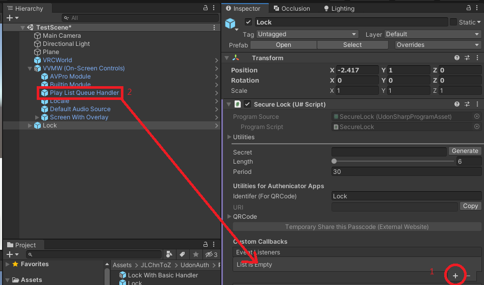
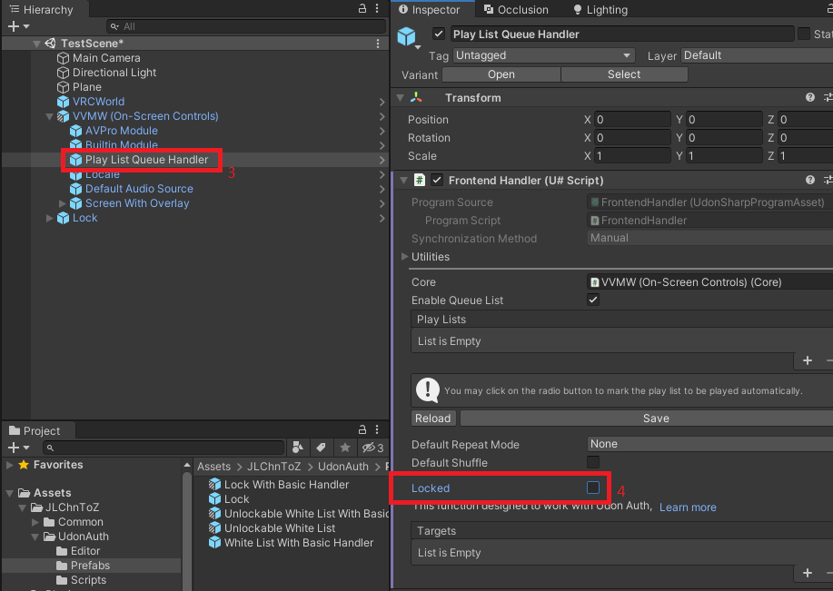

1. Assume you have set up Udon Auth in your scene, select the lock panel, click + button at custom callbacks field.
2. Find the "Player List Queue Handler" inside the player, drag it to custom callbacks field.
3. Select "Player List Queue Handler"
4. Enable "Lock" option.

In the other hand, you can program your own locks instead of using my paid asset, just send the `_OnUnlock` custom event to the Udon attached on Player List Queue Handler, and it will become unlocked.

### Audio Link
This player provides basic integration to Audio Link, basic setup please refer to the "Audio Link" option above.  
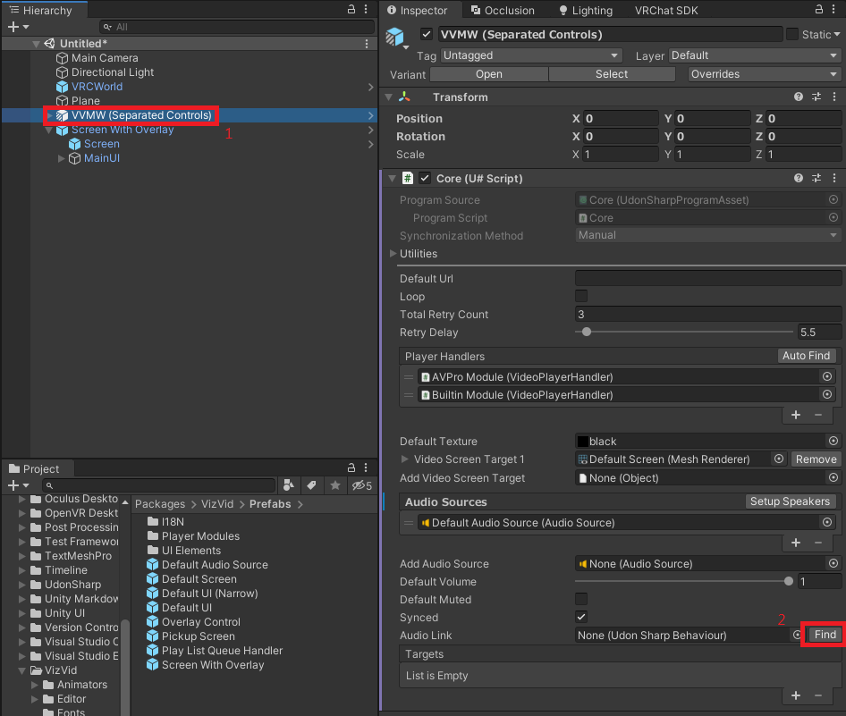

Additionally, if you want to use together with multiple channel audio sources provided from AVPro, you will need an audio source that don't controlled by the player, which will emits basic stereo output.

You have 2 ways to do this:
1. Use the provided "Audio Input" in Audio Link:
    - Drag the AVPro player module to the Video Source property in VRC AVPro Video Speaker component in "Audio Input" under AudioLink game object.
    - Select the AVPro player module, set the Primary Audio Source to "Audio Input".
2. Use an additional audio source:
    - Duplicate or drag Default Audio Source object to the scene.
    - Remove VRC Spatial Audio Source component.
    - Set volume to `0.01`.
    - Set the position to very far away from origin, something like `-999999`.
    - Set Video Source property in VRC AVPro Video Speaker component to AVPro player module.
    - Select the AVPro player module, set the Primary Audio Source to this newly created audio source.

### LTCGI
This player provides basic integration to [LTCGI](https://ltcgi.dev/). To use with LTCGI, use the provided "VideoCRT" CustomRenderTexture in Materials folder as video texture input inside LTCGI controller, then assigns this CustomRenderTexture to "Add Video Screen Target" option in the VVMW core, other then that just follow LTCGI documentation ([this](https://ltcgi.dev/Getting%20Started/Setup/Controller) and [this](https://ltcgi.dev/Getting%20Started/Setup/LTCGI_Screen)).  
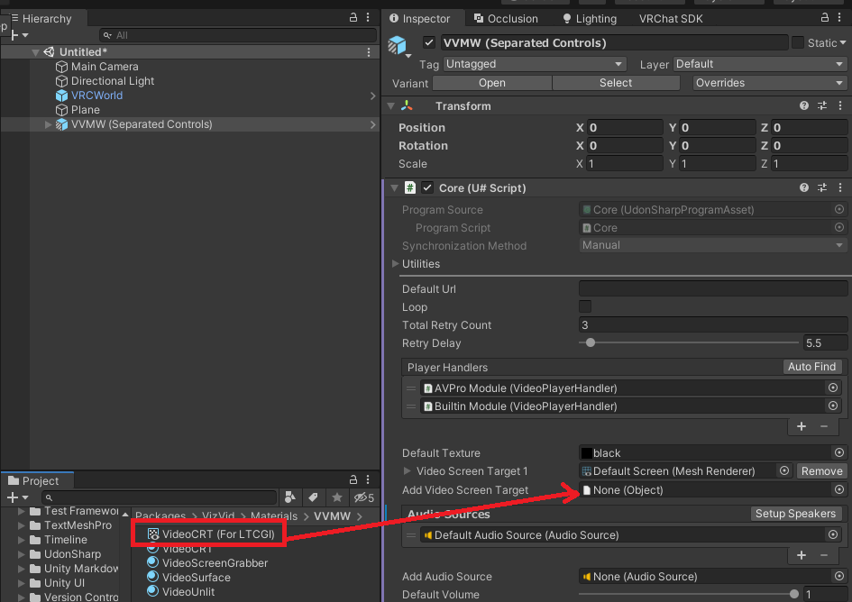

### YTTL
[YTTL (Video title viewer)](https://65536.booth.pm/items/4588619) is an addon for providing ability to display titles from several known sources (e.g. YouTube, Twitch, SoundCloud) in video players, it was created by ureishi and it is licensed with CC0. However, installing it on video players that are not originally supported, including VizVid, can be a bit tricky if you're not familiar with the technical side of things. To make it easier, we've included a modified version of YTTL, but you'll still need to follow a few steps to enable it:
Right-click on the player object in hierarchy, and select `VizVid > YTTL`.
