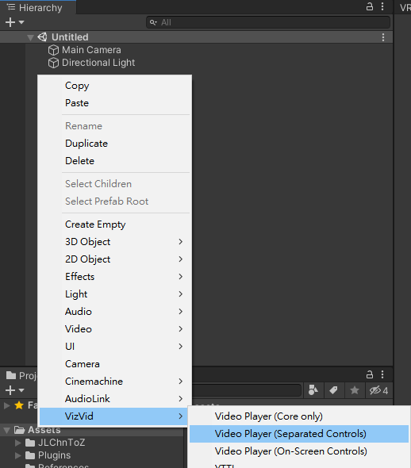
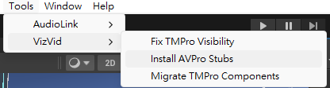
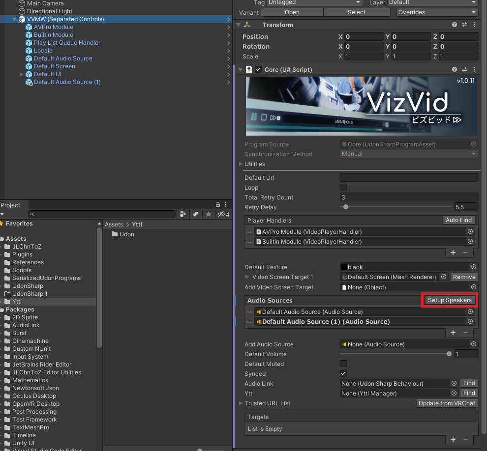
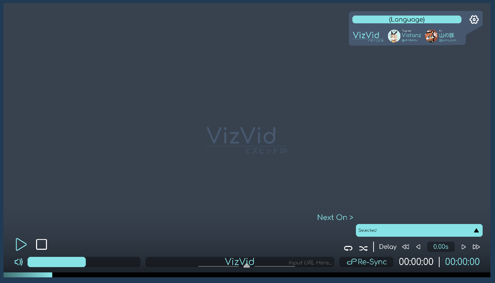
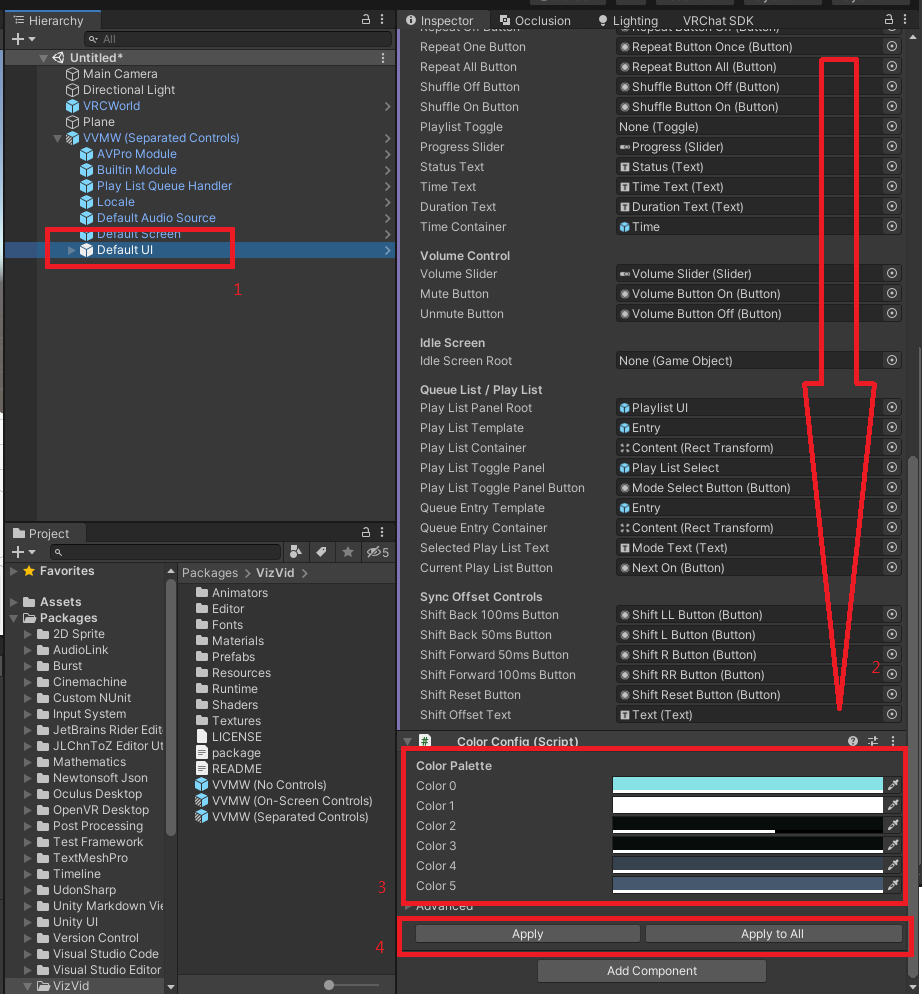
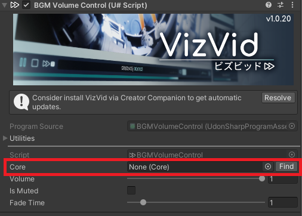
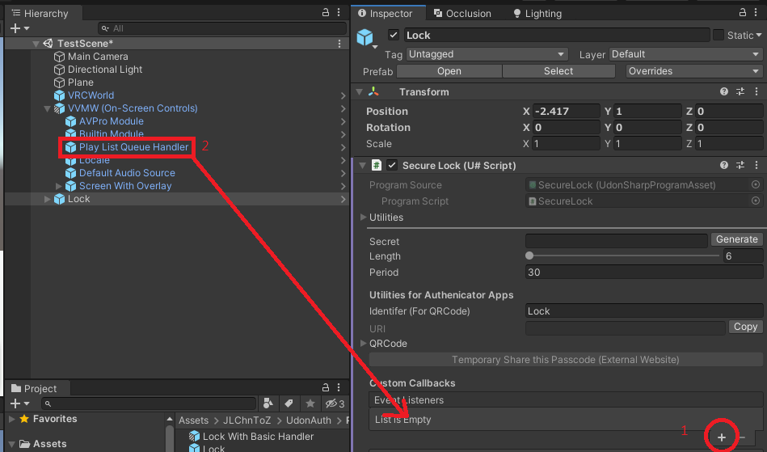
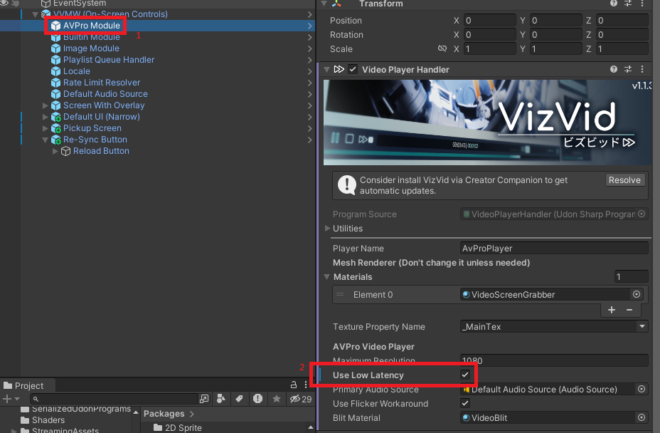
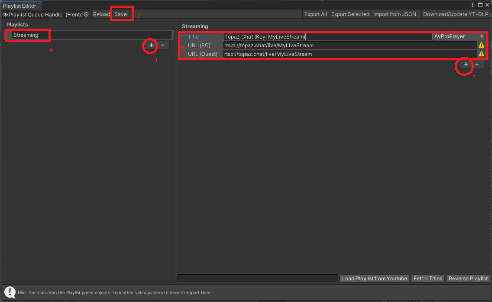

# VizVidマニュアル

[English Documentation](./README.md) · [中文說明文件](./README_ZH.md)

VizVidの使用をご検討いただき、誠にありがとうございます！

VizVidはVRChatに向けて開発している、汎用的な動画プレイヤーのフロントエンドです。ラウンジで皆で楽しんでいただける動画/ライブ配信プレイヤーだけではなく、大規模イベント、さらに展示会やショーケース・ブースにも対応する、汎用性が満載の動画プレイヤーになります。柔軟に構築されたガジェットのように、裏蓋を開けたら簡単に調整可能で、ユーザーの必要に応じて簡単に改変できます。

> [!NOTE]
> このマニュアルは v1.1.0 以降に対応しており、一部の内容は古いバージョンと異なります。

## 目次
- [導入方法](#導入方法)
    - [再生速度制御の有効化](#再生速度制御の有効化)
    - [画面の追加](#画面の追加)
    - [オーディオソースの追加（サラウンド）](#オーディオソースの追加（サラウンド）)
    - [新規操作パネルの追加](#新規操作パネルの追加)
    - [プレイリストの追加・インポート・エクスポート](#プレイリストの追加・インポート・エクスポート)
    - [ピックアップスクリーンの追加](#ピックアップスクリーンの追加)
    - [オーバーレイ操作パネルの追加](#オーバーレイ操作パネルの追加)
    - [再同期 (Re-Sync) ボタンの追加](#再同期-re-sync-ボタンの追加)
    - [テーマカラーの改変](#テーマカラーの改変)
    - [ユーザー接近の自動再生設定](#ユーザー接近の自動再生設定)
    - [動画を再生する時、ワールドBGMの自動フェードアウト](#動画を再生する時、ワールドBGMの自動フェードアウト)
    - [Text Mesh Proへの移行](#Text-Mesh-Proへの移行)
- [バンドルの仕組み](#バンドルの仕組み)
    - [VVMW (Game Object)](#VVMW-Game-Object)
    - [Builtin Module / AVPro Module / Image Module](#Builtin-Module--AVPro-Module--Image-Module)
    - [Playlist Queue Handler](#Playlist-Queue-Handler)
    - [Locale](#Locale)
    - [Default Screen / Screen](#Default-Screen-Screen)
    - [Default Audio Source](#Default-Audio-Source)
    - [Default UI / Screen with Overlay](#Default-UI--Screen-with-Overlay)
- [サードパーティーへ製品の対応](#サードパーティーへ製品の対応)
    - [Udon Auth](#Udon-Auth)
    - [Audio Link](#Audio-Link)
    - [LTCGI](#LTCHI)
    - [YTTL](#YTTL)
    - [Topaz Chat / VRCDN (他のストリーミングサービス)](#Topaz-Chat--VRCDN-他のストリーミングサービス)

## 導入方法
Unityヒエラルキーを右クリック、`Vizvid > Video Player`を選択。  

プレイヤーにはいくつかのバリエーションが存在します：  
  

また、画像のように、分割されたプレイリストの移動・無効化をすることができます：  

### 再生速度制御の有効化
VizVidは再生速度の制御ができます。この機能を有効化するには、AVProや、その「[スタブ](https://ja.wikipedia.org/wiki/%E3%82%B9%E3%82%BF%E3%83%96) (再生速度機能を連動させるプログラム)」を事前に導入が必要です。

以下の方法から一つを選んでください：
- スタブをプロジェクトにインポートします (一回だけでOKです。)
  
- [AVProトライアル版](https://github.com/RenderHeads/UnityPlugin-AVProVideo/releases)をインポートします。
- [AVPro有料版](https://assetstore.unity.com/packages/tools/video/avpro-video-v3-core-edition-278893)をインポートします。
(安くないプラグインなので、この機能を有効化するだけなら、強めに**おすすめしません**。)

### 画面の追加
Unityヒエラルキーにあるプレイヤーオブジェクトを右クリック、`VizVid > Additional Controls > Screen`を選択すると、画面が追加されます。

> [!NOTE]
> 注記：VizVidはいくらかのシェーダー交換性を持つように設計されています。[iwaSync3](https://hoshinolabs.booth.pm/items/2666275)向けに設定されたシェーダーを使う場合はそのまま流用しても大丈夫ですが、カスタムシェーダーなど、再生画面が特殊な構成で組み込まている場合、インスペクター設定の調整が必要な可能性があります。  

### オーディオソースの追加（サラウンド）
オーディオソース (スピーカー) を追加することで、マルチチャンネル・サラウンドなどの構成が可能です。(追加されたオーディオソースはAVProのみ対応していて、Builtin Playerには対応していませんので、予めご了承ください。)

プレイヤーオブジェクトを右クリック、`VizVid > Additional Controls > Audio Source`を選択すると、オーディオソースが追加されます。  

プレイヤーコンポーネントのインスペクターにある「Setup Speakers」をクリック。  

### 新規操作パネルの追加
VizVidは柔軟な構成を狙うため、操作パネルも同じ考え方で設計されており、複数の操作パネルが存在しても、同一のプレイヤーコアに繋がられます。様々な用途に合わせて、操作パネルのプレハブは3つのバリエーションを用意しています：

* **On-screen**：すべての操作パネルは画面に内蔵するため、余分なワールド空間は不要、リラックス系ワールドにはおすすめです。
  プレハブ名は「`Screen With Overlay`」です。  
  
* **Separated**：操作パネルを表示するため、一部ワールド空間を使いますが、オーバーレイパネル操作が苦手な方にはおすすめです。   
  プレハブ名は「`Default UI`」です。
  
* **Narrow**：再生画面に付けない・表示しない方にはおすすめです。  
  プレハブ名は「`Default UI (Narrow)`」です。 
  

Unityヒエラルキーにあるプレイヤーオブジェクトに右クリック、追加したい操作パネルを選択して、新規操作パネルが追加されます：
- `VizVid > Additional Controls > On Screen With Controls with Overlay`
- `VizVid > Additional Controls > Separated Controls`
- `VizVid > Additional Controls > Separated Controls (Narrow)`

### プレイリストの追加・インポート・エクスポート
プレイリストは事前に組み込まれ、「Playlist Queue Handler」ゲームオブジェクトで管理してます。他のプレイヤーと異なって、複数の操作パネルが入っても、同一キューのプレイリストを操作ができます。プレイリストの管理方法は以下の通りです：
1. ヒエラルキーにある「Play List Queue」オブジェクトを選択します。
2. 「Edit Playlists」ボタンをクリック。
   
4. 表示する編集ウィンドウに、以下の操作ができます：
    1. プレイリストの作成・消去
    2. 他の動画プレイヤー・YouTubeからのプレイリストをインポート
    3. JSONファイル経由で、プレイリストをインポート・エクスポート
5. 編集終わったら、「save」ボタン押して、編集ウィンドウを閉じると完成です。

現在プレイリストのインポートを対応しているプレイヤー：
* VizVid (そうです！同じワールドに実装した複数VizVidプレイヤーは、プレイリストの相互インポートができます！)
* USharp Video
* Yama Player
* KineL Video Player
* iwaSync 3
* JT Playlist
* ProTV by ArchiTech
* VideoTXL

インポートするとき、プレイリストを込めたゲームオブジェクトをドラッグして、VizVidプレイリスト編集ウィンドウにドロップ。

> [!NOTE]
> 注意：ドロップ場所によって、異なる結果があります。左半分にドロップする場合、新規プレイリストとして作成されます。右半分にドロップする場合、選択しているプレイリストの適用性によって追加されます。

### ピックアップスクリーンの追加
このコンポーネントは[元々 山の豚 が作りました](https://yamabuta.booth.pm/items/4189997)、ローカルで拡大・縮小機能を備えてピックアップスクリーンです。VizVidはこの機能を適用できるように、書き直して実装しています。

Unityヒエラルキーにあるプレイヤーオブジェクトを右クリック、`VizVid > Additional Controls > Pickupable Screen`を選択して、ピックアップスクリーンが追加されます。

### オーバーレイ操作パネルの追加
プレイモードによって、Instanceに参加している全員に対し、ミニ操作パネルを表示することができます。VRモードは腕に表示され、デスクトップモードはモニターの隅に表示されます。音量調整や再同期 (Re-Sync) の操作ができます。

### 再同期 (Re-Sync) ボタンの追加
ライブ配信イベントに参加中のユーザー向けに、オーバーレイ操作パネルにある再同期ボタンの代用品として「Re-Sync Button」および「Global Sync Button」の2種類の再同期ボタンを用意しています。各ボタンは、ローカル再同期とグローバル再同期の機能に対応しています。

### テーマカラーの改変
簡単にテーマカラーを変更できます。「Color Config」というスクリプトを使用して、変更したいUIコンポーネントの色を調整し、「Apply」または「Apply to All」ボタンを押すだけで変更が適用されます。「Apply」は現在調整中のUIにのみ適用され、「Apply to All」はすべてのVizVidコンポーネントに設定を適用します。

### ユーザー接近の自動再生設定
VizVidは、ユーザーが特定のエリアに入る時に再生、離れると停止、ブース向けの機能を対応しています。

この機能を有効化するには、ヒエラルキーにあるプレイヤーオブジェクトを右クリック、`VizVid > Additional Controls > Auto Play On Near (Local Only)`を選択します。2つのトリガー方法をご用意しています。コライダーを使う場合は、サイズを設定すると完成です。コライダーを使わない場合は、距離を設定すると完成です。

### 動画を再生する時、ワールドBGMの自動フェードアウト
動画プレイヤーに動画・音楽などのコンテンツを楽しんでる間、ワールド内蔵のBGMと混ぜると、決して良い経験ではありません。そのため、BGM音量制御コンポーネントをご用意しました。このコンポーネントは、ワールドのBGMオーディオソースに追加できるように設計されています。

このコンポーネントを追加するには、オーディオソースを入った、実装済みBGMゲームオブジェクトを選択して、インスペクターの「Add Component」で、`VizVid > Components > BGM Volume Control`を選択します。

次に、追加されたコンポーネントの中、Coreの右にある「Find」をクリックし、または、動画プレイヤー自身をここにドラッグします (複数VizVidが存在する場合におすすめ)。ここで音量や他の設定を調整することができます。

以上で完了します！

### Text Mesh Proへの移行
VRの中に、文字を綺麗に表示にするため、レガシィテキストの代わり、UnityとVRChat SDKは、TextMeshPro (TMPro) の使用は推奨しています。VizVidはv1.0.32以降、TMProへの移行に対応しています：
1. Default UI・オーバーレイ操作パネル・再同期 (Re-Sync) ボタンなど、最も上の階層のUIゲームオブジェクトを選択します。
2. Unityメニューバーに「`Tools > VizVid > Migrate TMPro Components`」を選択して、この後はスクリプトに任せてください。
3. はい、終わり。

> [!NOTE]
> 注意：この手順は、シーンがあるオブジェクトのみ適用され、その以降アップデートで追加されたUI要素や、手動で追加/置換えたUIオブジェクトには適用されませんので、追加/置換えた対象になったオブジェクトに、再度この手順を行ってください。

Unityエディター内TMProに移行したVizVid、英語以外のテキストが豆腐 (→□) に表示された場合、この記事をご参照ください：[TextMeshPro in VRChat](https://hai-vr.notion.site/TextMeshPro-in-VRChat-91561782adea47a78569cec641fd5ee9#88dd13b80e4d4caeafc00f26b4aa2ae1)。

## バンドルの仕組み
Unityヒエラルキーにあるプレハブは、以下の通りになります：
* VVMW
    * Builtin Module
    * AVPro Module
    * Playlist Queue Handler
    * Locale
    * Default Screen (オーバーレイ版以外)
    * Default Audio Source
    * Default UI / Screen with Overlay
        * Screen (オーバーレイ版のみ)

順次に説明します。

### VVMW (Game Object)
これはVizVidの頭脳であり、VizVidの同期 (有効化の場合のみ)や制御をしています。インスペクターに表示されるオプションは以下になります：
* (こちらは、Playlist Queue Handlerを無効化して、リンク解除の場合のみ表示されるオプションです)
    * **Default URL**：ユーザーがInstanceにJoinする時、自動再生されるURLです。
    * **Default Quest URL**：Quest/Androidユーザー向け、代わりに再生されるURLです。入力しない場合、Default URLが再生されます。
    * **Auto Play Player Type**：自動再生URLを読み込む「モジュール」です。
    * **Loop**：リピート再生の有効化を選択します (プレイヤーUIで変更できる)。
* **Auto Play Delay Time**：ワールドに入った時、自動再生URL読み込みの遅延設定。VizVidだけではなく、同じワールドに自動再生を掛けた、複数のプレイヤーが存在する場合、読み込みレート制限を掛けないように、5の倍数を設定して、読込時間をずらしておいてください。
* **Total Retry Time**：読み込み失敗の場合、再読み込み回数の上限設定。
* **Retry Delay**：再読み込みの遅延設定。
* **Time Drift Detect Threshold**：再生の時間ドリフトが設定値に超えた場合、オーナーの再生時間と再同期します。動画再生時間が前後に飛んだり、再生時間ドリフトが激しいなど問題を防ぐため、設定値をあまり変えないようをおすすめします。
* **Player Handlers**：プレイヤー/ビューアコンポーネントの「モジュール」です。未使用のモジュールを外す以外、基本的には改変のは要りません。モジュールについては[Builtin Module / AVPro Module / Image Module](#Builtin-Module--AVPro-Module--Image-Module)をご参照ください。
* **Default Texture**：設定なしの場合、既定値のテクスチャが表示されます。任意のテクスチャの変更は自由ですが、シンプルにしたい場合、既定値そのままをおすすめします。
* **Video Screen Target (番号)**：映像テクスチャを表示するコンポーネントです。任意のマテリアル・レンダラー・UI Raw画像コンポーネントの使用が可能です。三角で格納しているオプションは高度な設定です。サードパーティーシェーダーで映像テクスチャを使用する場合除き、基本的に調整しなくても構いません。
* **Add Video Screen Target**：追加映像画面ターゲットを使用するには、対応可能なコンポーネントをここにドラッグします。
* **Audio Sources**：リストに表示するオーディオソースは、プレイヤーの音量調整に制御され、動画の音声を再生します。Builtin Playerの場合、一個のオーディオソースのみ対応します。AVProの場合、最大8個のモノラルオーディオソースに対応しています。つまり、左チャンネルの音源は左のオーディオソースに設置、リアスピーカー音源を後ろ左右にあるオーディオソースに設置など、複数独立したオーディオソースの設置が可能です。スピーカー配置完了すると、「Setup Speaker」をクリックすることで、自動的にマッピングします。(複数AVProプレイヤーが存在する場合、手動マッピングが必要になりますので、予めご了承ください。)
* **Default Volume**：デフォルト音量を設定します。
* **Synced**：ユーザー同士の再生同期を行うかを設定します。ブースに接近の自動再生など、各自ローカルで再生させたい場合に、設定を外します。制御用UI外せない限り、ユーザーは各自でプレイヤーを制御することができます。
* **Audio Link**：[Audio Link](https://github.com/llealloo/vrc-udon-audio-link)への対応。再生するとき、音声データをワールドに設置されたAudio Linkに送信します。
* **Targets**：カスタムスクリプトの統合に対応するため、ここでアサインされたUdon (sharp) に、イベントデータを出力します。(統合したい方は、各自ソースコードを読んでおいてください。ソースコードに関する記事は提供していませんので、予めご了承ください。)
* **Realtime GI Update Interval**：リアルタイムGIを更新する間隔。無効化するには、0に設定すればOKです。Light Probe・Realtime GIなど、ワールドと画面レンダラーに設定することで、この機能の使用ができます。

### Builtin Module / AVPro Module / Image Module
動画再生 / 画像表示用モジュールです。バックエンドの動画プレイヤー / 画像ビューアをVizVidのフロントエンドに接続するゲームオブジェクトです。オプションは以下になります：
* **Player Name**：UIに表示するプレイヤー / ビューアの名前です。名前を変更するか、またlang.jsonファイルの改変か、ローカライズを行えます。
* **Materials**, **Texture Property Name**：基本的にこの設定を調整する必要はありません。バックエンドのプレイヤー / ビューアから、画面を取得するものです。
* **Maximum Resolution**：動画解像度の選択が可能の場合、設定値の高さの映像データを読み込みます。デフォルト値は1080です。
* (※AVPro限定オプション) Use Low Latency：ライブ配信を視聴する場合、低遅延モードの有効化設定です。
* **Primary Audio Source**：音声データをオーディオソースに優先送信する設定です。Builtin Playerの場合、これは唯一の出力源になります。Audio Linkを設定している場合、オーディオソースから流れた音をAudio Linkに送信します。
* (※AVPro限定オプション) **Use Filcker Workaround**：極めて軽微な処理負荷をかかりますが、画面の点滅を回避するソリューションでございます。技術的に言えば、映像テクスチャの反転されてしまうやカラースペースの問題も修正され、とくにシェーダーを対応させることは要りません。
* **Bilt Material**：画面点滅回避用の臨時マテリアルです。そのままにしてください。

### Playlist Queue Handler
再生キューを管理するオプションのコンポーネントです。プレイリストの管理と再生キューの有効化の設定ができます。
* **Core**：VVMWに接続用コンポーネントです。設定されていない場合、「Find」をクリックして設定を行います。
* **Enable Queue List**：有効化にすると、動画再生の間に追加したURLは、キューリストに入れます。ある程度再生マナーを持ちたい方におすすめします。
* **History Size**：再生履歴の数を設定します。
  0より大きい値に設定すると、キューリストの側に、再生履歴が表示されます。VizVidに入力したURLと入力者が再生履歴に記録され、再生履歴からURLを選択すると、素早く再キューイングすることができます。
  値を0に設定すると無効化になります。
  (事前に組み込まれたプレイリストは記録されません。)
* **Edit Playlists…**：事前に入れるプレイリスト編集用コンポーネントです。 \
調整可能な項目は以下になります：
    * **Reload**：編集内容を破棄し、インスペクターにリロードします。
    * **Save**：編集内容を保存します。**自動保存は行えませんので、編集完了後、必ずsaveをクリックしてください。**
    * **Export All**：すべてのプレイリストをJSON形式で書き出します。
    * **Export Selected**：選択したプレイリストをJSON形式で書き出します。
    * **Import from JSON**：前回保存したプレイリストのJSONファイルをインポートします。インポートする時点で、追加・上書きを選択するプロンプトウィンドウが表示されます。
    * **Playlists**：事前に入れたプレイリストです。追加・消去・並べ替え・名前変更ができます。
    * **&lt;プレイリスト名>**：プレイリストを選択すると、以下の編集ができます：
        * **Title**：プレイヤーに表示するタイトルです。
        * **URL (PC)**：動画のURLです。YouTube・Twitch・SoundCloud・RTSP・RTMPなどのURLに対応します。
        * **URL (Quest)**：Quest / Android ユーザー向けURLです。RTSPTなど、Androidプラットフォームに対応しないURLに対して、代用のURLを入れます。(入れない場合は、PC用URLを流用します。)
        * **&lt;Builtin / AVPro Player / Image Viewer>**：再生/表示するモジュールを事前に指定します。ライブ配信やSoundCloudなど、AVProが必須の場合に指定することができます。
        * **Load Playlist from YouTube**：YouTubeプレイリストを入力することで、選択するプレイリストに追加されます。
        * **Fetch Titles**：動画タイトルを取得します。現時点はYouTubeのみに対応します。
* **Default Playlist**：ユーザーがJoinする時、デフォルト選択するプレイリストです。
* **Auto Play**：有効化することで、ユーザーがJoinする時、設定したDefault Playlistを自動再生します。接近自動再生を使用する場合、この機能を無効化し、[こちらの説明](#ユーザー接近の自動再生設定)に従い行ってください。
* **Auto Play Delay Time**：ワールドに入った時の自動再生URL読み込みの遅延設定。VizVidだけではなく、同じワールドに、自動再生を掛けた、複数のプレイヤーが存在する場合、読み込みレート制限を掛けないよう、5の倍数を設定して、読込時間をずらしておいでください。
* **Default Loop**：事前にリピート再生を有効化に設定します(プレイヤーUIで変更できます)。VVMW (Core) の設定と違い、こちらの設定はプレイリスト・キューリストのリピート再生を入れます。
* **Default Shuffle**：事前にランダム再生を有効化に設定します(プレイヤーUIで変更できます)。
* **Locked**：事前にプレイヤーをロックします。[Udon Auth](https://xtl.booth.pm/items/3826907) (有料) や他互換性あるスクリプトに対応します。
* **Target**：VVMW本体と同じく、カスタムスクリプトの統合用です。

プレイリストを追加するには、[こちらのセクション](#プレイリストの追加・インポート・エクスポート)をご参照ください。

### Locale
ロケールマネージャーです。テキストの追加や改変はここで行えます。

また、高度な使い方に関しては、VizVidを抜いた状態でも使えます。Language Reciverを使って、他のテキストコンポーネントと合わせて、自分のロケールインターフェイスを作れます。

### Default Screen / Screen
デフォルトの画面です。詳しくは、[こちらのセクション](#画面の追加)をご参照ください。

### Default Audio Source
デフォルトのオーディオソースです。詳しくは、[こちらのセクション](#オーディオソースの追加（サラウンド）)をご参照ください。

### Default UI / Screen with Overlay
デフォルトのUIです。基本のプレイヤー制御ができます。詳しくは、[こちらのセクション](#新規操作パネルの追加)をご参照ください。

## サードパーティーへ製品の対応
### Udon Auth
VizVidはUdon Authに対応しています。イベント会場にて、Staff Only専用などの用途に設計されたギミックに対するOTPソリューションです。こちらの[Booth](https://xtl.booth.pm/items/3826907)の購入をご検討ください。

1. Udon Authを組み込まれた前提で、Lockコンポーネントを選択し、Custom Callbacksの「+」ボタンを押してください。
2. VizVidの「Playlist Queue Handler」を、追加されたCustom Callbacksにドラッグしてください。
3. VizVidの「Playlist Queue Handler」を選択し、Lockを有効化してください。

Udon Authを使用しない場合、自作アンロックギミックの使用も可能です。_OnUnlockのカスタムイベントをPlaylist Queue HandlerにあるUdonに送信すれば、ロックが解除されます。

### Audio Link
VizVidはAudioLinkに対応しています。[こちらのセクション](#VVMW-Game-Object)を参照し、セットアップを行ってください。  

AVProのマルチチャンネルでAudio Linkを使用する場合、プレイヤーに制御されない、ほぼ無音のオーディオソースを使って、Audio Linkに送信します。

2つの実装方法があります。
1. Audio Linkに提供された「Audio Input」を使う：
    * AVProプレイヤーモジュールを、AudioLinkゲームオブジェクトの下にある「Audio Input」のVRC AVPro Video Speakerコンポーネント中のVideo Sourceにドラッグします。
    * AVProプレイヤーモジュールを選択して、Primary Audio Source設定を「Audio Input」に入れます。
2. 追加のオーディオソースを使う：
    * 複製、またDefault Audio Sourceオブジェクトをシーンにドラッグします。
    * VRC Spatial Audio Sourceコンポーネントを外します。
    * 音量を`0.01`に設定します。
    * オブジェクトの位置を`-999999`など、ワールド自体からすっごく離れた場所に移動します。
    * VRC AVPro Video SpeakerコンポーネントのVideo Sourceを、AVProプレイヤーモジュールに設定します。
    * AVProプレイヤーモジュールを選択し、Primary Audio Sourceを新規作成したオーディオソースに設定します。

### LTCGI
VizVidは[LTCGI](https://ltcgi.dev/)と基本的な統合に対応しています。LTCGIコントローラーと同様、Materialフォルダーにある「VideoCRT」カスタムレンダーテクスチャを、VVMWの「Add Video Screen Target」にドラッグし、LTCGIの説明 ([これ](https://ltcgi.dev/Getting%20Started/Setup/Controller)と[これ](https://ltcgi.dev/Getting%20Started/Setup/LTCGI_Screen)) に従い行ってください。  

### YTTL
[YTTL (動画タイトル表示)](https://65536.booth.pm/items/4588619) はureishi様が製作し、CC0ライセンスで使用させて頂いており、有名なサイト (YouTube・Twitch・ニコニコ動画・SoundCloud) からタイトルを取得し、プレイヤーに表示するプラグインです。VizVidは公認対応版のYTTLをご用意しましたが、有効化するには、いくつかの手順が必要となります：Unityヒエラルキーにあるプレイヤーオブジェクトを右クリック、`VizVid > YTTL`を選択します。

### Topaz Chat / VRCDN (他のストリーミングサービス)
VizVidはTopaz Chat、VRCDNなど、様々なストリーミングサービスに対応していますが、別々のプレイヤー同時に配信視聴モードに入っていくと、ワールドのパフォーマンスが低下になってしまい、同期関連の問題も発生しやすくになりますので、以下の手順に従い設定を行ってください：

1. AVProモジュールに「Use Low Latency」を有効化。
   
2. ヒエラルキーにあるプレイヤーオブジェクトを選択。
3. 「Edit Playlists...」ボタンをクリック。
   
4. 左側の「+」ボタンをクリック
5. プレイリスト名を入力
6. 右側の「+」ボタンをクリック
7. 以下の情報を入力：
   - **Title**：タイトル情報を入力。(ストリーミングキーを共有したい場合、こちらに入力することがおすすめします。)
   - **Topaz Chat用URL**：`<Key>` 情報をストリーミングキーに置き換えます。
     - **URL (PC)**: `rtspt://topaz.chat/live/<Key>`
     - **URL (Quest)**: `rtsp://topaz.chat/live/<Key>` PC用リンクと違い、Quest版 (また他のAndroidクライアント)はRTSPTプロトコルに対応しないの対策です。
   - **VRCDN用URL**: `<Key>`情報をVRCDNから提供したストリーミングキーに置き換えます。
     - **URL (PC)**: `rtspt://stream.vrcdn.live/live/<Key>` (VRCDNから提供したRTSPT URL)
     - **URL (Quest)**: `https://stream.vrcdn.live/live/<Key>.live.ts` (VRCDNから提供したMPEG-TS URL)
8. メニューから「Save」をクリック。
   

> [!NOTE]
> この方法VizVidから永久の保証はできませんので、ストリーミングサービス業者のマニュアルを事前に読んでください。
> - [Topaz Chat](https://booth.pm/ja/items/1752066)
> - [VRCDN](https://wiki.vrcdn.live/en/stream/Getting-Started)

ワールドにいるユーザーが配信を行いたい場合、プレイリストにあるストリーミングキーを使って、配信することができます。