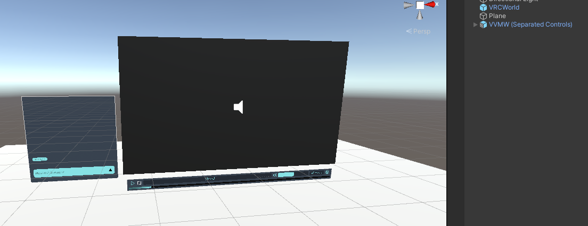
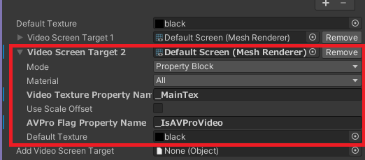
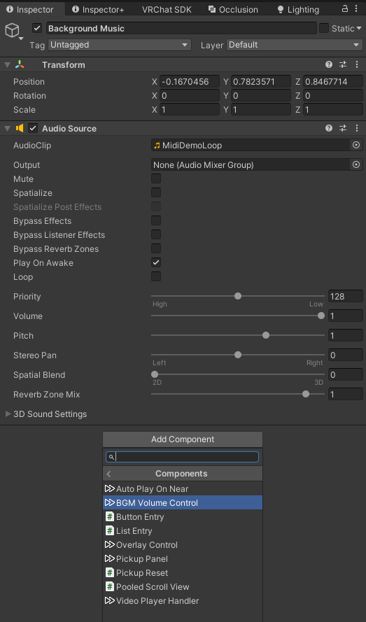
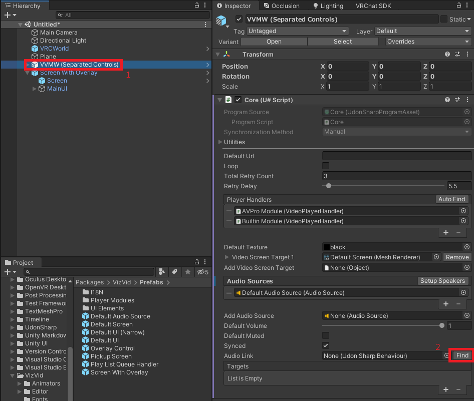

# VizVid 說明文件

嗨！VizVid 是一款為了 VRChat 所設計的多功能媒體播放器前端。它的用途廣泛，除了在地圖與朋友一起觀看影片或直播用的播放器、大型音樂表演的活動場地，甚至在展覽會或展示攤位都能使用。針對各式各樣的需求，VizVid 有著前所未有的靈活性。猶如電子零件廠販賣的電子用品般，只要打開後蓋，就能依各自所需，自由地進行調整。

> [!NOTE]
> 本說明文件內容，涵蓋了 v1.0.34 或往後更新的版本，一部分的說明與舊版會有所不同。

## 目錄
* [安裝方法](#安裝方法)
	* [新增額外螢幕](#新增額外螢幕)
    * [新增額外 Audio Source](#新增額外-Audio-Source)
	* [新增額外控制面板](#新增額外控制面板)
	* [新增 / 匯入 / 匯出播放清單](#新增--匯入--匯出播放清單)
	* [新增移動式螢幕](#新增移動式螢幕)
	* [新增重疊控制面板](#新增重疊控制面板)
	* [新增 Re-Sync 按鈕](#新增-Re-Sync-按鈕)
	* [更改顏色](#更改顏色)
    * [設定使用者接近自動播放](#設定使用者接近自動播放)
    * [設定影片播放時背景音樂自動淡出](#設定影片播放時背景音樂自動淡出)
    * [遷移至 Text Mesh Pro](#遷移至-Text-Mesh-Pro)
* [VizVid 的構造](#VizVid-的構造)
	* [VVMW (Game Object)](#VVMW-Game-Object)
	* [Builtin Module / AVPro Module](#Builtin-Module--AVPro-Module)
	* [Playlist Queue Handler](#Playlist-Queue-Handler)
	* [Locale](#Locale)
	* [Default Screen / Screen](#Default-Screen--Screen)
	* [Default Audio Source](#Default-Audio-Source)
	* [Default UI / Screen with Overlay](#Default-UI--Screen-with-Overlay)
* [第三方套件支援](#第三方套件支援)
	* [Udon Auth](#Udon-Auth)
	* [Audio Link](#Audio-Link)
	* [LTCGI](#LTGCI)
	* [YTTL](#YTTL)

## 安裝方法
於 Hierarchy 空白處按下滑鼠右鍵，選擇`VizVid > Video Player`。  

這邊可以先看一下不同的播放器形式：  

另外，如圖片所示，分割出來的播放清單也可以移動或停用：  

### 新增額外螢幕
於 Hierarchy 中的播放器物件上按下滑鼠右鍵，選擇`VizVid > Additional Controls > Screen`以新增。  

> [!NOTE]
> 附註：VizVid 盡可能地讓 [iwaSync3](https://hoshinolabs.booth.pm/items/2666275) 等等的特殊著色器上，保持一定的相容性，不需做出額外調整。但若有做出自訂著色器等等較特殊設定，視情況還是可能需調整 Inspector 的數值設定。

### 新增額外 Audio Source
可以透過增加額外的 Audio Source (喇叭)，製作例如多聲道、環繞音效等等音響配置。需注意，此設定僅支援 AVPro。不支援 Unity 的內建播放器。

於 Hierarchy 中的播放器物件上按下滑鼠右鍵，選擇 `VizVid > Additional Controls > Audio Source` 以新增。  

點選播放器元件上「Setup Speakers」按鈕進行設定。  

### 新增額外的控制面板
VizVid 是以高靈活性為前提進行製作，控制面板也是如此。針對不同的使用情境，我們提供了三種不同類型的控制面板，且這些控制面板皆能控制同一個播放器。開始前，先介紹以下三種控制面板的類型：
- On-screen：不需額外空間，控制選項皆搭載於播放器內的觸控螢幕。適合放鬆類的世界。  
  Prefab 名稱是`Screen With Overlay`。
  
- Separated：雖需留些空間放置控制面板，但適合不擅長操作觸控螢幕的使用者。  
  Prefab 名稱是`Default UI`。
  
- Narrow：適合跟螢幕分開放置的控制面板 (或是沒螢幕)。  
  Prefab 名稱是`Default UI (Narrow)`。
  

於 Hierarchy 中的播放器物件上按下滑鼠右鍵，選擇要新增的控制器類型：
- `VizVid > Additional Controls > On Screen With Controls with Overlay`
- `VizVid > Additional Controls > Separated Controls`
- `VizVid > Additional Controls > Separated Controls (Narrow)`

### 新增 / 匯入 / 匯出播放清單
VizVid 可以透過「Playlist Queue Handler」物件，事先製作 VizVid 用的播放清單，並進行管理。跟其他播放器不同，即使有多個控制面板，還是可以同一個待播清單進行操作。以下為管理播方清單的方法：
1. 於 Hierarchy 中，選擇「Play List Queue Handler」物件。
2. 點選「Edit Playlists」。
3. 跳出的編輯視窗中，你可以：
    a. 新增 / 移除播放清單
    b. 從其他播放器或 YouTube 匯入播放清單
    c. 從 JSON 檔案匯入 / 匯出播放清單
4. 完成編輯後，記得按下視窗上方的「save」按鈕，儲存播放清單。

以下是目前支援匯入播放清單的播放器：
- VizVid (沒錯，同個世界中的多個 VizVid 可以互相匯入播放清單。)
- USharp Video
- Yama Player
- KineL Video Player
- iwaSync 3
- JT Playlist
- ProTV by ArchiTech
- VideoTXL

透過拖曳遊戲物件至播放清單編輯視窗中進行匯入。

> [!NOTE]
> 請注意，根據物件擺放位置的左右側，會出現不同的結果：左側會加入全新的播放清單。右側會根據目前選擇的播放清單的相容性進行新增。

### 新增移動式螢幕
本元件由 [Yama Buta](https://yamabuta.booth.pm/items/4189997) 原創製作，具有放大縮小功能的 Local 移動式螢幕。VizVid 為了對應此功能，重新進行了編寫。

於 Hierarchy 中的播放器物件上按下滑鼠右鍵，選擇`VizVid > Additional Controls > Pickupable Screen`以新增。  

### 新增重疊控制面板
根據遊玩模式，會針對房間內的每位玩家，顯示一個小型控制面板。VR 模式會顯示於手腕上，桌面模式則會顯示於螢幕角落。可以進行音量調整和 Re-Sync。

於 Hierarchy 中的播放器物件上按下滑鼠右鍵，選擇`VizVid > Additional Controls > Overlay Controls`以新增。  

### 新增 Re-Sync 按鈕
此元件適合有串流內容的活動會場，讓觀眾可以重新同步串流內容，是重疊面板的替代方案。提供了`Re-Sync Button` 和 `Global Sync Button`兩種類型的按鈕。差異在於會觸發本機或全體的重新同步。

於 Hierarchy 中的播放器物件上按下滑鼠右鍵，選擇`VizVid > Additional Controls > Resync Button`或`Global Resync Button`以新增。  

### 更改顏色
沒錯，你可以幾乎一鍵更改 UI 的配色。VizVid 的每個 UI 元件中，都包含了`Color Config`腳本。只要調整好喜歡的配色，點選下方的`Apply`或`Apply to All`。`Apply`按鈕僅會套用目前更改的 UI 配色，`Apply to All`則會將配色套用至所有的 UI。  

### 設定使用者接近自動播放
VizVid 原生支援使用者進入特定區域時播放，離開時停止。適合用於展場類地圖的影片播放。

於 Hierarchy 中的播放器物件上按下滑鼠右鍵，選擇`VizVid > Additional Controls > Auto Play On Near (Local Only)`以啟用此功能。根據需求，調整 Collider 大小設定觸發範圍。若不想使用 Collider，也可以透過設定距離來達成。  

### 設定影片播放時背景音樂自動淡出
有玩過 VRChat 過的玩家應該理解，在自帶背景音樂的地圖中，同時又透過播放器播放音樂、影片等等內容，兩種聲音就這麼撞在一起，這種遊玩體驗想必很糟。向各位介紹背景音樂音量控制元件。這個元件是設計給地圖內建的背景音樂，可以附掛在地圖中所有的 Audio Source 上。

選擇裝有背景音樂的 Audio Source 遊戲物件，於 Inspector 中，點選「Add Componen」，選擇`VizVid > Components > BGM Volume Control`以新增。  

在新增好的元件，按下 Core 右邊的 Find 按鈕，或是把播放器拖曳至這裡。就可以調整音量和其他的設定了。  

就醬！

### 遷移至 Text Mesh Pro

為了讓 VR 中的文字能顯示得更清楚，比起 Legacy Text，Unity 跟 VRChat SDK 都建議使用 TextMeshPro (TMPro)。VizVid 在 v1.0.32 以後，開始支援將文字顯示系統遷移至 TMPro。

1. 選擇如 Default UI、Overlay Control、Re-Sync 按鈕等等，最上層的 VizVid UI 物件。
2. 選擇功能表中的`Tools > VizVid > Migrate TMPro Components`，腳本會搞定一切。
3. 就醬！

> [!NOTE]
> 注意：本步驟僅適用安裝於場景內的的物件，不會套用於往後更新追加的 UI 要素，以及手動新增 / 置換的 UI 物件。往後有這類 UI 物件出現，需要重新進行本步驟。

若想在 Unity 內測試遷移至 TMPro 的播放器，非英語的字元卻變成豆腐 (→□)，可以參考本文章：[TextMeshPro in VRChat](https://hai-vr.notion.site/TextMeshPro-in-VRChat-91561782adea47a78569cec641fd5ee9#88dd13b80e4d4caeafc00f26b4aa2ae1)。

## VizVid 的構造
VizVid 於 Hierarchy 中的 Prefab 構造如下：
- VVMW
    - Builtin Module
    - AVPro Module
    - Play List Queue Handler
    - Locale
    - *(重疊介面版以外)* Default Screen
    - Default Audio Source
    - Default UI / Screen With Overlay
        - *(僅重疊介面版)* Screen

以下逐一說明。

### VVMW (Game Object)
這是 VizVid 的「大腦」。在同個世界房間中，擔任 VizVid 的同步 (若有啟用)、控制的工作。在 Inspector 中能顯示、調整的選項如下：
- 這部分的選項，僅限 Playlist Queue Handler 停用，並解除連動的情況下才會顯示：
  - **Default URL**：玩家加入時，會自動播放的播放清單。
  - **Default Quest URL**：針對 Quest / Android 使用者，可以設定替代用的網址。若不輸入，則會沿用 Default URL 進行播放。
  - **Auto Play Player Type**：選擇播放網址的「模組」。
  - **Loop**：可設定是否預設啟用重複播放 (事後可經由控制面板調整)。
- **Auto Play Delay Time**：場景載入完成後的延遲播放時間。
  可避免多個播放器同時播放時，發生請求過於頻繁的問題。
  不僅限於 VizVid，若地圖中有播放器會自動播放，
  請務必將此數值設為 5 的倍數，錯開影片的載入時間。
- **Total Retry Count**：載入失敗時，重試次數的上限。
- **Retry Delay**：載入失敗時，重試的間隔時間。
- **Time Drift Detect Threshold**：若播放時間錯位高於這個數值，播放器會自動向主持人重新同步時間。
  建議不要將這個設定調太高或太低，可能會發生播放時間前前後後跳來跳去，
  或是時間錯位過於嚴重。
- **Player Handlers**：播放時所使用的「模組」。
  基本上不需更改。關於模組的說明，請見「Builtin Module」與「AVPro Module」。
- **Default Texture**：選擇沒有播放內容時使用的預設貼圖。若想保持簡潔，使用預設值即可。
- **Video Screen Target (數字)**：顯示影片貼圖的元件。可以在元件中，設定任何的材質、渲染器、UI Raw 圖片。
  收在三角形內的選項是進階設定。不使用第三方著色器接收影像的話，基本上不需要調整。
- **Add Video Screen Target**：要使用額外新增螢幕的話，可以將支援的元件拖曳至此。
- **Audio Sources**：會列出播放影片聲音的 Audio Source。VizVid 會控制他們的音量。
  內建影片播放器僅支援透過單個 Audio Source 輸出聲音。系統會優先使用它進行聲音輸出。
  AVPro 則支援最多 8 聲道，也代表你最多可以設定 8 個獨立的 Audio Source 發出聲音，例如左聲道輸出至左方 Audio Source，右後聲道設定至右後方 Audio Source。
  放置完畢後，可以點選「Setup Speaker」自動配置聲道位置。(有多個 AVPro 的情況，需全手動配置。敬請理解。)
- **Default Volume**：預設音量。
- **Synced**：可設定播放器是否同步。在展場等等使用情境，使用者之間的播放器不需要同步。
  關閉此設定時，只要有控制面板，每個玩家就可以獨立控制播放器。
- **Audio Link**：支援 [Audio Link](https://github.com/llealloo/vrc-udon-audio-link)。他會將聲音送至場景中安裝好的 Audio Link。
- **Targets**：可以整合自訂腳本。針對設定在此的 Udon (sharp) 傳送事件資料。
  我不會提關於原始碼的文字說明，若想整合自己的腳本，請自行研究原始碼並進行整合。
- **Realtime GI Update Interval**：即時全域光照的更新間隔。設定 0 即為停用。
  需要設定場景中的 Light Probe 和 Realtime GI 與螢幕渲染器，才能使用此功能。

### Builtin Module / AVPro Module
播放影片時使用的播放器模組。負責將後端的影片播放器，連接至 VizVid 核心的遊戲物件。
以下是可以調整的設定：

- **Player Name**：顯示於 UI 上的播放器名稱。可以直接更改名稱，或是更改 **lang.json** 進行在地化翻譯。
- **Materials**, **Texture Property Name**：通常不用更改設定。這裡是負責從播放器後端取得影片的畫面。
- **Maximum Resolution**：載入影片的最高解析度 (如果可選)。數值是影片的高度。預設值為`1080`。
- **Use Low Latency**：AVPro 限定選項。若要觀賞串流內容。此選項可降低觀看延遲。
- **Primary Audio Source**：聲音會優先輸出的 Audio Source。
  如果是內建播放器，他將是唯一的輸出源。
  如果有設定 Audio Link，他會將設定在此的 Audio Source 聲音送至 Audio Link。
- **Use Flicker Workaround**：AVPro 限定選項。
  雖然會使用極少量的額外資源，但可以緩解觀賞串流內容時，畫面閃爍的問題。
  技術上來說，它也可以修正畫面上下顛倒，以及色彩空間的問題，
  能省去對著色器做出額外調整的麻煩。
- **Blit Material**：避免畫面閃爍的暫存材質。若沒必要不要動它。

### Playlist Queue Handler
管理播放佇列，可選用的元件。可以管理播放清單，與啟用播放佇列。

- **Core**：將元件指向至 VizVid 核心。若為留空，按「Find」即可解決。
- **Enable Queue List**：若為啟用，影片播放期間，當其他使用者新增網址，將會加入播放佇列中。
  建議啟用，讓大家當個有禮貌的乖寶寶。
- **Edit Playlists...**：編輯播放清單的元件。  
  播放清單編輯視窗內，可做出以下調整：
    - **Reload**：取消變更，並將播放清單載回至 Inspector。
    - **Save**：將變更內容儲存至元件。**編輯完畢後，請務必點選。否則不會儲存編輯內容！**
    - **Export All**：將所有播放清單輸出至 JSON 檔案。
    - **Export Selected**：將選擇的播放清單輸出至 JSON 檔案。
    - **Import from JSON**：從過往儲存的 JSON 中，匯入播放清單。匯入時會出現提示視窗，選擇新增或覆蓋播放清單。
    - **Playlists**：所有自訂的播放清單都會顯示在此。可以新增、移除、重新排列、重新命名。
    - **&lt;播放清單名稱&gt;**：選擇播放清單時，可以進行以下操作：
        - **Title**：要顯示的影片標題。
        - **URL (PC)**：影片連結。支援 YouTube、Twitch、SoundCloud、RTMP、RTSP 等等連結。
        - **URL (Quest)**：對於 RTSPT / RTMP 等等 Quest / Android 平台不支援的連結，提供可用連結的替代方案(留空即會沿用 PC 的連結)。
        - **&lt;Builtin / AVPro Player&gt;**：選擇播放連結的模組。
        若播放連結為串流或 SoundCloud，請選擇 AVPro 模組。
        - **Load Playlist from YouTube**：將 YouTube 播放清單匯入至選擇的播放清單。
        - **Fetch Titles**：若 Title 欄為空，則可自動取得並匯入影片標題，目前僅支援 YouTube。
- **Dafault Playlist**：使用者加入房間時，預設的播放清單。
- **Auto Play**：若啟用自動播放，使用者加入房間時，便會自動播放 Default Platlist 設定的播放清單。
  若要啟用使用者接近自動播放，請停用本功能，
  並遵循[該說明](#設定使用者接近自動播放)進行設定。
- **Auto Play Delay Time**：加入房間時，自動播放的讀取延遲設定。
  可避免多個播放器同時播放時，發生請求過於頻繁的問題。
  不僅限於 VizVid，若地圖中有播放器會自動播放，
  請務必將此數值設為`5`的倍數，錯開影片的載入時間。
- **Default Loop**：可設定是否預設啟用重複播放 (事後可經由控制面板調整)。
  跟 VVMW (Core) 的設定不同點在於，這會重複播放整個播放清單 / 佇列。
- **Default Shuffle**：可設定是否預設啟用隨機播放 (事後可經由控制面板調整)。
- **Locked**：可預設鎖定播放器。
  本功能是為 [Udon Auth](https://xtl.booth.pm/items/3826907) (付費內容) 或其他相容的腳本而設計。
- **Targets**：跟 VVMW 本體相同，可以整合自訂腳本。

關於新增播放清單，請參考[新增 / 匯入 / 匯出播放清單](#新增--匯入--匯出播放清單)環節。

### Locale
在地化翻譯管理器。你可以自行新增或改變翻譯。

另個進階用法，它可以在沒有 VizVid 的前提下使用。能透過`Language Receiver`配合其他的文字元件，自行製作在地化翻譯。

### Default Screen / Screen
預設畫面。可自由進行縮放、移動。相關使用細節，請參考[新增額外螢幕](#新增額外螢幕)環節。

### Default Audio Source
預設 Audio Source。相關使用細節，請參考[新增額外 Audio Source](#新增額外-Audio-Source) 環節。
### Default UI / Screen with Overlay
預設 UI。提供基礎的播放器操作介面。相關使用細節，請參考[新增額外控制面板](#新增額外控制面板)環節。

## 第三方套件支援

### Udon Auth
VizVid 原生支援 Udon Auth。Udon Auth 是我在 [Booth](https://xtl.booth.pm/items/3826907) 上販售的付費內容。針對活動會場，工作人員限定區域機關等等場合，所設計的 OTP 解決方案。

1. 在安裝好 Udon Auth 的前提下，選擇 Lock 元件，並於 Custom Callbacks 上點選「+」按鈕。
2. 找到 VizVid 的「Playlist Queue Handler」，將其拖曳至「Custom Callbacks」區域。
3. 選擇「Playlist Queue Handler」並啟用「Lock」選項。

在不使用 Udon Auth 的情況下，也可以使用自製的解鎖機關。只需要對附在 Playlist Queue Handler 上的 Udon 送出`_OnUnlock`自訂指令，也能進行解鎖。

### Audio Link
VizVid 能整合基礎的 Audio Link。基礎安裝請參考上方的「Audio Link」選項環節。  

另外，若要要使用 AVPro 提供的多聲道，需要一個不被 VizVid 控制，幾乎無聲的 Audio Source 來對 Audio Link 輸出聲音。

有兩種實作方法：
1. 使用 Audio Link 內提供的「Audio Input」：
    - 將 AVPro 播放器模組，拖曳至 AudioLink 遊戲物件下的「Audio Input」中的 VRC AVPro Video Speaker 元件中的 Video Source。
    - 選擇 AVPro 播放器模組，將 Primary Audio Source 設定成「Audio Input」。
2. 使用額外的 Audio Source：
    - 複製或將 Default Audio Source 拖曳至場景內。
    - 移除 VRC Spatial Audio Source 元件。
    - 將音量設至`0.01`。
    - 把物件的位置移動到像`-999999`之類，離地圖本身超級遠的地方。
    - 將 VRC AVPro Video Speaker 中的 Video Source 設定改成 AVPro 播放器模組。
    - 選擇 AVPro 播放器模組。將 Primary Audio Source 設定至剛剛加入的 Audio Source。

### LTCGI
VizVid 支援對 [LTCGI](https://ltcgi.dev/) 的基本整合。跟 LTGCI 控制器相同，使用 Material 資料夾中的「VideoCRT」自訂渲染材質，將這個自訂渲染材質，拖曳至VizVid 核心中的「Add Video Screen Target」選項，並參考 LTCGI 的說明文件進行設定 ([這篇](https://ltcgi.dev/Getting%20Started/Setup/Controller)跟[這篇](https://ltcgi.dev/Getting%20Started/Setup/LTCGI_Screen))。  

### YTTL
[YTTL (Video title viewer)](https://65536.booth.pm/items/4588619) (由 ureishi 製作，遵循創用 CC0 授權方式) 可以從知名影片網站 (YouTube、Twitch、niconico 動畫、SoundCloud) 取得標題，並顯示於播放器上。VizVid 雖然內建官方認證相容版的 YTTL，但需要遵循以下步驟啟用：
於 Hierarchy 中的播放器物件上按下滑鼠右鍵，選擇`VizVid > YTTL`以啟用。