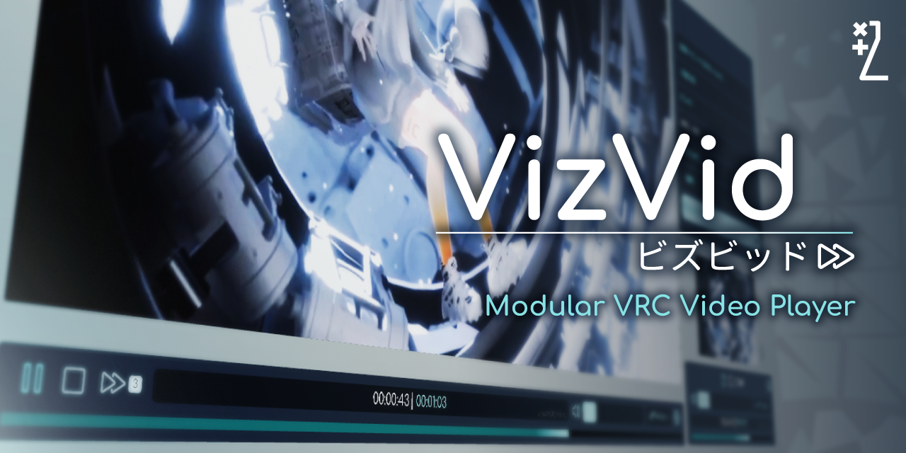

# VizVid



Welcome! VizVid is a general-purpose video player frontend for use in VRChat. It aims to cover many use cases, from watch-together video/live stream player in lounges, to large event venue for music performances, or even booths for exhibitions or showcases. Due to its target customers, it has a flexible architecture, just like a factory made electronic but with a easy to open back lid, make it easier to let users mess them around for their needs.

## Features
- Basic playback, seeking controls
- Pre-defined playlists & user queue list
- Playback history for user inputed URLs (since v1.0.32)
- Quest (Android) client specific URLs (only available on pre-defined URLs, play lists and API)
- PNG/JPEG Image Viewer (since v1.0.37)
- Low latency mode, (tested with RTSP/RTMP streams)
- Playback speed adjustment (since v1.1.0)
- Smart request handling, debounces switch video requests to avoid rate limit errors (since v1.1.0)
- Local mode (toggleable syncing with other users within instance before uploading)
- Modulized screen, audio & UI architecture, support multiple instances
- Both on-screen & separated interfaces available
- Optional extra alternative URL input for supporting cross-platform users (since v1.3.0)
- (Almost) one-click to change interface colors
- Supports both legacy UI and TextMeshPro setup (since v1.0.32)
- Local pickupable & scaleable screen
- Wrist band (VR) / keyboard (desktop) resync button & volume controls
- Auto plays when local user steps into specific region
- Auto fades out background music when video is playing
- Dedicated component assigns random stream link per-instance/user (since v1.3.0)
- Custom shader with various display modes built-in (Stretch, Contain, Cover, Stereographic Video Source), can be configurated on material options
- Luminance adjustment for screens using built-in materials (sice v1.1.0)
- Localization system with auto language detection (English, Chinese, Japanese & Korean)
- Locked UI with [Udon Auth](https://xtl.booth.pm/items/3826907).
- Basic [Audio Link](https://github.com/llealloo/vrc-udon-audio-link) support, which will auto switch audio source when playing, also reports player state (playback progress, volume, loop, shuffle, etc.) on newer version (1.0.0+).
- Basic [LTCGI](https://ltcgi.dev/) integration, provided CustomRenderTexture for use.
- Bundled a modified version of [YTTL](https://65536.booth.pm/items/4588619) to display video title from known sources.
- Dedicated updater for [VRC Light Volumes](https://github.com/REDSIM/VRCLightVolumes).
- Simple API for [your own udons] integration.
- Privacy first - We guarantee we do not include features that requires dedicated server to work; Also, features requires external resources are not opt-in by default.

## Demo
Please visit the [official demo world](https://vrchat.com/home/world/wrld_7239d09c-7b25-43a5-8ccd-502d986b016a)!

## Documentation
- [English Manual](https://xtlcdn.github.io/VizVid/docs/)
- [日本語マニュアル](https://xtlcdn.github.io/VizVid/docs/index_ja.html)
- [中文說明文件](https://xtlcdn.github.io/VizVid/docs/index_zh.html)
- [API References](https://xtlcdn.github.io/VizVid/api/Global.html)

## Installation
You may use following methods:

- Via VCC (Recommend):
  1. Ensure you have installed VRChat Creator Companion, if not, [download here](https://vrchat.com/download/vcc).
  2. Go to [my package listings landing page](https://xtlcdn.github.io/vpm/), click "Add to VCC" button under the banner and follow instructions.
  3. You can then go to "Manage Project" of your own world project, click on the "+" button to add the player component.
  4. Enjoy!
- Via Command Line:  
  Alternatively, instead of VCC, if you are an advanced geek like to use command line, you may use a tool called [`vrc-get`](https://github.com/vrc-get/vrc-get):
  ```powershell
  cd path/to/your/world/project/folder
  vrc-get repo add https://xtlcdn.github.io/vpm/index.json
  vrc-get install idv.jlchntoz.vvmw
  ```
- Via Booth: [Click here](https://xtl.booth.pm/items/5056077).
- Via GitHub Releases: [Click here](https://github.com/JLChnToZ/VVMW/releases/latest).

## Issues
For any issues, please contact me on [Discord server](https://discord.gg/fkDueQMbj8) or [file an issue on GitHub](https://github.com/JLChnToZ/VVMW/issues/new) if you believe there is a bug.

## Credits
- **Vistanz** ([@JLChnToZ](https://x.com/JLChnToZ)) - Programming
- **山の豚** ([@yama_buta](https://x.com/yama_buta)) - Art

## Special Thanks
- **LR163** & **Cross** - Make this Project Happens, Early Tester
- **HsiaoTzuOWO** - Early Tester
- **Yan-K** - UI / UX Consultant
- **六森** - Advertisement Materials, Demo World
- **水鳥 Waterbird** - Naming, Japanese Documentation Proofreading
- **Kuriko** - Assisted Documentations, Assisted Japanese / Traditional Chinese Localization
- **奈良阪 Narazaka** - Assisted Japanese Localization
- **Sonic853** - Assisted Simplified Chinese Localization
- **Krislyz** - Assisted Hebrew Localization
- **JustTemTem** & **Meiji** - Assisted Thai Localization
- **はるる早苗 HaruruSanae** - Assisted Japanese Documentation
- **[All Other GitHub Contributors](https://github.com/JLChnToZ/VVMW/graphs/contributors)**

## License
[MIT](./Packages/idv.jlchntoz.vvmw/LICENSE)

> [!IMPORTANT]
> **This project is licensed under the MIT License — it is NOT public domain, and it is NOT CC0.**
> 
> You are very welcome to use, modify, and redistribute this code in your own projects, including commercial ones. However, the MIT License **requires** that the copyright notice and license text be retained in all copies **or substantial portions** of the Software.
> 
> Please note:
> 
> - **"Substantial portion" is not limited to large blocks of code.** A distinctive function, a non-trivial algorithm, or a creative implementation can qualify — even if it's short.
> - **Cosmetic changes do not remove the obligation.** Renaming variables, reformatting, or mechanically refactoring a copied portion does not make it your own work. If the expression is derived from this project, attribution is required.
> - **Reimplementing an idea from scratch is fine.** Copyright protects expression, not ideas or algorithms. If you read this code, understand the concept, and write your own implementation independently, you owe nothing — though a mention is always appreciated.
> 
> To comply, please include at minimum:
> 
> - The original copyright notice (`Copyright (c) [year] [author]`)
> - A copy of the MIT License text
> - A reasonable indication of the source (e.g., a link to this repository)
> 
> Honest users have nothing to worry about — adding a few lines to your `LICENSE`, `NOTICE`, or `README` is all it takes.
> 
> **However, be aware:** the MIT License's permission is **conditional on compliance**. Copy a substantial portion without attribution, and your use falls outside the license — leaving plain, unlicensed copying under copyright law. No grace period, no prior warning, no revocation needed: the permission simply never extended to that use. All remedies under copyright law are reserved.
> 
> Thank you for respecting the work of open-source authors.
> 
> ---
> 
> **本プロジェクトは MIT ライセンスの下で公開されています。パブリックドメインでも CC0 でもありません。**
> 
> 本コードを商用・非商用問わず、ご自身のプロジェクトで自由に使用・改変・再配布していただくことは大歓迎です。ただし MIT ライセンスは、ソフトウェアの全体または**実質的な一部(substantial portion)**を複製・再配布する際に、**著作権表示およびライセンス全文を保持すること**を**義務付けています**。
> 
> ご注意ください:
> 
> - **「実質的な一部」は、大量のコードに限られません。** 特徴的な関数、非自明なアルゴリズム、創作性のある実装などは、たとえ行数が少なくても該当しうるものです。
> - **表面的な改変では義務を免れません。** 変数名の変更、整形、機械的なリファクタリングを施しても、コピー元の表現に依拠している限り「自作」にはなりません。本プロジェクトの表現に由来する部分には、帰属表示が必要です。
> - **アイデアを理解して自力で書き直すのは問題ありません。** 著作権が保護するのは「表現」であって「アイデア」や「アルゴリズム」そのものではありません。本コードを読んで理解し、独立して自分で実装し直したのであれば、義務は発生しません（ひとこと言及していただけると嬉しいですが）。
> 
> 特に、MIT ライセンスを「自由に使ってよい」「クレジット不要」と誤解されているケースが散見されますが、**それは誤りです**。「無償で使える」ことと「無断で使える」ことは別物です。
> 
> 遵守のため、最低限以下を明記してください：
> 
> - 元の著作権表示（`Copyright (c) [年] [著作者名]`）
> - MIT ライセンス全文の同梱
> - 出典の明示（本リポジトリへのリンク等）
> 
> 良識あるご利用者の方には難しいことは何もありません。`LICENSE`・`NOTICE`・`README` のいずれかに数行追記するだけです。
> 
> **ただし、ご承知おきください。** MIT ライセンスによる許諾は、**本規定の遵守を条件として成立します**。実質的な一部を帰属表示なく複製した時点で、その利用はライセンスの範囲外となり、残るのは単なる**無許諾複製=著作権侵害**です。猶予期間・事前警告・許諾取消通知のいずれも必要ありません — その利用には最初から許諾が及んでいないからです。著作権法上のあらゆる救済手段を留保します。
> 
> オープンソース作者の労力に敬意を払っていただき、ありがとうございます。

## Changelog
[Click here](./CHANGELOG.md)

***

Made with :heart: in :hong_kong: :taiwan:.