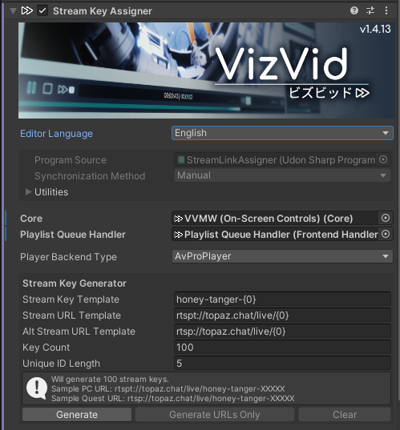
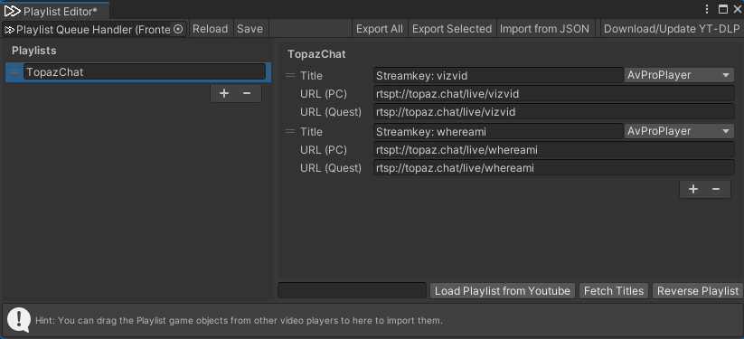
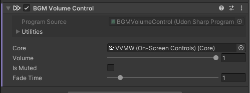
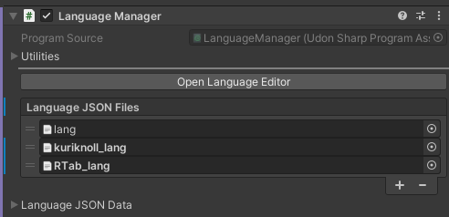
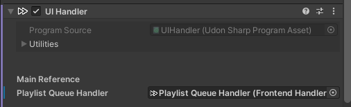
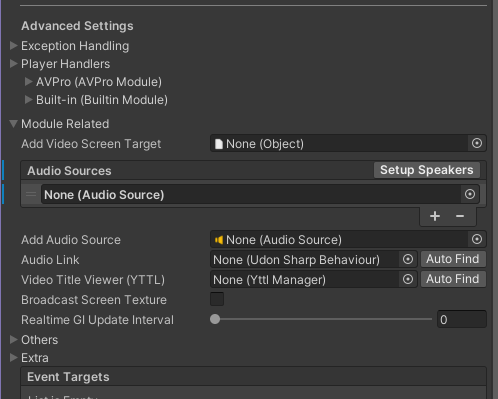
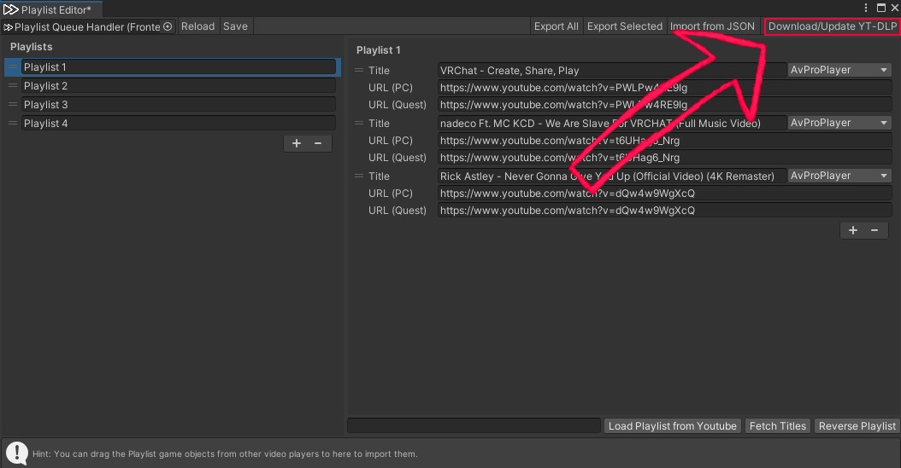
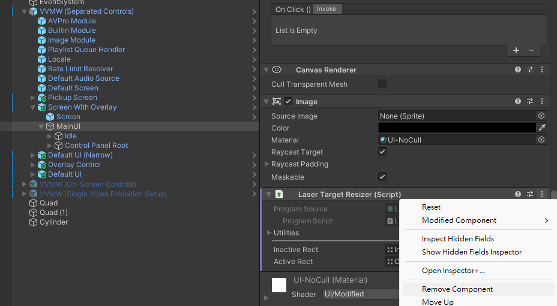

# VizVid Documentation  

VizVid is a versatile multimedia player frontend designed specifically for VRChat. Whether you are watching videos with friends, hosting music performances, or setting up a gallery exhibition, VizVid provides a robust solution for any scenario.  

Built with a modular design, VizVid allows you to pick and choose the exact components you need to build a custom player tailored to your world.  

> [!NOTE]  
> This documentation covers version v1.4.13 and later. Some features or instructions may differ in older versions.  

---
## Quick Start  
### How to Add VizVid into Your World  
1. Right-click on the hierarchy.  
  
2. Find VizVid in the menu.  
3. Choose the player preset you want to add.  
  

#### Common Presets  
General-purpose presets for most uses.  
* **On-Screen Controls**  
The simplest version — controllers embedded on the screen. No extra spaces needed.  
  
* **Separated Controls**  
Controller and playlist panels can be placed independently if you didn't prefer touchscreen-like controlls.  
  

#### Exhibition Presets  
Designed for exhibition use. VizVid runs in local mode. Includes a proximity-based autoplay feature.  
* **For Single Video Exhibition**  
Designed to play a single video with playlist module disabled.  
* **For Multiple Video Exhibition**  
Designed to play multiple videos and supports playlists.  

---
### Recommended Settings  
#### Enable Playback Speed Control  
This feature depends on AVPro Stub.  
Follow the steps on the image below to install it.  
  

#### Enable YTTL  
Support showing video titles for YouTube videos.  
Follow the steps on the image below to install it.  
  

#### Migrate to Text Mesh Pro
Using Text Mesh Pro will make fonts on VizVid even clearer.  
Select all VizVid prefabs in hierarchy.  
And follow the steps on the image below to migrate.  

---
### Editing Playlists  
Here's the detailed guide for playlist editor.  
  

* **Left-side playlist column**  
    * Click <kbd>＋</kbd> or <kbd>ー</kbd> to add / remove playlists.  
    * You can store multiple playlists. Drag on the left <kbd>＝</kbd> icon to reorder playlists.  
* **Right-side playlist contents**  
    * Click <kbd>＋</kbd> or <kbd>ー</kbd> to add / remove contents.  
    * Titles can be set manually, or after entering a YouTube URL, use the <kbd>Fetch Titles</kbd> 
    below to auto-fill the title.  
    * Enter a PC URL, the Quest URL will be auto-filled.  
URL (PC) and URL (Quest) let you set different URLs for different platforms (useful for live streams).  
    * Choose a different backend depending on media type; `AVProPlayer` is set by default.  
    * Drag on the left <kbd>＝</kbd> icon to reorder contents.  
* **Top toolbar**  
    * <kbd>Reload</kbd>: Restore the last saved playlist.  
    * <kbd>Save</kbd>: Save the current playlist to the player.  
    * <kbd>Export All</kbd>: Export all playlists to a JSON file.  
    * <kbd>Export Selected</kbd>: Export the currently selected playlist to a JSON file.  
    * <kbd>Load from JSON</kbd>: Import an external JSON playlist.  
    * <kbd>Download/Update YT-DLP</kbd>: Install or update yt-dlp (for fetching video titles).  
* **Bottom toolbar**  
    * <kbd>Load Playlist from YouTube</kbd>: Paste a YouTube playlist URL into the left column to import it into the current playlist. Supports Public and Unlisted playlists (accessible via link); Private playlists are not supported.  
    * <kbd>Fetch Titles</kbd>: Read a YouTube link and automatically fill in the title.  
    * <kbd>Reverse Playlist</kbd>: Reverse the order of the playlist.  

---

## Modules  
Beyond the standard templates, VizVid provides various modules that can be mixed and matched.  

### Key Concepts  
Before proceeding, distinguish between these two terms first:  

1. **Prefab**  
The objects visible in your **Hierarchy**. These are pre-configured containers of components.  
  
2. **Component**  
The scripts visible in the **Inspector**. These are the functional building blocks of VizVid.  
  

### Prefabs  

Right-click in the Hierarchy and navigate to `VizVid > Modules` to find these prefabs:  

* **VizVid Core**  
The "Brain" of VizVid.  
Every independent player instance requires one **Core**.  
By default, it includes the prefabs in the follow:  
    * AVPro Module  
    * Builtin Modile  
    * Image Module  
    * Playlist Queue Handler  
    * Locale  
    * Rate Limit Resolver  
    * Dafault Audio Source  

---
* **On-Screen Controls with Screen**  
A touchscreen-style controller bundled with a screen object.  
* **Separated Controls**  
A standalone controller that can be placed anywhere without video screen.  
* **Separated Controls (Narrow)**  
A compact version for tight spaces.  
* **Separated Controls (with Alt. URL Input, Narrow)**  
Compact controller with support for entering alternative URLs on mobile platforms.  
* **Overlay Controls**  
A HUD controller providing extra control for both Desktop and VR users.  

---
* **Pickupable Screen**  
A portable screen that can be moved and resized. It is set to **Local** by default (other users won't see your personal screen).  
* **Screen**  
A standard screen object that can be placed independently from the controls.  

---
* **Resync Button**  
A standalone button to force synchronization. Highly recommended for live events.  
* **Stream Key Assigner**  
Automatically generates stream keys for services like TopazChat. Useful for music events.  
> [!Note]  
> See [Stream Key Assigner](#streamkeyassigner) for more details.  

---
* **Audio Source (Mono)**  
Add a mono audio source for VizVid.  
* **Audio Source (Stereo)**  
Add a stereo audio source set for VizVid.  
* **Audio Source (5.1 Surround)**  
Add a 5.1 sorround audio source set for VizVid.  
*(See [5.1 Surround Configuration](#51-Surround-Configuration) for setup details).*  

---
* **Auto Play on Near (Local Only)**  
Triggers a default video when a user approaches and stops it when they leave. Ideal for exhibition booths.  

---

### Components  

> [!Note]  
> This section covers settings relevant to most users.  
> For advanced usage, go check [OtherScenarios](#Other-Scenarios), [Q&A](#QampA), or [join our Discord server](https://discord.gg/fkDueQMbj8).  

#### **Core**  

This component manages VizVid's playback logic.  
*(Note: Some options only appear when a `Frontend Handler` is specified).*
* **Common Settings**  
    * **Edit Playlists...**  
Opens the playlist editor window. You can create, edit, and import playlists.  
For detailed usage, ckeck on [Editing Playlists](#editing-playlists).  
    * **Enable Queue List**  
When enabled, URLs you input can be queued into the queue list.  
    * **History Size**  
Set how many playback URLs are stored in history. Set `0` to disable it.  
*Note: Contents played from playlists will not be recorded in history.*  

* **Default Behavior**  
Adjust VizVid's default values for this world.  
    * **Auto Play on Join**  
Auto play the default playlist when the first player joined the world.  
    * **Auto Play Delay**  
If there are no other video players besides VizVid in the world, you don't need adjust this.  
    * **Auto Play on Idle**  
If the current playlist finishes, VizVid will continue play the default playlist.  
    * **Default Playlist**  
Choose a playlist to use as the default from your saved playlists.  
    * **Default Volume**  
The default volume level for players when they join the world.  
    * **Default Muted**  
VizVid's volume are muted by default when players join the world.  
    * **Default Repeat Mode**  
Choose from: None, Repeat One, Repeat All.  
    * **Default Shuffle**  
Shuffle is enable by default when players join the world.  
    * **Seed Random Before Shuffle**  
Regenerate random seed for shuffle playback when VizVid plays a playlist.  

* **Advanced Settings**  
    * **Exception Handling**  
        * **Total Retry Count**  
        The maximum number of retry attempts when loading fails.  
        * **Retry Delay**  
        The interval time between retries when loading fails.  
        * **Time Drift Detect Threshold**  
        Detects playback latency between all users.  
        Playback progress will be auto-adjust if the threshold is exceeded.  

* **Player Handlers**  
Manages the backends connected to VizVid.  
AVPro, Builtin, and Image are provided by default.  
* **Module Related**  
Manages the module's specifications on VizVid.  
    * **Video Screen Target**  
Specifies the screen object containing the `Screen Configurator` component.  
    * **Audio Sources**  
Specifies the `Audio Source` for VizVid’s sound output.  
Multiple Audio Sources can be specified for multi-channel setups.  
    * **Audio Link**  
Specifies the `AudioLink` component.  
If you already had AudioLink in the project, you can click <kbd>Auto Find</kbd> to specify.  
    * **Video Title Viewer (YTTL)**  
Specifies the `YTTL Manager` component.  
    * **Broadcast Screen Texture**  
Enables broadcast screen textures, allowing supported shaders (e.g., [Poiyomi](https://www.poiyomi.com/color-and-normals/decals#video-texture)) to display VizVid's video signals.  
    * **Realtime GI Update Interval**  
The update interval for Realtime Global Illumination. Set to `0` to disable.  
* **Others**  
    * **URL Input Filter**  
URL filtering settings.  
Implementation can be based on inheritance by referring to this [Udon Script](https://github.com/JLChnToZ/VVMW/blob/develop/Packages/idv.jlchntoz.vvmw/Runtime/VVMW/InputFilterBase.cs).  
    * **Global Default Texture**  
The texture displayed by default on all screens when VizVid has no video content.  
This can be changed individually in each `Screen Configurator`.  
    * **Synced**  
Sets whether VizVid operates globally. Enabled by default.  
    * **Enable Persistence**  
Sets whether to save VizVid settings (such as volume). Enabled by default.  
* **Extra Features**  
    * **Locked**  
Locks the player by default. You can configure this by writing a [compatible script](../api/JLChnToZ.VRC.VVMW.FrontendHandler.html?q=locked#JLChnToZ_VRC_VVMW_FrontendHandler_Locked) or purchasing [Udon Auth](https://xtl.booth.pm/items/3826907).  
* **Event Targets**  
Sends event data to Udon Sharp scripts set here to integrate custom scripts.  

#### Frontend Handler  
This component manages playlists and VizVid's default behavior.  

The options for this component are integrated into the `Core` component.  
Please refer to the [Core](#Core) section.  

#### **UI Handler**  
This component manages VizVid’s UI element's specification.  

* **Main References**  
    * **Core Handler**  
    Responsible for connecting to the `Core` component.  
If the reference is missing, you can click <kbd>Auto Find</kbd> to link it to the `Core` component in the scene.  
    * **Playlist Handler**  
    Responsible for connecting to the `Playlist Queue Handler` component.  
    If the reference is missing, you can click <kbd>Auto Find</kbd> to link it to the `Playlist Queue Handler` component in the scene.  

#### Color Config  

This component manages UI color and usually appears alongside the `UI Handler`.  

* **Color Palette**  
Provides six default colors that can be assigned to different UI parts of VizVid.  
* **Apply on Build**  
Enabled by default. The currently modified colors will be applied automatically when Unity builds the scene.  
* **Apply**  
Allows you to apply colors to only the current `Color Config` component, or to all `Color Config` components in the scene.  

#### Screen Configurator  

This component is made for linking the video screen output to a specified shader.  

* **Core Handler**  
Specifies the linked VizVid core.  
If it displays "None (Core)", you can click <kbd>Auto Find</kbd> to specify the VizVid core in the scene.  
* **Screen Renderer**  
Specifies the Mesh Renderer where the video content will be output.  

---
## Other Scenarios  
### Import　Playlist from Other Video Players  
Just drag video player's object, drop in VizVid's playlist editor.  
Supported video players in the following:  
* VizVid  
* USharp Video  
* Yama Player  
* KineL Video Player  
* iwaSync 3  
* JT Playlist  
* ProTV by ArchiTech  
* VideoTXL  

### Lighting & Visuals  
#### LTCGI  
1. Refer to the [LTCGI Documentation](https://ltcgi.dev/Getting%20Started/Setup/Controller) and place the LTCGI Controller into your scene.  
2. In the LTCGI Inspector, an "Auto-Configure XXX" button will automatically appear.  
3. Confirm that "XXX" is your VizVid Core, then click the button to allow LTCGI to receive the video signal from VizVid.  

> [!Note]  
> LTCGI requires the use of supported shaders to display effects correctly.  
> Refer to [this documentation](https://ltcgi.dev/Getting%20Started/Installation/Compatible_Shaders) to select a suitable shader.  

#### VRC Light Volume (VRCLV)  

1. In the Hierarchy, right-click the VizVid screen object  
2. Follow the settings shown in the attached image to enable VRC Light Volume for VizVid:  
  

> [!Note]  
> Please note that VRC Light Volume requires the use of supported shaders to display effects correctly.  

### Audio/Video Streaming  

Many performance-based events uses external RTMP/RTSP services for low-latency stream into VRChat.  
VizVid provides 3 methods in the following of stream URLs for performers and users.  
Let's use [TopazChat](https://github.com/TopazChat/TopazChat) as an example.  

#### Stream Key Assigner  

Automatically generates and applies stream keys for streaming services.  
  
* **Core Handler**  
    Responsible for connecting to the `Core` component.  
If the reference is missing, you can click <kbd>Auto Find</kbd> to link it to the `Core` component in the scene.  
* **Playlist Queue Handler**  
    Responsible for connecting to the `Playlist Queue Handler` component.  
    If the reference is missing, you can click <kbd>Auto Find</kbd> to link it to the `Playlist Queue Handler` component in the scene.  
* **Player Backend Type**  
Select the designated player backend. Streaming events typically use `AvProPlayer`.  
* **Stream Key Template**  
The format of the stream key. This can be modified as needed.  
* **Stream URL Template**  
The primary stream URL. Defaults to the TopazChat service and can be changed as needed.  
* **Alt. Stream URL Template**  
Alternative link for mobile platforms.  
Defaults to the TopazChat service; please use the same server as the URL above.  
> [!Note]  
> `{0}` represents the unique ID for stream key; please ensure it is kept in the template.  
* **Key Count**  
The number of keys to be generated.  
* **Unique ID Length**  
The number of characters for the generated keys.  

#### Separated Controls (with Alt. URL Input, Narrow)  

Allows manual input of the stream URL and an alternative mobile platform URL directly within VRChat.  
Reference image below:  
  

#### Playlist Editing  

Stream using a fixed stream key via the playlist.  
Configuration reference image below:  
  

### Audio  

#### BGM Volume Control  

If your world has background music or ambient sounds, you can add this component to allow VizVid to automatically mute these Audio Sources when media content is playing. They will be unmuted when playback stops.  

1. Select the Audio Source you want to auto-mute.  
2. In the Inspector, add the `BGM Volume Control` component.  
3. Specify the core to be used.  
  
4. Done!  

#### 5.1 Surround Configuration  

VRChat's AVPro backend supports 5.1 surround sound output within VRChat.  
This is commonly used in cinema scenes or similar environments.  
After adding `Audio Source (5.1 Surround)` via the menu, it will automatically link to VizVid.  
Finally, adjust the positions of the Audio Sources as needed.  
  

### Reversing Playlist Order  

If you prefer not to use VizVid’s default reverse-order (descending) playlist, you can change it using the following method:  

1. Locate the `Scroll View` prefab in your project at this path:  
`Packages > VizVid > Prefabs > UI Elements`  
2. Double-click the prefab to edit it.  
3. In the Inspector on the right, find the `Pooled Scroll View` component.  
4. Uncheck `Inverse Order` and save the prefab.  
  
5. Done!  

> [!Note]  
> This operation sets the order for all playlists at once. To configure a specific playlist individually, locate the corresponding prefab instance within the Hierarchy UI objects and modify it there.  

### Locale  

**Language Manager** is located under the **Locale** object to manage locales.  
It also supports Text Mesh Pro UI elements outside of VizVid.  

1. In the Language Manager, refer to the JSON format to add a custom JSON file, edit the Language Keys, and enter the corresponding translations.  
2. Add the `Language Receiver` component to the Text Mesh Pro UI object you want to translate.  
3. Enter the corresponding Language Key.  
4. Done.  

> [!Tip]  
> Language Manager can operate without VizVid. You can remove related objects (including the Core) if you don't need VizVid.  
> Keep the language menu, you can still switching between languages.  

> [!Note]  
> Language Manager supports importing multiple JSON files. If you are concerned about overwriting VizVid's built-in JSON lists, you can create a separate JSON and import it into this component.  
>   

### API Reference  

Please refer to [this page](../api/Global.html) to link custom functions to VizVid.  

---
## Q&A  

(Continuously Updated)  

---
**Q1**: I configured LTCGI according to the instructions, but it didn't work.  
**A1**: Your screen shader is likely not provided by VizVid. Please [manually add an LTCGI Screen](https://ltcgi.dev/Getting%20Started/Setup/LTCGI_Screen) component.  

---
**Q2**: I changed the default volume for VizVid, but it doesn't seem to reflect in VRChat?  
**A2**: VRChat will use user's data first if they visited the world when `Enable Persistence` is checked in the VizVid Core.  
To reset this and apply new default values, users must reset their data for that world in VRChat.  
  

---
**Q3**: I can't find `Core` option in some components.  
  
**A3**: Remove the `Playlist Queue Handler` object for once from the reference field, and the `Core` option will appear.  
Due to the limitations of Unity's inspector editor, if the component has already found the `Playlist Queue Handler`, the `Core` option will be hidden by default.  

---
**Q4**: No video, sound during playback  
**A4**: Make sure your screen, audio source objects are specified in your `Core` component.  
  

---
**Q5**: It's feels buggy when fetching YouTube related contents. (Title, Playlist, etc.)  
**A5**: Maybe you've got an outdated YT-DLP. Click on <kbd>Download/Update YT-DLP</kbd> might fix it.  

---
**Q6**: I want VizVid's touchscreen have respond wherever my laser/cursor pointed to it.  
**A6**: Follow the image below, remove the `Laser Target Resizer` component.

---
> [!Note]  
> If this section didn't solve your problem.  
> Just [join our Discord server](https://discord.gg/fkDueQMbj8) look for help.  