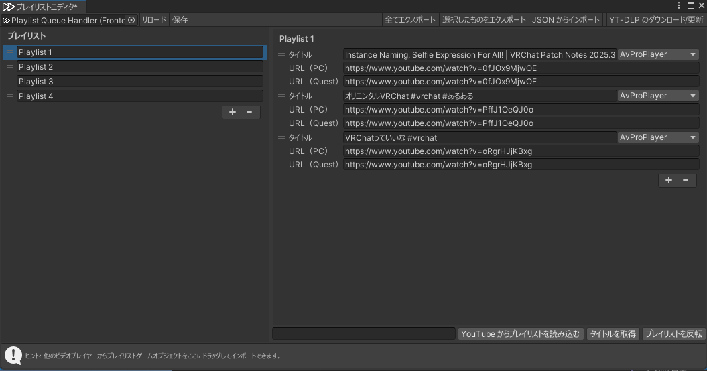
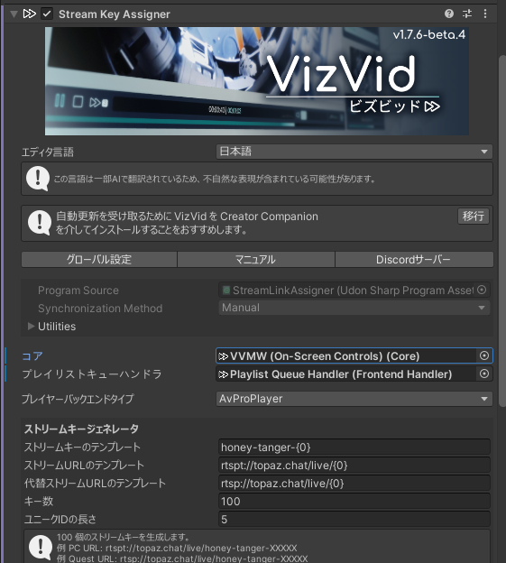
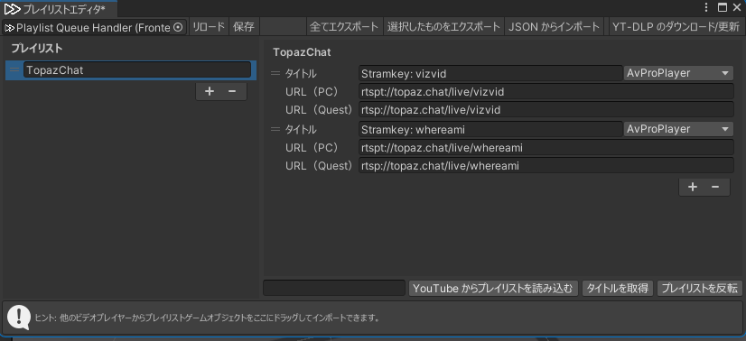
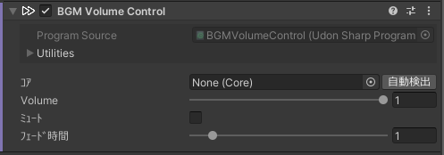
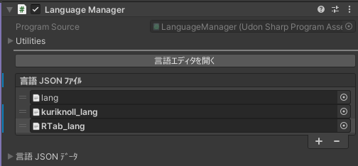
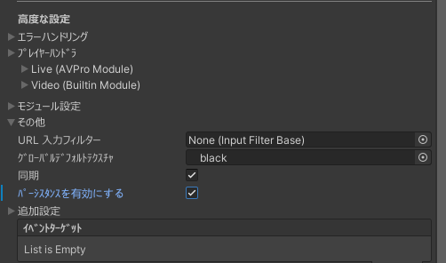
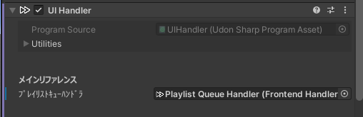
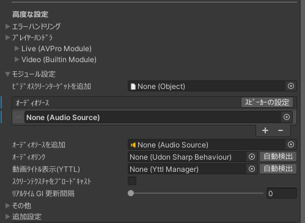

# VizVid マニュアル  
VizVid は、VRChat 向けに設計された多機能なビデオプレイヤー・フロントエンドです。みんなと動画鑑賞やライブ配信の視聴はもちろん、音楽イベントの会場や展示会など、幅広いシーンで活用できます。  
VizVid はモジュール化設計を採用しており、用途に合わせて必要な機能（モジュール）を選択し、自分だけのプレイヤーを簡単に構築することが可能です。  

> [!NOTE]  
> 本マニュアルは v1.4.13 以降のバージョンに対応しています。旧バージョンとは一部仕様が異なる場合がありますのでご注意ください。  

---

## クイックスタート  
### VizVid の導入方法  
1. ヒエラルキーウィンドウの空白部分を右クリックします。  
  
2. 表示されたメニューから `VizVid` を探します。  
3. 追加したいプレイヤーのプリセットを選択します。  
  

#### よく使うプリセット  
汎用性の高い VizVid です。  
* **On-Screen Controls**  
最もシンプルなプリセット。コントローラーがスクリーンに内蔵されます。  
  
* **Separated Controls**  
他のビデオプレーヤーによく使う形式。コントローラーとスクリーンの配置が自由に調整することができます。  
  

### 展示会用プリセット  
展示会仕様になった VizVid です。ローカル動作で、接近すると自動再生します。  
* **For Single Video Exhibition**  
一本の動画を再生します。プレイリスト機能抜き。  
* **For Multiple Video Exhibition**  
複数の動画を再生します。プレイリスト機能付き。  

---
### おすすめ設定  
#### 再生速度制御の有効化  
本機能は AVPro Stub に依存しています。  
下記の画像に参考し、設定を行ってください。  

#### YTTL の有効化  
YouTube 動画を再生する場合、動画タイトルを表示させる機能です。  
下記の画像に参考し、設定を行ってください。  
  

#### Text Mesh Pro への移行  
Text Mesh Pro に移行すると、よりきれいなテキストの表示ができます。  
VizVid 関連のプレハブを選択し、  
下記の画像に参考し、設定を行ってください。  
  

---
### プレイリストの編集  
以下ではプレイリスト編集画面の各機能を説明します。  
  

* **左側のプレイリスト**  
    * <kbd>＋</kbd> または <kbd>ー</kbd> を押してプレイリストを追加 / 削除します。  
    * 複数のプレイリストを格納できます。左側の <kbd>＝</kbd> を押しながらドラッグして順序を変更できます。  
* **右側のリスト内容**  
    * <kbd>＋</kbd> または <kbd>ー</kbd> を押してメディアリンクを追加 / 削除します。  
    * タイトルは自由に設定できます。YouTube の URL を入力して、下の <kbd>タイトルを取得</kbd> 機能を使うと自動で入力されます。  
    * PC 用の URL を入力すると、Quest 用の URL が自動で埋められます。URL (PC)、URL (Quest) はプラットフォームごとに別の URL を設定できます（ライブ向けの機能）。  
    * タイトル右側に、バックエンドを選択できます。デフォルトは `AVProPlayer` です。URLコンテンツに応じて、調整してください。  
    * タイトル左側の <kbd>＝</kbd> を押しながらドラッグしてメディアの順序を変更できます。  
* **上部ツールバー**  
    * <kbd>リロード</kbd>：前回保存したプレイリストを読み込みます。  
    * <kbd>保存</kbd>：現在のプレイリストを VizVid に保存します。  
    * <kbd>全てエクスポート</kbd>：すべてのプレイリストを JSON ファイルにエクスポートします。  
    * <kbd>選択したものをエクスポート</kbd>：現在選択しているプレイリストを JSON ファイルにエクスポートします。  
    * <kbd>JSON からインポート</kbd>：外部の JSON プレイリストをインポートできます。  
    * <kbd>YT-DLP のダウンロード/更新</kbd>：yt-dlp（タイトル取得用ツール）をインストール、更新します。  
* **下部ツールバー**  
    * <kbd>YouTube からプレイリストを読み込む</kbd>：左側の欄に YouTube プレイリストの URL を入力すると、現在のプレイリストにインポートできます。公開リストおよび非公開リストのみ対応し、プライベートリストは対応しません。  
    * <kbd>タイトルを取得</kbd>：YouTube のリンクを読み取り、自動でタイトルを入力します。  
    * <kbd>プレイリストを反転</kbd>：プレイリストの順序を反転します。  

---
## モジュール  
VizVid では、前述の基本プリセット以外にも、多種多様なモジュールを自由に組み合わせて自分好みのプレイヤーを構築できます。  
このセクションでは、各モジュールの概要について解説します。  

### はじめに  
解説にあたって、まず以下の 2 つの概念を整理しておきましょう。  
1. **プレハブ (Prefab)**  
ヒエラルキー (Hierarchy) に配置される、設定済みのコンポーネントを含むオブジェクト。  
  
2. **コンポーネント (Component)**  
インスペクター (Inspector) 上に表示される、VizVid を構成するの基本。  
  

### プレハブ  
ヒエラルキーの右クリックメニューに、`VizVid > Modules` を開くと、VizVid で使用可能なモジュール用プレハブが表示されます。  
各プレハブの機能は以下の通りです。  

* **VizVid Core**  
VizVid の頭脳となるモジュールです。  
個々の VizVid が正常に動作するためには、必ず 1 つの `Core` コンポーネントが必要です。  
デフォルトの Core プレハブには、以下の内容が含まれています：  
    * AVPro Module  
    * Builtin Module  
    * Image Module  
    * Playlist Queue Handler  
    * Locale  
    * Rate Limit Resolver  
    * Default Audio Source  

---
* **On-Screen Controls with Screen**  
タッチパネル式コントローラーです。  
このプレハブにはスクリーンオブジェクトが含まれています。  
* **Separated Controls**  
独立型コントローラーです。  
スクリーンと離れた場所に配置できます。  
* **Separated Controls (Narrow)**  
省スペースに適した、スリム版の独立型コントローラーです。  
* **Separated Controls (with Alt. URL Input, Narrow)**  
モバイルプラットフォーム向けの代替 URL 入力に対応した、スリム版の独立型コントローラーです。  
* **Overlay Controls**  
ユーザーに追従するタイプのコントローラーです。  
デスクトップモードやVRモードにおいて、手元での操作を可能にします。  

---
* **Pickupable Screen**  
手に持って移動させることができるスクリーンです。
必要に応じて自由にサイズを変更できます。  
デフォルトではローカル設定となっており、他のユーザーからは自分が見ているスクリーンは見えません。  
* **Screen**  
VizVid 用のスクリーンです。  
コントローラーとは別の場所に配置できます。  

---
* **Resync Button**  
独立した「Re-Sync（再同期）」ボタンです。  
主に音楽イベントやパフォーマンス会場などで利用されます。  
* **Stream Key Assigner**  
ストリームキーを自動生成、発行します。  
TopazChat などのストリーミングサービスの設定が可能です。  
主に音楽イベントやパフォーマンス会場などで利用されます。  
> [!Note]  
> 活用方法については、[Stream Key Assigner](#streamkeyassigner) を参照してください。  

---
* **Audio Source (Mono)**  
VizVid 用のモノラル Audio Source を追加します。  
* **Audio Source (Stereo)**  
VizVid 用のステレオ Audio Source セットを追加します。  
* **Audio Source (5.1 Surround)**  
VizVid 用の 5.1ch サラウンド Audio Source セットを追加します。  
詳細は [5.1ch サラウンド構成](#51ch-サラウンド構成)を参照してください。  

---
* **Auto Play on Near (Local Only)**  
ユーザーが近づいた際に、あらかじめ設定された動画を自動再生し、離れると自動停止します。  
展示会向けワールドに適した機能です。  
（この機能はローカルモードのみ対応しています。）  

---
### コンポーネント  
> [!note]  
> このセクションでは、主に一般ユーザー向けの機能を記載しています。  
> 記載されていないものや不明な点がある場合は、  
> [その他の応用](#その他の応用)、[Q&A](#QampA) を参照するか、[Discord サーバー](https://discord.gg/fkDueQMbj8)にてお問い合わせください。  

#### **Core**  
このコンポーネントは VizVid の「核」であり、すべての再生制御を行います。  
> [!Note]  
> `Frontend Handler` コンポーネントとの紐付けが解除される場合、一部のオプションは表示されません。  

* **よく使う設定**  
    * **プレイリストを編集...**  
    プレイリスト編集ウィンドウが表示されます。プレイリストの作成、編集、インポートを行えます。  
    詳しい情報は[プレイリストの編集](#プレイリストの編集)にご参照ください。  
    * **キューリストを有効にする**  
    有効にすると、入力したURLをキューリストに追加されます。  
    * **履歴サイズ**  
    再生した URL を記録する数を調整します。  
    *※プレイリストからの再生は記録されません。*  

* **デフォルト動作**  
VizVid のデフォルト値を設定します。  
    * **Join する時自動再生**  
    プレイヤーが Join する時、デフォルトプレイリストを再生されます。  
    * **自動再生遅延**  
    もしワールド内に、VizVid 以外の動画プレイヤーがなかったら、`0` のままにしておいでください。  
    * **アイドル時に自動再生**  
    現在プレイリストの再生が終了後、デフォルトプレイリストを再生されます。  
    * **デフォルトプレイリスト**  
    作成済みのプレイリストから、デフォルトで再生するものを選択します。  
    * **デフォルト音量**  
    プレイヤーがワールドに Join 時の初期音量を設定します。  
    * **デフォルトミュート**  
    プレイヤーがワールドに Join 時、ミュートを設定します。  
    * **デフォルトのリピートモード**  
    なし、1 曲リピート、全曲リピートから選べます。  
    * **デフォルトでランダム再生**  
    プレーヤーの初期状態でランダム再生を有効にします。  
    * **ランダム再生前シード再生成**  
    プレイリストを再生するたびにシードが再生成し、ランダム性を高めます。  

* **高度な設定**  
    * **エラーハンドリング**  
        * **合計リトライ回数**  
        読み込み失敗時にリトライする上限回数です。  
        * **リトライ遅延**  
        読み込み失敗時のリトライ間隔（秒）です。  
        * **タイムドリフト検知閾値**  
        ユーザー間の再生ズレを検知します。しきい値を超えると自動的に同期が行われます。  
    * **プレイヤーハンドラ**  
    VizVid と紐付けしたバックエンドを管理します。デフォルトでは AVPro、Builtin、Image が提供されています。  
    * **モジュール設定**  
    VizVid と紐付けした各モジュールを管理します。  
        * **ビデオスクリーンターゲット**  
        `Screen Configurator` コンポーネントを持つスクリーンオブジェクトを指定します。  
        * **オーディオソース**  
        VizVid の音声を出力する `Audio Source` を指定します。複数指定してマルチチャネル設定を行うことも可能です。  
        * **オーディオリンク**  
        `Audio Link` コンポーネントを指定します。プロジェクト内に Audio Link がある場合、<kbd>自動検出</kbd> で紐付けが可能です。  
        * **動画タイトル表示(YTTL)**  
        `YTTL Manager` コンポーネントを指定します。  
        * **スクリーンテクスチャのブロードキャスト**  
        画面テクスチャをブロードキャストし、対応するシェーダー（例：[Poiyomi](https://www.poiyomi.com/color-and-normals/decals#video-texture)）で VizVid の映像を表示できるようにします。  
        * **リアルタイム GI 更新間隔**  
        リアルタイム・グローバルイルミネーションの更新間隔です。「0」で無効になります。  
    * **その他 (Others)**  
        * **URL 入力フィルター**  
        URL のフィルタリング設定です。  
        この [Udon スクリプト](https://github.com/JLChnToZ/VVMW/blob/develop/Packages/idv.jlchntoz.vvmw/Runtime/VVMW/InputFilterBase.cs)を参考し、継承での応用が可能です。  
        * **グローバルデフォルトテクスチャ**  
        映像が流れていない時に表示されるデフォルトのマテリアルです。各 `Screen Configurator` ごとに個別に変更することも可能です。  
        * **同期**  
        VizVid をグローバルで動作させるか設定します。デフォルトで有効です。  
        * **パーシスタンスを有効化**  
        VRChat Persistence に通じで、音量などの設定情報を保存します。デフォルトで有効  です。
    * **追加設定**  
        * **ロック**  
        プレイヤーをロックします。    
        [対応スクリプト](../api/JLChnToZ.VRC.VVMW.FrontendHandler.html?q=locked#JLChnToZ_VRC_VVMW_FrontendHandler_Locked)を作成するか、[Udon Auth](https://xtl.booth.pm/items/3826907) を導入することで制御可能です。  
    * **イベントターゲット**  
    ここに指定した Udon Sharp スクリプトにイベントデータを送信し、カスタムスクリプトと連携させることができます。  

#### Frontend Handler  
このコンポーネントは、プレイリストの管理やプレイヤーのデフォルト値を設定します。  
`Core` コンポーネントにこのコンポーネントのオプションが統合されています。  
詳細は [Core](#Core) セクションを参照してください。  

#### **UI Handler**  
このコンポーネントは、プレイヤーの UI 関連オブジェクトとの紐付けを管理します。  

* **メインリファレンス**  
    * **コア**  
    `Core` コンポーネントと紐付けします。  
    `Missing (Core)` になってしまった場合、<kbd>自動検出</kbd> をクリックしてシーン内の `Core` コンポーネントがあるオブジェクトに紐付けられます。  
    * **プレイリストキューハンドラ**  
    `Frontend Handler` コンポーネントと紐付けします。  
    `Missing (Frontend Handler)` になってしまった場合、<kbd>自動検出</kbd> をクリックしてシーン内の `Frontend Handler` コンポーネントがあるオブジェクトに紐付けられます。  

#### Color Config  
このコンポーネントは UI のカラー設定を管理するもので、通常は `UI Handler` とセットで使用されます。  

* **カラーパレット**  
    デフォルトで 6 色のカラー設定が用意されており、VizVid の各部位の色を指定できます。  
* **ビルド時に自動適用**  
    デフォルトで有効です。シーンのビルド時に、現在のカラー設定を自動的に適用します。  
* **適用**  
    現在の `Color Config` コンポーネントのみに適用するか、シーン内の全ての `Color Config` コンポーネントに適用するかを選択できます。  

#### Screen Configurator  
このコンポーネントは、VizVid の映像を紐付けしたテクスチャに送信します。  

* **コア**  
    `Core` コンポーネントと紐付けします。  
    `Missing (Core)`になってしまった場合、<kbd>自動検出</kbd> をクリックしてシーン内の `Core` コンポーネントがあるオブジェクトに紐付けられます。  
* **Screen Renderer**  
    映像を出力したい Mesh Renderer を指定します。  
    
---
## その他の応用  
## 他のビデオプレイヤーのプレイリストの導入  
他のビデオプレイヤーオブジェクトを、プレイリストエディタにドラッグアンドドロップ。  
現在対応するビデオプレイヤー  
* VizVid  
* USharp Video  
* Yama Player  
* KineL Video Player  
* iwaSync 3  
* JT Playlist  
* ProTV by ArchiTech  
* VideoTXL  

### ライティング関連  
#### LTCGI  
1. [LTCGI ドキュメント](https://ltcgi.dev/Getting%20Started/Setup/Controller) を参考に、LTCGI コントローラーをシーン内に配置します。  
2. LTCGI のインスペクターに、「Auto-Configure XXX」というボタンが自動的に表示されます。  
3. 「XXX」が使用している VizVid Core の名称であることを確認し、ボタンをクリックしてください。  
これにより、LTCGI が VizVid の映像信号を受信できるようになります。  

> [!Note]  
> LTCGI の効果を正常に表示させるには、対応したシェーダーを使用する必要があります。  
> [こちらのドキュメント](https://ltcgi.dev/Getting%20Started/Installation/Compatible_Shaders) を参照し、適切なシェーダーを選択してください。  

#### VRC Light Volume (VRCLV)  
1. ヒエラルキー上で VizVid のスクリーンオブジェクトを右クリックします  
2. 画像の通りに設定を行い、VizVid のスクリーンを VRC Light Volume に対応させます：  
  

> [!Note]  
> VRC Light Volume の効果を正常に表示させるには、対応したシェーダーを使用する必要があります。  

### ストリーミング関連  
配信系イベント向け、低遅延ストリーミングを求め、外部 RTMP/RTSP サービスを使う場合はよくあります。  
ここでは [TopazChat](https://github.com/TopazChat/TopazChat) を例に、3 つの方法を挙げて説明します。  

#### Stream Key Assigner  
ストリームキーを生成・発行し、VizVid に適用することができます。  
  
* **コア**  
`Core` コンポーネントと紐付けします。  
`Missing (Core)`になってしまった場合、<kbd>自動検出</kbd> をクリックしてシーン内の `Core` コンポーネントがあるオブジェクトに紐付けられます。  
* **プレイリストキューハンドラ**  
`Frontend Handler` コンポーネントと紐付けします。  
`Missing (Frontend Handler)` になってしまった場合、<kbd>自動検出</kbd> をクリックしてシーン内の `Frontend Handler` コンポーネントがあるオブジェクトに紐付けられます。  
* **プレイヤーバックエンドタイプ**  
使用するプレイヤーのバックエンドを選択します。配信系イベントでは通常 `AvProPlayer` を使用します。  
* **ストリームキーのテンプレート**  
ストリームキーのフォーマットを指定します。必要に応じて内容を変更可能です。  
* **ストリーム URL のテンプレート**  
メインの配信 URL です。デフォルトでは TopazChat のサービスが設定されていますが、自由に変更可能です。  
* **代替ストリーム URL のテンプレート**  
モバイルプラットフォーム向けの代替リンクです。デフォルトでは TopazChat が設定されています。上の URL と同じサーバーを使用するようにしてください。  
> [!Note]  
> `{0}` は生成されたストリームキーのユニーク ID が適用される部分ですので、必ずテンプレートに残しておいてください。  
* **キーの数**  
生成するストリームキーの数です。  
* **ユニーク ID の長さ**  
生成されるユニーク ID の文字数です。  

#### Separated Controls (with Alt. URL Input, Narrow)  
VRChat 内から手動で配信 URL と、モバイルプラットフォーム用の代替 URL を入力することができます。  
イメージは以下の通りです：  
  

#### プレイリスト編集による設定  
プレイリスト機能を利用し、固定のストリームキーを使用して配信を行います。  
設定イメージは以下の通りです：  
  

### オーディオ関連  
#### BGM Volume Control  
ワールド内に BGM や環境音がある場合、このコンポーネントを追加することで、VizVid での再生開始時にそれらの Audio Source を自動的にミュートし、停止時にミュートを解除することができます。  
1. 自動ミュートしたい Audio Source を選択します。  
2. インスペクターで `BGM Volume Control` コンポーネントを追加します。  
3. 使用するプレイヤーの Core を指定します。  
  
4. 設定完了です。  

#### 5.1ch サラウンド構成  
VRChat の AVPro バックエンドを利用することで、5.1ch サラウンド音声を出力できます。  
映画館系ワールドなどでよく利用されます。  
メニューから `Audio Source (5.1 Surround)` を追加すると、自動的に VizVid に紐付けられます。  
必要に応じて各 Audio Source の位置を調整してください。  
  

### プレイリストの並び順を反転させる  
VizVid のプレイリストはデフォルトで逆順になっています。これを変更したい場合は以下の手順を行ってください。  
1. プロジェクト内の以下のパスから `Scroll View` プレハブを探します。  
   `Packages > VizVid > Prefabs > UI Elements`  
2. プレハブをダブルクリックして編集モードに入ります。  
3. 右側のインスペクターで `Pooled Scroll View` コンポーネントを探します。  
4. `Inverse Order` のチェックを外し、プレハブを保存します。  
  
5. 設定完了です。  
> [!Note]  
> この操作はすべてのプレイリストの並び順に適用されます。個別に設定したい場合は、ヒエラルキー上の該当する UI オブジェクト内にあるプレハブから直接変更してください。  

### 多言語対応  
VizVid の言語管理コンポーネントは、Locale オブジェクトにある Language Manager です。  
これは VizVid 以外の Text Mesh Pro UI にも利用可能です。  
1. Language Manager 内で、既存の JSON 形式を参考に新しい JSON ファイルを追加し、Language Key とそれに対応する訳文を作成します。  
2. 翻訳したい Text Mesh Pro UI オブジェクトに `Language Receiver` コンポーネントを追加します。  
3. 対応する Language Key を入力します。  
4. 設定完了です。  
> [!Tip]  
> Language Manager 機能は VizVid 抜きで、独立動作が可能です。  
> 言語切り替えメニューさえ残っていればちゃんと機能します。  

> [!Note]  
> Language Manager は複数の JSON ファイルを読み込むことができます。VizVid 内蔵の JSON を上書きしたくない場合は、別途作成した JSON を追加することをおすすめします。  
  

### API リファレンス  
必要な機能を VizVid と連携させる際は、[こちらのページ](../api/Global.html) (英語) を参照してください。  

---

## Q&A  
（随時更新）  

---
**Q1**: LTCGI を説明通りに設定しましたが、反映されない。  
**A1**: スクリーンのシェーダーが VizVid 提供のものではないが原因かもしれません。  
[LTCGI の手動設定方法](https://ltcgi.dev/Getting%20Started/Setup/LTCGI_Screen) (英語) を参考し、手動で LTCGI スクリーンを追加してください。  

---
**Q2**: VizVid のデフォルト音量を変更したが、VRChat 内で反映されていない。  
**A2**: Core の設定で`パーシスタンスを有効化`のチェックを入れると、以前に入室したユーザーは、保存された音量設定が優先されます。新しいデフォルト値を適用させるには、ユーザー側で「ユーザーデータをリセット」を行う必要があります。  
  

---
**Q3**: `コア`を表示するはずコンポーネントに、`プレイリストキューハンドラ`しか表示されない。  
  
**A3**: `プレイリストキューハンドラ`の紐付けを一旦解除し、`コア`の項目が表示されます。  
これはインスペクターのエディタ仕組み制限により、`プレイリストキューハンドラ`が先に設定されている場合、デフォルトで`コア`が表示されないになっています。  

---
**Q4**: 再生中画面見えない・音出ない。  
**A4**: 関連オブジェクトの紐付けが解除しまったかもしれません。`Core` のモジュール設定もう一度確認してみてください。  
  

---
> [!Note]  
> 上記に載ってない問題、サポートがほしい場合、  
> 遠慮なく [Discord サーバー](https://discord.gg/fkDueQMbj8)にてお問い合わせください。  