# VizVid マニュアル  
VizVid は、VRChat 向けに設計された多機能なビデオプレイヤー・フロントエンドです。みんなと動画鑑賞やライブ配信の視聴はもちろん、音楽イベントの会場や展示会など、幅広いシーンで活用できます。  
VizVid はモジュール化設計を採用しており、用途に合わせて必要な機能（モジュール）を選択し、自分だけのプレイヤーを簡単に構築することが可能です。  

> [!NOTE]
> 本マニュアルは v1.8.0 以降のバージョンに対応しています。旧バージョンとは一部仕様が異なる場合がありますのでご注意ください。  

---

## クイックスタート  
### VizVid の導入方法  
1. ヒエラルキーウィンドウの空白部分を右クリックします。  
  
2. 表示されたメニューから `VizVid` を探します。  
3. 追加したいプレイヤーのプリセットを選択します。  
  

### よく使うプリセット  
汎用性の高い VizVid です。  
* **On-Screen Controls**  
最もシンプルなプリセット。コントローラーがスクリーンに内蔵されます。  
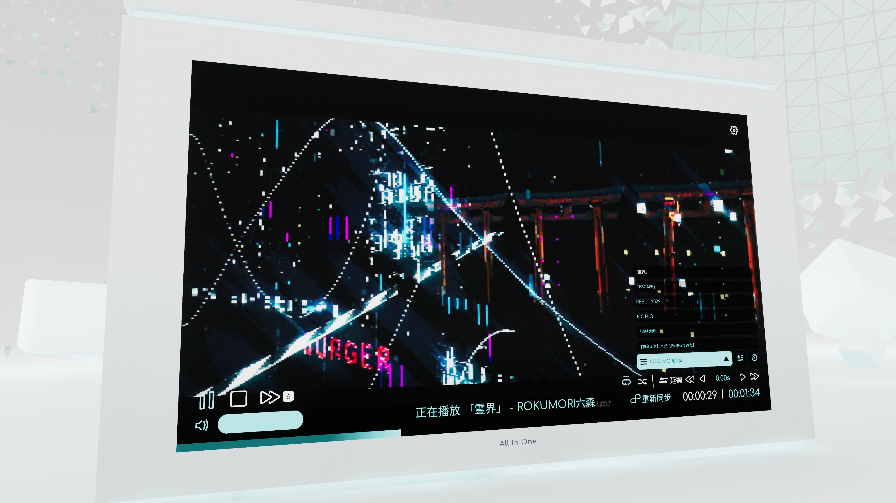  
* **Separated Controls**  
他のビデオプレーヤーによく使う形式。コントローラーとスクリーンの配置が自由に調整することができます。  
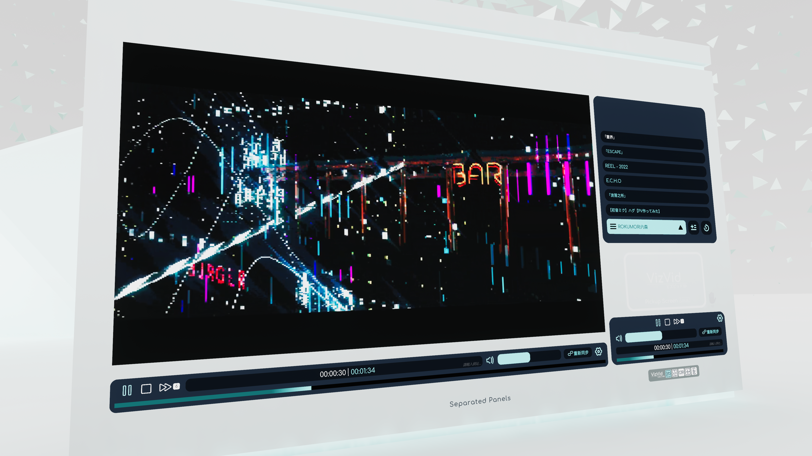  

### 展示会用プリセット  
展示会仕様になった VizVid です。ローカル動作で、接近すると自動再生します。  
* **For Single Video Exhibition**  
一本の動画を再生します。プレイリスト機能抜き。  
* **For Multiple Video Exhibition**  
複数の動画を再生します。プレイリスト機能付き。  

---
### おすすめ設定  
#### 再生速度制御の有効化  
本機能は AVPro Stub に依存しています。  
下記の画像に参考し、設定を行ってください。  

#### YTTL の有効化  
YouTube 動画を再生する場合、動画タイトルを表示させる機能です。  
下記の画像に参考し、設定を行ってください。  
  

#### Text Mesh Pro への移行  
Text Mesh Pro に移行すると、よりきれいなテキストの表示ができます。  
VizVid 関連のプレハブを選択し、  
下記の画像に参考し、設定を行ってください。  
  

---
### 設定  
#### グローバル設定  
該当ワールド内のすべての VizVid に対する設定です。  
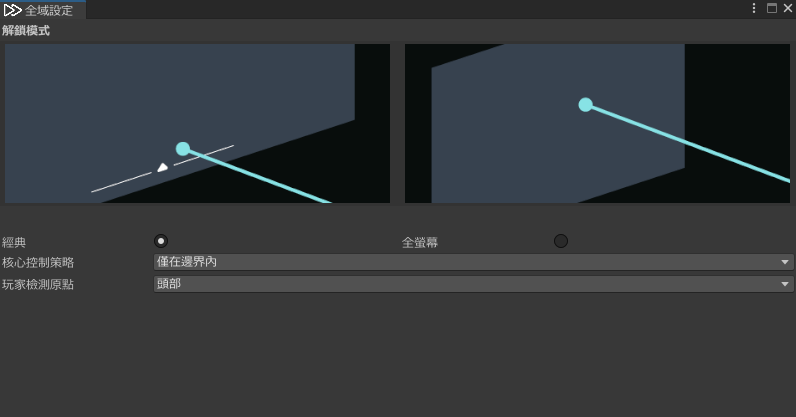  
* **アンロックモード**  
VizVid タッチスクリーンのデフォルトのアンロックモードを指定します。  
    * **オリジナル**  
    ポインターを画面下に向け、インジケーターが表示されたらクリックして UI を表示します。  
    * **フルスクリーン**  
    ポインターを画面の任意の場所に向けてクリックするだけで UI を表示します。  
* **コア動作ポリシー**  
Active Region 専用機能。機能のトリガーポリシーを調整します。デフォルト値は `境界内のみ` です。  
    * **すべて制御**  
以下の Active Region 機能のみを有効化します：  
        * AudioLink  
        * Overlay Control  
    * **境界内のみ**  
    Active Region 内に入った場合のみ、すべてのActive Region機能が有効になります。  
    * **境界内のみ、無ければ最も近いものを選択**  
    Active Region 内に入ると有効になります。  
    進入していない場合は、プレイヤーに最も近い Active Region を検出して、すべての Active Region 機能を有効にします。  
* **プレイヤー検出原点**  
Active Region 検出判定の位置を設定します。  

#### 本体設定  
簡易モードから詳細モードに切り替えると、すべての設定オプションが表示されます。  
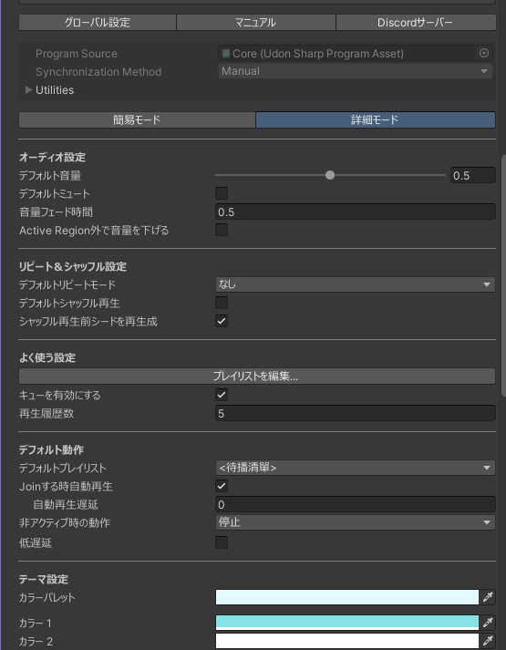  
詳細については [Core](#core) を参照してください。

---
### プレイリストの編集  
以下ではプレイリスト編集画面の各機能を説明します。  
  

* **左側のプレイリスト**  
    * <kbd>＋</kbd> または <kbd>ー</kbd> を押してプレイリストを追加 / 削除します。  
    * 複数のプレイリストを格納できます。左側の <kbd>＝</kbd> を押しながらドラッグして順序を変更できます。  
* **右側のリスト内容**  
    * <kbd>＋</kbd> または <kbd>ー</kbd> を押してメディアリンクを追加 / 削除します。  
    * タイトルは自由に設定できます。YouTube の URL を入力して、下の <kbd>タイトルを取得</kbd> 機能を使うと自動で入力されます。  
    * PC 用の URL を入力すると、Quest 用の URL が自動で埋められます。URL (PC)、URL (Quest) はプラットフォームごとに別の URL を設定できます（ライブ向けの機能）。  
    * タイトル右側に、バックエンドを選択できます。デフォルトは `AVProPlayer` です。URLコンテンツに応じて、調整してください。  
    * タイトル左側の <kbd>＝</kbd> を押しながらドラッグしてメディアの順序を変更できます。  
* **上部ツールバー**  
    * <kbd>リロード</kbd>：前回保存したプレイリストを読み込みます。  
    * <kbd>保存</kbd>：現在のプレイリストを VizVid に保存します。  
    * <kbd>全てエクスポート</kbd>：すべてのプレイリストを JSON ファイルにエクスポートします。  
    * <kbd>選択したものをエクスポート</kbd>：現在選択しているプレイリストを JSON ファイルにエクスポートします。  
    * <kbd>JSON からインポート</kbd>：外部の JSON プレイリストをインポートできます。  
    * <kbd>YT-DLP のダウンロード/更新</kbd>：yt-dlp（タイトル取得用ツール）をインストール、更新します。  
* **下部ツールバー**  
    * <kbd>YouTube からプレイリストを読み込む</kbd>：左側の欄に YouTube プレイリストの URL を入力すると、現在のプレイリストにインポートできます。公開リストおよび非公開リストのみ対応し、プライベートリストは対応しません。  
    * <kbd>タイトルを取得</kbd>：YouTube のリンクを読み取り、自動でタイトルを入力します。  
    * <kbd>プレイリストを反転</kbd>：プレイリストの順序を反転します。  

---
## モジュール  
VizVid では、前述の基本プリセット以外にも、多種多様なモジュールを自由に組み合わせて自分好みのプレイヤーを構築できます。  
このセクションでは、各モジュールの概要について解説します。  

### はじめに  
解説にあたって、まず以下の 2 つの概念を整理しておきましょう。  
1. **プレハブ (Prefab)**  
ヒエラルキー (Hierarchy) に配置される、設定済みのコンポーネントを含むオブジェクト。  
  
2. **コンポーネント (Component)**  
インスペクター (Inspector) 上に表示される、VizVid を構成するの基本。  
  

### プレハブ  
ヒエラルキーの右クリックメニューに、`VizVid > Modules` を開くと、VizVid で使用可能なモジュール用プレハブが表示されます。  
各プレハブの機能は以下の通りです。  

* **VizVid Core**  
VizVid の頭脳となるモジュールです。  
個々の VizVid が正常に動作するためには、必ず 1 つの `Core` コンポーネントが必要です。  
デフォルトの Core プレハブには、以下の内容が含まれています：  
    * AVPro Module  
    * Builtin Module  
    * Image Module  
    * Playlist Queue Handler  
    * Locale  
    * Rate Limit Resolver  
    * Default Audio Source  

---
* **On-Screen Controls with Screen**  
タッチパネル式コントローラーです。  
このプレハブにはスクリーンオブジェクトが含まれています。  
* **Separated Controls**  
独立型コントローラーです。  
スクリーンと離れた場所に配置できます。  
* **Separated Controls (Narrow)**  
省スペースに適した、スリム版の独立型コントローラーです。  
* **Separated Controls (with Alt. URL Input, Narrow)**  
モバイルプラットフォーム向けの代替 URL 入力に対応した、スリム版の独立型コントローラーです。  
* **Overlay Controls**  
ユーザーに追従するタイプのコントローラーです。  
デスクトップモードやVRモードにおいて、手元での操作を可能にします。  

---
* **Pickupable Screen**  
手に持つ移動させることができる、タブレットみたいなスクリーンです。  
必要に応じて自由にサイズを変更できます。  
デフォルトではローカル設定となっており、他のユーザーからは自分が見ているスクリーンは見えません。  
* **Screen**  
VizVid 用のスクリーンです。  
サブクリーンとして、コントローラーとは別の場所に配置できます。  

---
* **Resync Button**  
独立した「Re-Sync（再同期）」ボタンです。  
主に音楽イベントやパフォーマンス会場などで利用されます。  
* **Stream Key Assigner**  
ストリームキーを自動生成、発行します。  
TopazChat などのストリーミングサービスの設定が可能です。  
主に音楽イベントやパフォーマンス会場などで利用されます。  
    > [!Note]
    > 活用方法については、[Stream Key Assigner](#streamkeyassigner) を参照してください。  

---
* **Audio Source (Mono)**  
VizVid 用のモノラル Audio Source を追加します。  
* **Audio Source (Stereo)**  
VizVid 用のステレオ Audio Source セットを追加します。  
* **Audio Source (5.1 Surround)**  
VizVid 用の 5.1ch サラウンド Audio Source セットを追加します。  
詳細は [5.1ch サラウンド構成](#51ch-サラウンド構成)を参照してください。  

---
* **Auto Play on Near (Local Only)**  
ユーザーが近づいた際に、あらかじめ設定された動画を自動再生し、離れると自動停止します。  
展示会向けワールドに適した機能です。  
（この機能はローカルモードのみ対応しています。）  

---
* **Active Region**  
プレイヤーが設定範囲内のVizVidに接近すると、指定された機能が起動します。  

---
### コンポーネント  
#### Core  
このコンポーネントは VizVid の「核」であり、すべての再生制御を行います。  
> [!Note]
> モジュールが欠落している場合、一部のオプションは非表示になるか、表示内容が変更されます。  

##### オーディオ設定  
* **デフォルト音量**  
プレイヤーがワールドに Join 時の初期音量を設定します。  
* **デフォルトミュート**  
プレイヤーがワールドに Join 時、ミュートを設定します。  
* **音量フェードイン・フェードアウトの持続時間**  
ミュート / ミュート解除や、Active Region の出入り時の音量フェードイン・フェードアウト時間を設定します。  
* **範囲外時の低音量**  
Active Region から外に出た際に下げる目標音量を指定します。  

##### リピート&シャッフル設定  
* **デフォルトのリピートモード**  
なし、1 曲リピート、全曲リピートから選べます。  
* **デフォルトでシャッフル再生**  
プレーヤーの初期状態でシャッフル再生を有効にします。  
* **シャッフル再生前シード再生成**  
プレイリストを再生するたびにシードが再生成し、ランダム性を高めます。  

##### よく使う設定  
* **プレイリストを編集...**  
プレイリスト編集ウィンドウが表示されます。プレイリストの作成、編集、インポートを行えます。  
詳しい情報は[プレイリストの編集](#プレイリストの編集)にご参照ください。  
* **キューリストを有効にする**  
有効にすると、入力したURLをキューリストに追加されます。  
* **履歴サイズ**  
再生した URL を記録する数を調整します。  
    > [!note]
    > プレイリストからの再生は履歴に記録されません。  

##### デフォルト動作  
* **デフォルトプレイリスト**  
作成済みのプレイリストから、デフォルトで再生するものを選択します。  
* **Join する時自動再生**  
プレイヤーが Join する時、デフォルトプレイリストを再生されます。  
    * **自動再生遅延**  
    もしワールド内に、VizVid 以外の動画プレイヤーがなかったら、`0` のままにしておいでください。  
* **非アクティブ時の動作**  
キューやプレイリスト内の動画再生が終了した際、指定された動作を実行します：  
    * **停止**  
    何も動作を行いません。  
    * **デフォルトプレイリストを再生**  
    デフォルトプレイリストに戻り、最初の項目から再生を開始します。  
    * **最後に再生したプレイリストアイテムを再開**  
    プレイリスト再生の途中でユーザーからの動画を再生した場合、その完了後に自動的に直前のプレイリスト項目に戻って再生を再開します。
* **低遅延**  
低遅延を有効にすると、配信コンテンツ視聴時の遅延を一部軽減できます。  

##### テーマ設定  
* **カラーパレット**  
現在のカラー設定をベースにし、トーンを調整します。  
* **カラー #**  
VizVid の各部位の色を設定します。  
* **ビルド時に自動適用**  
    デフォルトで有効です。シーンのビルド時に、現在のカラー設定を自動的に適用します。  
* **適用**  
    現在のカラー設定をVizVidに適用します。  

##### 画面設定  
* **待ち受け画像**  
映像表示されていない場合、表示するテクスチャを設定します。  
* **スクリーンテクスチャの共有**  
画面テクスチャを共有し、対応するシェーダー（例：[Poiyomi](https://www.poiyomi.com/color-and-normals/decals#video-texture)）で VizVid の映像を表示できるようにします。  
* **リアルタイム GI 更新間隔**  
リアルタイム・グローバルイルミネーションの更新間隔です。`0`で無効になります。  

##### モジュール管理
* **スクリーン目標**
`Screen Configurator` コンポーネントが含まれるスクリーンオブジェクトを一覧表示します。  
    * **モード**  
    デフォルトで3つのオプションが用意されています：  
        * **プロパティブロック**  
        マテリアルプロパティを変更することなく、映像を直接そのオブジェクトに適用します。最も軽量なソリューションです。  
        * **共有マテリアル**  
        映像をマテリアルに直接出力します。そのマテリアルを使用している他のオブジェクトがある場合、それらすべてに VizVid の映像が表示されます。  
        * **複製マテリアル**  
        先にそのマテリアルを自動複製し、映像を直接マテリアルに出力します。  
        > [!note]
        > 使用しているマテリアルやシェーダーによって、このオプションが使用できない場合があります。  
    * **マテリアル**  
    1つのオブジェクトに複数のマテリアルが存在する場合、VizVid の映像を出力する対象のマテリアルを指定できます。
    * **映像テクスチャプロパティ名**  
    映像のテクスチャプロパティ名です。該当マテリアルのシェーダーに基づいて、デフォルトの名前が自動入力されます。
    * **スケールオフセットを使用**  
    マテリアルのシェーダーが AVPro モードに対応しておらず、映像が上下反転して表示される場合、このオプションにチェックを入れて修正をお試しください。  
    * **AVProフラグプロパティ名**
    マテリアルのシェーダーが AVPro モードに対応している場合、プロパティ名をカスタマイズして割り当てることができます。
    * **輝度設定**  
    デフォルトのスクリーン発光強度を設定します。デフォルト値は `1` です。
    * **ミラーで反転**  
    ミラーの中で映像を水平反転させるかどうかを決定します。チェックを入れると反転します。  
    * **表示モード**  
    VRChat 内で VizVid スクリーンが表示される条件を設定します。  
    * **待ち受け画像**  
    Coreの待ち受け画像設定とは異なり、該当スクリーンに対して個別の待機画像を設定できます。  
    * **Point Light Volume**  
    VRC Light Volume を設定します。詳細については [VRC Light Volume (VRCLV)](#vrc-light-volume-vrclv) を参照してください。  
    * **アスペクト比を修正**  
    プレイヤーオブジェクトの形状変更に合わせて、このボタンでアスペクト比を自動調整し、映像の変形を防ぐことができます。  

* **Audio Source**
VizVid の音声を出力する `Audio Source` を一覧表示します。  
複数の Audio Source を指定して、マルチチャンネル設定を行うことができます。  
    * **Mode**  
    受信する音声チャンネルを設定します。（AVPro のみ有効）  
    > [!note]
    > その他の設定は VRC Spatial Audio Source のオプションです。
    > 設定については[こちらのページ](https://creators.vrchat.com/worlds/components/vrc_spatialaudiosource/)のドキュメントを参照してください。  
    * **Audio Sourceのプロパティを表示**  
    該当Audio Sourceのプロパティ設定ウィンドウを表示して調整を行います。  

* **バックエンド管理**  
VizVid が連携するバックエンドを管理します。  
デフォルトで AVPro、Builtin、Image が用意されています。  
左側の <kbd>=</kbd> アイコンをドラッグ＆ドロップすることで、優先順位を調整できます。  
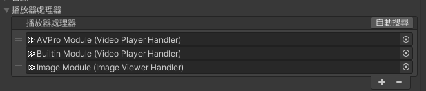  
* **Live (AVPro Module)**  
    * **最大解像度**  
    YouTube などのマルチ解像度に対応したサービスにアクセスリクエストを送信する際、デフォルトで要求する解像度です。  
    * **低遅延**  
    AVPro の低遅延モードを有効にします。ライブ配信の再生時のみ有効です。  
    * **最先順位Audio Source (ステレオ / 左)**  
    メインで出力するAudio Sourceを設定します。Audio Sourceの設定に応じて、ステレオまたは左チャンネルを出力できます。  
    * **最先順位Audio Source (右)**  
    メインで出力するオAudio Sourceを設定します。対象のAudio Sourceが右チャンネル用に設定されていれば、指定して右チャンネルを出力できます。  
    * **画面点滅対策を使用**  
    AVPro でコンテンツを試聴している際、画面の点滅現象を解決します。  
        > [!Note]
        > 現在 VRChat 側で AVPro の更新によりこの問題が修正されたため、デフォルトでは無効になっています。  
    * **フォールバックハンドラー**  
    コンテンツを AVPro で再生できない場合、該当再生バックエンドに切り替えて再試行します。デフォルトは `Builtin Module` です。  
* **Video (Builtin Module)**  
    * **最大解像度**  
    YouTube などのマルチ解像度に対応したサービスにアクセスリクエストを送信する際、デフォルトで要求する解像度です。  
    * **最先順位Audio Source (ステレオ / 左)**  
    メインで出力するAudio Sourceを設定します。Audio Sourceの設定に応じて、ステレオまたは左チャンネルを出力できます。  
        > [!note]
        Builtinバックエンドは複数のAudio Sourceに対応していないため、出力先のAudio Sourceをステレオに設定することを推奨します。  
    * **フォールバックハンドラー**  
    コンテンツを Builtin で再生できない場合、該当再生バックエンドに切り替えて再試行します。デフォルトは `AVPro Module` です。  
* **画像 (Image Module)**  
    * **動画プレイヤーバックエンド名**  
    画像バックエンドハンドラーの名前です。  
    * **フォールバックハンドラー**  
    コンテンツを表示できない場合、この再生バックエンドに切り替えて再試行します。デフォルトは空欄です。  
    > [!note]
    > このエリアの設定を変更することは推奨されません。  
* **動画タイトル表示(YTTL)**  
`YTTL Manager` コンポーネントを指定します。  
* **AudioLink**  
`AudioLink` コンポーネントを指定します。プロジェクト内に AudioLink がある場合、<kbd>自動検出</kbd> で紐付けが可能です。  

##### エラー処理
* **最大リトライ回数**  
読み込み失敗時にリトライする上限回数です。  
* **フォールバックリトライ回数**  
リトライ回数がこの値を超えると、自動的に再生バックエンドを切り替えます。  
* **リトライ遅延**  
読み込み失敗時のリトライ間隔（秒）です。  
* **時間ズレ検出しきい値**  
ユーザー間の再生ズレを検知します。しきい値を超えると自動的に同期が行われます。  

##### その他  
* **同期**  
VizVid をグローバルで動作させるか設定します。デフォルトで有効です。  
* **保存機能を有効する**  
VRChat Persistence に通じで、音量などの設定情報を保存します。デフォルトで有効です。  
* **URL 入力フィルター**  
URL のフィルタリング設定です。  
この [Udon スクリプト](https://github.com/JLChnToZ/VVMW/blob/develop/Packages/idv.jlchntoz.vvmw/Runtime/VVMW/InputFilterBase.cs)を参考し、継承での応用が可能です。  
* **ロック**  
VizVidをロックします。    
[対応スクリプト](../api/JLChnToZ.VRC.VVMW.FrontendHandler.html?q=locked#JLChnToZ_VRC_VVMW_FrontendHandler_Locked)を作成 / 使用するか、[Udon Auth](https://xtl.booth.pm/items/3826907) を導入することで制御可能です。  
* **イベントターゲット**  
ここに指定した Udon Sharp スクリプトにイベントデータを送信し、カスタムスクリプトと連携させることができます。  

#### Frontend Handler  
このコンポーネントは、プレイリストの管理やプレイヤーのデフォルト値を設定します。  
> [!note]
> このコンポーネントのオプションは `Core` コンポーネントに統合されています。  
> 詳細は [Core](#Core) セクションを参照してください。  

#### UI Handler  
このコンポーネントは、プレイヤーの UI 関連オブジェクトとの紐付けを管理します。  
* **メインリファレンス**  
    * **コア**  
    `Core` コンポーネントと紐付けします。  
    `Missing (Core)` になってしまった場合、<kbd>自動検出</kbd> をクリックしてシーン内の `Core` コンポーネントがあるオブジェクトに紐付けられます。  
    * **プレイリストキューハンドラ**  
    `Frontend Handler` コンポーネントと紐付けします。  
    `Missing (Frontend Handler)` になってしまった場合、<kbd>自動検出</kbd> をクリックしてシーン内の `Frontend Handler` コンポーネントがあるオブジェクトに紐付けられます。  

> [!note]
> 他のオプションは UI の形式によって設定構成が異なります。必要に応じて設定を調整するか、自作の UI コンポーネントを連携できます。

#### Screen Configurator  
このコンポーネントは、VizVid の映像を紐付けしたテクスチャに送信します。  
* **Screen Renderer**  
映像を出力したい Mesh Renderer を指定します。  

> [!note]
> このコンポーネント一部のオプションは `Core` コンポーネントの `スクリーン目標` に統合されています。  
> 詳細は [Core](#Core) セクションを参照してください。  

#### Color Config  
このコンポーネントは UI のカラー設定を管理するもので、通常は `UI Handler` とセットで使用されます。  

* **カラーパレット**  
現在のカラー設定をベースにし、トーンを調整します。  
* **カラー #**  
VizVid の各部位の色を設定します。  
* **ビルド時に自動適用**  
    デフォルトで有効です。シーンのビルド時に、現在のカラー設定を自動的に適用します。  
* **適用**  
    現在の `Color Config` コンポーネントのみに適用するか、シーン内の全ての `Color Config` コンポーネントに適用するかを選択できます。  
* **詳細**  
    * **カラーパレットを追加、削除**  
    必要に応じて別のカラー番号を追加し、`UI Graphics` コンポーネントと組み合わせることで、特定のカラーインデックス番号を指定して UI のカラーを設定できます。

#### Active Region  
このコンポーネントは、プレイヤーが設定範囲内のVizVidに入ると、指定された機能が起動します。  
* **コア**  
`Core` コンポーネントと紐付けします。  
`Missing (Core)`になってしまった場合、<kbd>自動検出</kbd> をクリックしてシーン内の `Core` コンポーネントがあるオブジェクトに紐付けられます。  
* **バウンズ**  
Active Regionの有効範囲を調整します。  
* **静的区域**  
バウンズの位置をロックします。  
* **アクティブ状態の検出**  
チェックを入れない場合、Active Region オブジェクトが無効な状態であっても、有効な Active Region として扱われます。  
* **ワールドスペースのバウンズを使用**  
Active Region 自体の Transform を無視し、バウンズボックスのみを読み取ります。処理負荷をわずかに軽減できます。  
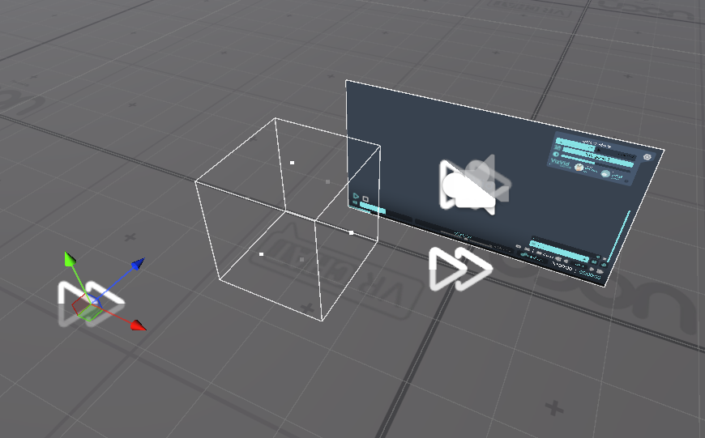

#### Audio Source Configurator  
このコンポーネントは 2.0 / 5.1 Audio Sourceセットの位置や減衰距離の設定を一括管理します。  
* **Audio Sources**  
調整対象のAudio Sourceを設定します。  
* **近距離境界**  
プレイヤーがこの範囲内にいる場合、すべてのAudio Sourceは元の音量で出力されます。  
* **遠距離境界**  
プレイヤーがこの範囲外に出ると、これらのAudio Sourceの音が聞こえなくなります。  
* **推定**  
現在のバウンズの範囲に基づいて、最適な境界減衰設定を計算します。  
* **適用**  
設定されるAudio Sourceに適用します。

---
## その他の応用  
### 他のビデオプレイヤーのプレイリストの導入  
他のビデオプレイヤーオブジェクトを、プレイリストエディタにドラッグアンドドロップ。  
現在対応するビデオプレイヤー  
* VizVid  
* USharp Video  
* Yama Player  
* KineL Video Player  
* iwaSync 3  
* JT Playlist  
* ProTV by ArchiTech  
* VideoTXL  

### ライティング関連  
#### LTCGI  
1. [LTCGI ドキュメント](https://ltcgi.dev/Getting%20Started/Setup/Controller) を参考に、LTCGI コントローラーをシーン内に配置します。  
2. LTCGI のインスペクターに、「Auto-Configure XXX」というボタンが自動的に表示されます。  
3. 「XXX」が使用している VizVid Core の名称であることを確認し、ボタンをクリックしてください。  
これにより、LTCGI が VizVid の映像信号を受信できるようになります。  

> [!Note]
> LTCGI の効果を正常に表示させるには、対応したシェーダーを使用する必要があります。  
> [こちらのドキュメント](https://ltcgi.dev/Getting%20Started/Installation/Compatible_Shaders) を参照し、適切なシェーダーを選択してください。  

#### VRC Light Volume (VRCLV)  
1. ヒエラルキー上で VizVid のスクリーンオブジェクトを右クリックします  
2. 画像の通りに設定を行い、VizVid のスクリーンを VRC Light Volume に対応させます：  
  

> [!Note]
> VRC Light Volume の効果を正常に表示させるには、対応したシェーダーを使用する必要があります。  
> [こちらのドキュメント](https://github.com/REDSIM/VRCLightVolumes/blob/main/Documentation/CompatibleShaders.md) を参照し、適切なシェーダーを選択してください。    

### 配信視聴関連  
配信系イベント向け、低遅延配信を求め、外部 RTMP / RTSP サービスを使う場合はよくあります。  
ここでは [TopazChat](https://github.com/TopazChat/TopazChat) を例に、3 つの方法を挙げて説明します。  

#### Stream Key Assigner  
ストリームキーを生成・発行し、VizVid に適用することができます。  
  
* **コア**  
`Core` コンポーネントと紐付けします。  
`Missing (Core)`になってしまった場合、<kbd>自動検出</kbd> をクリックしてシーン内の `Core` コンポーネントがあるオブジェクトに紐付けられます。  
* **プレイリストキューハンドラ**  
`Frontend Handler` コンポーネントと紐付けします。  
`Missing (Frontend Handler)` になってしまった場合、<kbd>自動検出</kbd> をクリックしてシーン内の `Frontend Handler` コンポーネントがあるオブジェクトに紐付けられます。  
* **プレイヤーバックエンドタイプ**  
使用するプレイヤーのバックエンドを選択します。配信系イベントでは通常 `AvProPlayer` を使用します。  
* **ストリームキーのテンプレート**  
ストリームキーのフォーマットを指定します。必要に応じて内容を変更可能です。  
* **ストリーム URL のテンプレート**  
メインの配信 URL です。デフォルトでは TopazChat のサービスが設定されていますが、自由に変更可能です。  
* **代替ストリーム URL のテンプレート**  
モバイルプラットフォーム向けの代替リンクです。デフォルトでは TopazChat が設定されています。上の URL と同じサーバーを使用するようにしてください。  
> [!Note]
> `{0}` は生成されたストリームキーのユニーク ID が適用される部分ですので、必ずテンプレートに残しておいてください。  
* **キーの数**  
生成するストリームキーの数です。  
* **ユニーク ID の長さ**  
生成されるユニーク ID の文字数です。  

#### Separated Controls (with Alt. URL Input, Narrow)  
VRChat 内から手動で配信 URL と、モバイルプラットフォーム用の代替 URL を入力することができます。  
イメージは以下の通りです：  
  

#### プレイリスト編集による設定  
プレイリスト機能を利用し、固定のストリームキーを使用して配信を行います。  
設定イメージは以下の通りです：  
  

### オーディオ関連  
#### BGM Volume Control  
ワールド内に BGM や環境音がある場合、このコンポーネントを追加することで、VizVid での再生開始時にそれらの Audio Source を自動的にミュートし、停止時にミュートを解除することができます。  
1. 自動ミュートしたい Audio Source を選択します。  
2. インスペクターで `BGM Volume Control` コンポーネントを追加します。  
3. 使用するプレイヤーの Core を指定します。  
  
4. 設定完了です。  

#### 3Dステレオ設定  
VizVid で方向感を持つステレオ構成を出力を設定します。  
以下の手順で設定を行ってください：  
1. メニューから `Audio Source (Stereo)` を追加すると、自動的に VizVid に紐付けられます。  
2. シーンの必要に応じて、参考画像内の黄色い線のバウンズを調整し、Audio Sourceの位置を設定します。  
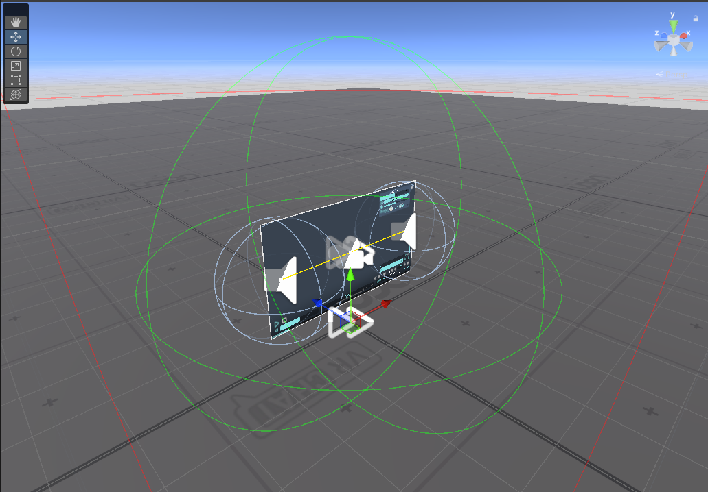  
3. <kbd>推定</kbd> をクリックして減衰設定を調整します。  
詳細な設定については [Audio Source Configurator](#audio-source-configurator) を参照してください。  
4. <kbd>適用</kbd> をクリックして、設定をAudio Sourceに適用します。  
5. 設定完了です。

#### 5.1ch サラウンド構成  
VRChat の AVPro バックエンドを利用することで、5.1ch サラウンド音声を出力できます。  
映画館系ワールドなどでよく利用されます。  
1. メニューから `Audio Source (5.1 Surround)` を追加すると、自動的に VizVid に紐付けられます。  
2. シーンの必要に応じて、参考画像内の黄色い枠線のバウンズを調整し、Audio Sourceの位置を設定します。  
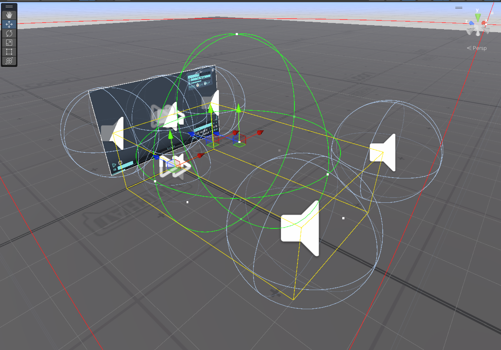  
3. <kbd>推定</kbd> をクリックして減衰設定を調整します。  
詳細な設定については [Audio Source Configurator](#audio-source-configurator) を参照してください。  
4. <kbd>適用</kbd> をクリックして、設定をAudio Sourceに適用します。  
5. 設定完了です。

> [!note]
> Builtin バックエンドの技術的制限により、複数のAudio Sourceに対応していないため、音声が左側から出力される場合があります。  
> ご利用の際は、必要に応じて Builtin バックエンドの設定を適切に調整してください。

### 表示関連  
#### プレイリストの並び順を反転させる  
VizVidのプレイリストを旧版の逆順に調整したい場合、以下の手順を行ってください。  
1. プレイリストオブジェクトから `Play List Entries` オブジェクトを選択します。  
    > [!Note]  
    > 該当オブジェクトは、プレハブによって配置が異なります。  
    > 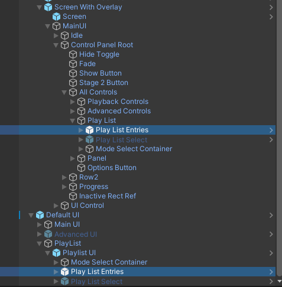  
2. 右側のインスペクターで `Pooled Scroll View` コンポーネントを探します。  
3. `Inverse Order` のチェックを外します。  
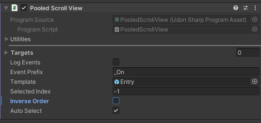  
4. `Play List Entries` オブジェクトを展開し、その中にある `Next On`、もしくは `Next On Holder` オブジェクトを選択します。  
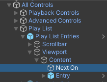  
5. インスペクターにある `Rect Transform` の設定を、画像のように調整します。  
    * Default UIの場合  
    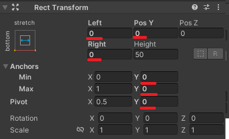 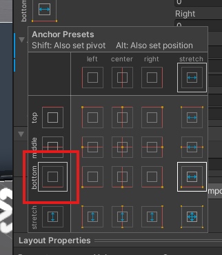  
    * Screen With Overlayの場合  
    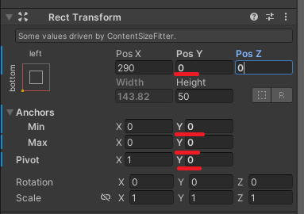 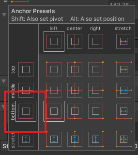  
6. 設定完了です。  

### Overlay Control を使用してシーン内の複数の VizVid を制御する  
ワールド内に複数の VizVid が設置されている場合に適しています。  
Active Regionの有効範囲を調整することで、プレイヤーがその範囲内に入るだけでOverlay Controlの制御対象が切り替わります。  
1. Active Region を追加したい、VizVid Coreコンポーネントが含まれているオブジェクトを選択します。  
2. そのオブジェクトに右クリックして、`VizVid > Modules > Active Region` を選択します。  
3. 新しく追加された `Active Region` オブジェクトを選択し、バウンズを調整して有効範囲を設定します。  
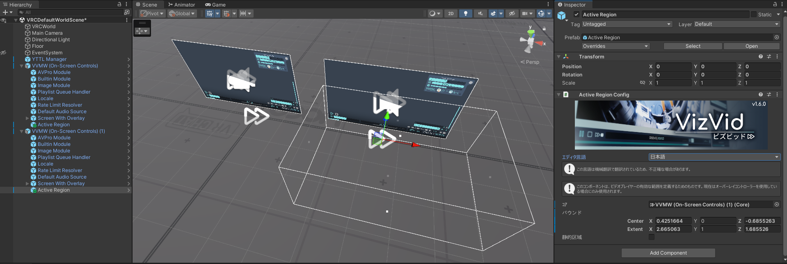  
4. 設定完了です。  

### 多言語対応  
VizVid の言語管理コンポーネントは、Locale オブジェクトにある Language Manager です。  
これは VizVid 以外の Text Mesh Pro UI にも利用可能です。  
1. Language Manager 内で、既存の JSON 形式を参考に新しい JSON ファイルを追加し、Language Key とそれに対応する訳文を作成します。  
2. 翻訳したい Text Mesh Pro UI オブジェクトに `Language Receiver` コンポーネントを追加します。  
3. 対応する Language Key を入力します。  
4. 設定完了です。  
> [!Tip]
> Language Manager 機能は VizVid 抜きで、独立動作が可能です。  
> 言語切り替えメニューさえ残っていればちゃんと機能します。  

> [!Note]
> Language Manager は複数の JSON ファイルを読み込むことができます。VizVid 内蔵の JSON を上書きしたくない場合は、別途作成した JSON を追加することをおすすめします。  
  

### API リファレンス  
必要な機能を VizVid と連携させる際は、[こちらのページ](../api/Global.html) (英語) を参照してください。  

---

## よくある質問  
（随時更新）  

---
**Q1**: LTCGI を説明通りに設定しましたが、反映されない。  
**A1**: スクリーンのシェーダーが VizVid 提供のものではないが原因かもしれません。  
[LTCGI の手動設定方法](https://ltcgi.dev/Getting%20Started/Setup/LTCGI_Screen) (英語) を参考し、手動で LTCGI スクリーンを追加してください。  

---
**Q2**: VizVid のデフォルト音量を変更したが、VRChat 内で反映されていない。  
**A2**: Core の設定で`保存機能を有効にする`のチェックを入れると、以前に入室したユーザーは、保存された音量設定が優先されます。新しいデフォルト値を適用させるには、ユーザー側で「ユーザーデータをリセット」を行う必要があります。  
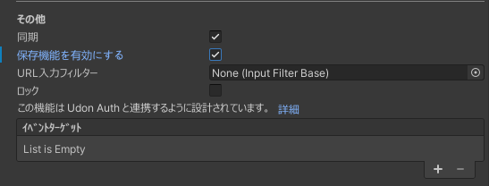  

---
**Q3**: `コア`を表示するはずコンポーネントに、`プレイリストキューハンドラ`しか表示されない。  
  
**A3**: `プレイリストキューハンドラ`の紐付けを一旦解除し、`コア`の項目が表示されます。  
これはインスペクターのエディタ仕組み制限により、`プレイリストキューハンドラ`が先に設定されている場合、デフォルトで`コア`が表示されないになっています。  

---
**Q4**: 再生中画面見えない・音出ない。  
**A4**: 関連オブジェクトの紐付けが解除しまったかもしれません。`Core` のモジュール設定もう一度確認してみてください。  
  

---
**Q5**: YouTube関連の読み込めなんか行かない？  
(タイトル、プレイリストの取得が制限され、バグった感じ)  
**A5**: YT-DLP が古いかもしれません。<kbd>YT-DLP のダウンロード/更新</kbd> をクリックして、YT-DLP をアップデートしてみましょう。改善できるはずです。  
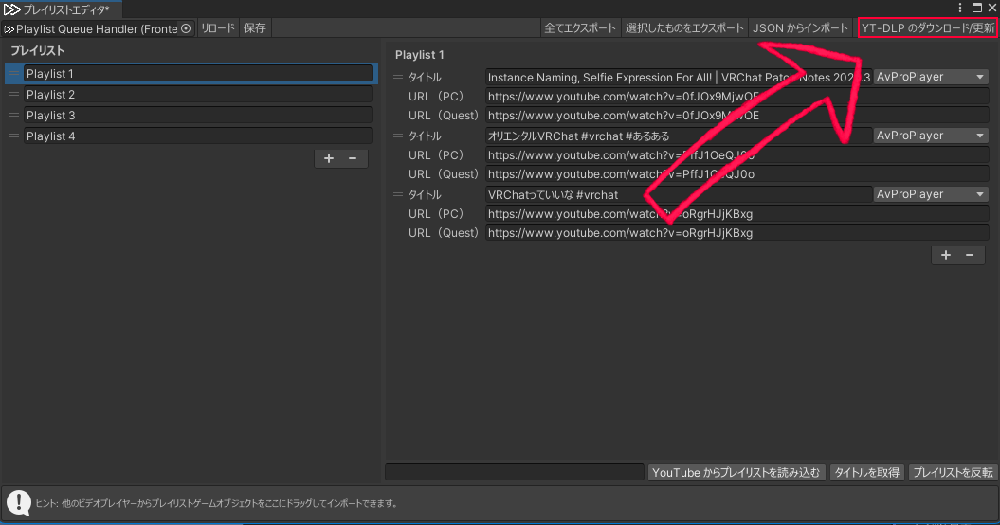  

---
**Q6**: Unity内のVizVidは動いていないだけど、なぜ？  
**A6**: Unity環境では、VRChatのAVProやBuilt-inなどのバックエンドが利用できないため、VizVidでの再生は行えません。VizVidの動作をテストする場合は、VRChat SDKからTest Buildを作成し、VRChat環境でローカルテストを行ってください。  
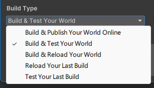  

---
> [!Note]
> 上記に載ってない問題、サポートがほしい場合、  
> 遠慮なく [Discord サーバー](https://discord.gg/fkDueQMbj8)にてお問い合わせください。  
