# VizVid 說明文件  
VizVid 是一款為 VRChat 所設計，用途廣泛的多媒體播放器前端。除了跟朋友一起看影片、直播，大音樂表演活動場地，展示會場也能使用，用途極為廣泛。  
VizVid 採用模組化設計，針對任何使用情境，可根據自己的需求，選擇適合的模組，輕鬆地拼裝出屬於自己的 VizVid。  

> [!NOTE]  
> 本說明文件涵蓋 v1.4.13 或往後版本，一部分說明可能與舊版有所不同  

---
## 快速上手
### VizVid 安裝方式  
1. 在 Hierarchy 空白處點選滑鼠右鍵  
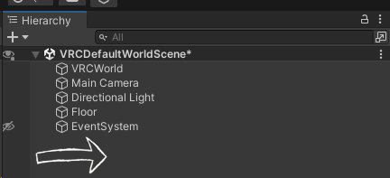  
2. 找到 VizVid 的選單  
3. 選擇想新增的播放器類型  
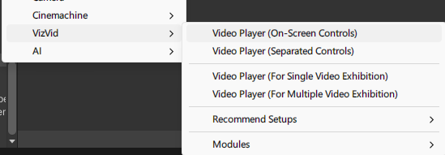  

#### 常用預設組  
一般使用，用途最廣泛。  
* **On-Screen Controls**  
最簡單、易用的版本，螢幕就是你的控制器。
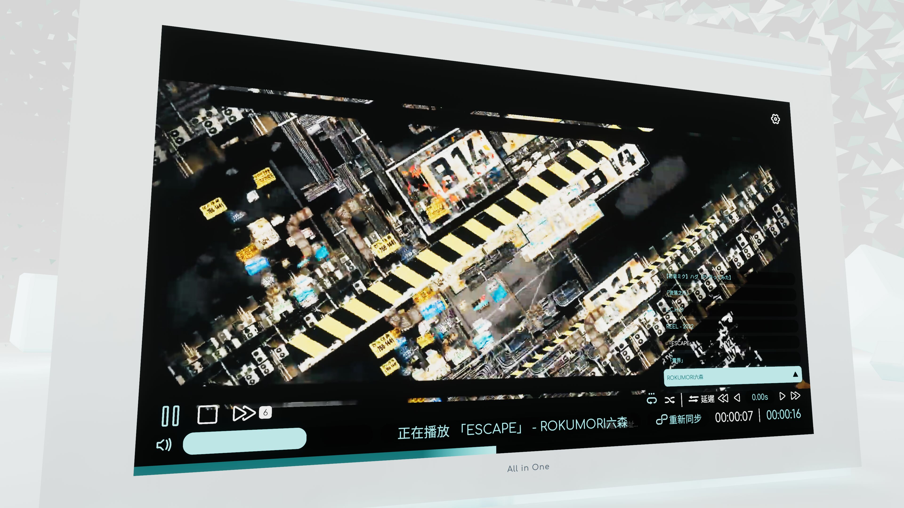  
* **Separated Controls**  
傳統播放器常用的形式，控制器、播放清單等，可分開擺放。  
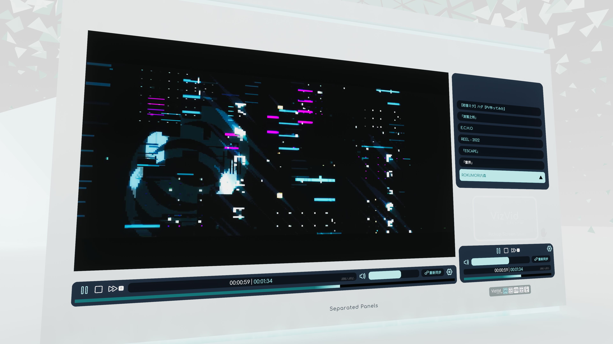  

#### 展場用預設組  
通常為展場使用，播放器為 Local 運作，內建靠近即播放功能。  
* **For Single Video Exhibition**  
設計為播放單支影片。無播放清單功能。  
* **For Multiple Video Exhibition**  
設計為播放多支影片。有播放清單功能。  

---
### 推薦設定  
#### 啟用播放速度控制  
本功能需要 AVPro Stub 才能啟用，依附圖說明操作即可安裝。  
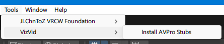  

#### 啟用 YTTL  
[YTTL](https://65536.booth.pm/items/4588619) (由 ureishi 製作，遵循創用 CC0 授權) 可從知名影片網站 (YouTube、Twitch) 取得內容標題，顯示於播放器。  
依附圖說明操作即可安裝。  
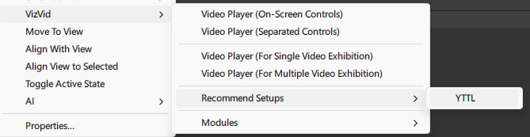  

#### 使用 Text Mesh Pro  
可使 VizVid 的字體顯示更加清晰。  
選擇所有 VizVid 的 Prefab，依附圖說明操作即可套用。  
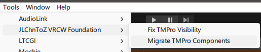

---
### 編輯播放清單  
以下說明播放清單編輯介面之各項功能。  
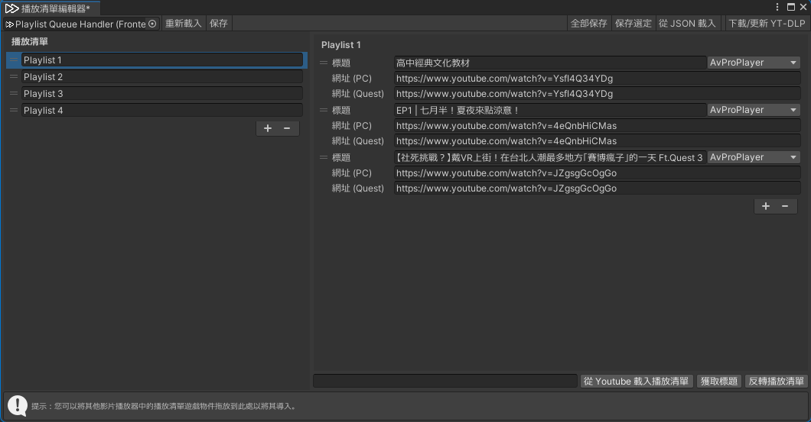  

* **左側播放清單**  
    * 按 <kbd>＋</kbd> 或 <kbd>ー</kbd> 以新增 / 刪除播放清單。  
    * 可以放入不同清單，按住左側 <kbd>＝</kbd> 即可自由拖曳清單排列順序。  
* **右側清單內容**  
    * 按 <kbd>＋</kbd> 或 <kbd>ー</kbd> 以新增 / 刪除媒體連結。  
    * 標題可自由設定，或輸入 YouTube 網址後，使用下方 <kbd>獲取標題</kbd> 功能自動填入。  
    * 輸入 PC 網址，Quest 網址會自動填入。  
網址 (PC)、網址 (Quest) 可針對不同平台，設定不同網址。(直播向功能)  
    * 可根據不同媒體類型，選擇不同 Backend，預設值是 `AVProPlayer`  
    * 按住標題左側 <kbd>＝</kbd> 即可自由拖曳媒體排列順序。  
* **上方功能列**  
    * <kbd>重新載入</kbd>：恢復上次儲存的播放清單。  
    * <kbd>保存</kbd>：將目前的播放清單儲存至播放器。  
    * <kbd>全部保存</kbd>：將所有播放清單匯出至 json 檔。  
    * <kbd>保存選定</kbd>：將目前選擇之播放清單匯出至 json 檔。  
    * <kbd>從 JSON 載入</kbd>：可以導入外部 json 播放清單。  
    * <kbd>下載/更新 YT-DLP</kbd>：安裝、更新 yt-dlp (獲取標題用的工具)  
* **下方功能列**  
    * <kbd>從 Youtube 載入播放清單</kbd>：於左側欄位輸入 YouTube 播放清單網址，即可匯入至當前播放清單。  
僅支援公開 / 不公開清單 (可透過連結存取)，無法使用私人清單。  
    * <kbd>獲取標題</kbd>：讀取 YouTube 連結，自動填入標題。  
    * <kbd>反轉播放清單</kbd>：反轉播放清單排序。  

---
## 模組  
除了上述的基本模板，  
VizVid 也提供各式各樣的模組，供使用者自由組合屬於自己的 VizVid。  
本章節將對於不同的模組進行基本介紹。  

### 前言  
本章節需先釐清兩個概念：  
1. **Prefab**  
顯示於 Hierarchy 中，裝載已經設定完成元件的物件。  
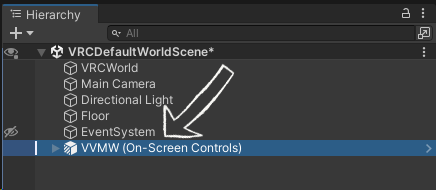  
2. **元件 (Component)**  
顯示於 Inspector 中，為 VizVid 的基礎組成部分。  
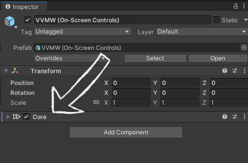  

### Prefab  
於 Unity 的 Hierarchy 空白處點選滑鼠右鍵，於 `VizVid > Modules` 選單中，會顯示適用於 VizVid 的模組 Prefab。  
以下進行各個 Prefab 的簡介。  
* **VizVid Core**  
為 VizVid 的核心。  
每個獨立的 VizVid 皆需要一個 `Core` 元件才能正常運作。  
預設 Core 的 Prefab 中，包含以下 Prefab：  
    * AVPro Module  
    * Builtin Modile  
    * Image Module  
    * Playlist Queue Handler  
    * Locale  
    * Rate Limit Resolver  
    * Dafault Audio Source  

---
* **On-Screen Controls with Screen**  
觸控螢幕型控制器。本 Prefab 包含一個螢幕物件。  
* **Saparated Controls**  
獨立型控制器，可與螢幕分開放置。  
* **Saparated Controls (Narrow)**  
縮小版獨立型控制器，適用小空間。  
* **Saparated Controls (with Alt. URL Input, Narrow)**  
縮小版獨立型控制器，支援輸入行動平台用的替代網址。  
* **Overlay Controls**  
跟隨使用者的控制器。  
給予桌面模式與 VR 模式額外的控制方式。  

---
* **Pickupable Screen**  
可動式螢幕，能將螢幕移動自己需要的地方。並根據需求自由縮放。  
預設為 Local，其他用戶不會看到你手上的螢幕。  
* **Screen**  
VizVid 用螢幕，可與控制器分開放置。  

---
* **Resync Button**  
單獨的重新同步按鈕。  
常用於影音表演型活動。  
* **Stream Key Assigner**  
自動生成 Streamkey。可設定 TopazChat 等串流服務。  
常用於影音表演型活動。  
> [!Note]  
> 相關應用，可參照 [Stream Key Assigner](#streamkeyassigner)

---
* **Audio Source (Mono)**  
新增單個 VizVid 用的單聲道 Audio Source。  
* **Audio Source (Stereo)**  
新增一組 VizVid 用的立體聲 Audio Source。  
* **Audio Source (5.1 Surround)**  
新增一組 VizVid 用的 5.1 環繞音效 Audio Source。  
可參照 [5.1 聲道配置](#51-聲道配置)。

---
* **Auto Play on Near (Local Only)**  
當用戶靠近時，會使 VizVid 自動播放預設影片。離開時則自動停止。  
適用於展場型地圖。  
(該功能僅支援 Local 模式。)  

---
### 元件 (Component)  
> [!note]
> 本章節僅列出一般使用者向功能。  
> 其餘未列出之設定，若有不明之處，  
> 可參考[特殊應用](#特殊應用)、[Q&A](#QampA)，或[加入 Discord 伺服器](https://discord.gg/fkDueQMbj8)進行詢問。  
#### **Core**  
該元件為 VizVid 的大腦，管理所有播放控制。
> [!Note]
> 未串接 `Frontend Handler` 元件時，部分選項將不予顯示。
* **常用設定**  
    * **編輯播放清單...**  
    點選後，會顯示播放清單的編輯視窗。可以製作、編輯、匯入播放清單。  
    詳細使用說明請見[編輯播放清單](#編輯播放清單)。  
    * **啟用待播清單**  
    啟用後，在輸入網址時，可以選擇將網址佇列至待播清單。  
    * **歷史紀錄大小**  
    設定播放網址歷史記錄數量，`0` 為停用。  
    *※ 請注意，來自播放清單的點播不會記錄至歷史記錄。*  
* **預設行為**  
    調整 VizVid 在該世界中的預設值。  
    * **加入時自動播放**  
    用戶加入世界時會開始播放預設播放清單  
    * **自動播放延遲**  
    若世界中沒有 VizVid 以外的播放器，不建議更動該數值。  
    * **閒置時自動播放**  
    若清單中影片播放完畢，則會播放預設播放清單。  
    * **預設播放清單**  
    可從製作好的播方清單中，選擇預設播放的內容。  
    * **預設音量**  
    用戶加入世界時的預設音量。  
    * **預設靜音**  
    用戶加入世界時，預設靜音。  
    * **預設重複模式**  
    可以選擇無、重複一次、重複全部。  
    * **預設隨機播放**  
    播放器預設啟用隨機播放。  
    * **隨機播放前種子隨機**  
    每次播放新的播放清單前，會重新打亂演算法，增加隨機度。  
* **進階功能**
    * **錯誤處理**  
        * **總重試次數**  
        載入失敗時，重試次數的上限。  
        * **重試延遲**  
        載入失敗時，重試的間隔時間。  
        * **時間飄移檢測閾值**  
        檢測所有用戶之間播放延遲。超過閾值會自動進行同步。  
    * **播放器處理器**  
    管理 VizVid 串接的後端。  
    預設提供 AVPro、Builtin、Image。  
    * **模組串接**  
    管理已串接至 VizVid 的模組。  
        * **影片螢幕目標**  
        指定含有 `Screen Configurator` 元件的螢幕物件。  
        * **音源**  
        指定輸出 VizVid 聲音的 `Audio Source`  
        可指定多個 Audio Source，進行多聲道設定。
        * **Audio Link**  
        指定串接的 `Audio Link` 元件。  
        若專案中有 Audio Link，可使用 <kbd>自動搜尋</kbd> 進行串接  
        * **影片標題查看器 (YTTL)**  
        指定串接的 `YTTL Manager` 元件。  
        * **廣播螢幕材質**  
        啟用廣播螢幕畫面，讓支援的 Shader (例如：[Poiyomi](https://www.poiyomi.com/color-and-normals/decals#video-texture)) 能顯示 VizVid 的螢幕畫面。  
        * **即時 GI 更新間隔**  
        即時全域光照的更新間隔。`0` 為停用。  
    * **其他**  
        * **URL 輸入篩選器**  
        URL 過濾設定。  
        可參考該 [Udon 腳本](https://github.com/JLChnToZ/VVMW/blob/develop/Packages/idv.jlchntoz.vvmw/Runtime/VVMW/InputFilterBase.cs)，基於 Inheritance 進行實作。  
        * **全域預設材質**  
        當 VizVid 沒有畫面時，所有畫面預設顯示的材質。  
        可於每個 `Screen Configurator` 各別更改。  
        * **同步**  
        設定 VizVid 是否為 Global 運作。預設啟動。  
        * **啟用設置存檔**  
        設定是否儲存 VizVid 的設定 (音量等)。預設啟動。  
    * **額外功能**  
        * **已鎖定**  
        預設鎖定播放器。可編寫[相容腳本](../api/JLChnToZ.VRC.VVMW.FrontendHandler.html?q=locked#JLChnToZ_VRC_VVMW_FrontendHandler_Locked)，或選購 [Udon Auth](https://xtl.booth.pm/items/3826907) 進行設定。  
    * **事件目標**  
    可針對設定在此的 Udon Sharp 傳送事件資料，整合自訂腳本。  
#### Frontend Handler  
該元件負責管理播放清單，播放器預設行為。  
`Core` 元件中已整合本元件之選項。可參照 [Core](#Core) 章節。  
#### **UI Handler**  
該元件負責管理播放器 UI 相關的串接。  
* **主要參考**  
    * **播放器核心**  
    負責連接 `Core` 元件。  
    若遺失，可點選 <kbd>自動搜尋</kbd>，串接至場景內的 `Core` 元件。  
    * **播放器及播放清單處理器**  
    負責連結 `Playlist Queue Handler` 元件。  
    若遺失，可點選 <kbd>自動搜尋</kbd>，串接至場景內的 `Playlist Queue Handler` 元件。  
#### Color Config  
該元件負責管理 UI 的顏色設定，通常與 `UI Handler` 一同出現。  
* **顏色調色盤**  
預設提供六種顏色，指定至 VizVid 不同部位。  
* **建置時自動套用**  
預設啟用，當編譯場景時，會自動套用目前更改的顏色。
* **套用**  
可只套用當前 `Color Config` 元件，或是套用至場景內所有 `Color Config` 元件。  
#### Screen Configurator  
該元件負責串接螢幕畫面至指定 Shader。  
* **播放器核心**  
指定串接的 VizVid 核心。  
若顯示 None (Core)，可點選 <kbd>自動搜尋</kbd> 找回場景中的 VizVid 核心。
* **Screen Renderer**  
指定欲輸出畫面的 Mesh Renderer。  

---
## 特殊應用  
### 從其他播放器導入播放清單
將其他播放器物件，拖曳至播放清單編輯器即可。  
目前支援以下播放器：  
* VizVid  
* USharp Video  
* Yama Player  
* KineL Video Player  
* iwaSync 3  
* JT Playlist  
* ProTV by ArchiTech  
* VideoTXL  

### 光影相關  
#### LTCGI  
1. 參考 [LTCGI 說明文件](https://ltcgi.dev/Getting%20Started/Setup/Controller)，將 LTCGI 控制器放入場景中。  
2. 在 LTCGI 的 Inspector，會自動出現「Auto-Configure XXX」的按鈕  
3. 請確認「XXX」是你的 VizVid Core，即可按下上述按鈕，使 LTCGI 接收 VizVid 的影像訊號。
> [!Note]
> 需注意，LTCGI 需要使用支援的著色器，才可正常顯示效果。  
> 請參考[該說明文件](https://ltcgi.dev/Getting%20Started/Installation/Compatible_Shaders)，選擇適合的著色器。  

#### VRC Light Volume (VRCLV)  
1. 於 Hierarchy，對 VizVid 的螢幕物件按下滑鼠右鍵。  
2. 依照以下附圖進行設定，即可在 VizVid 螢幕上啟用 VRC Light Volume。  
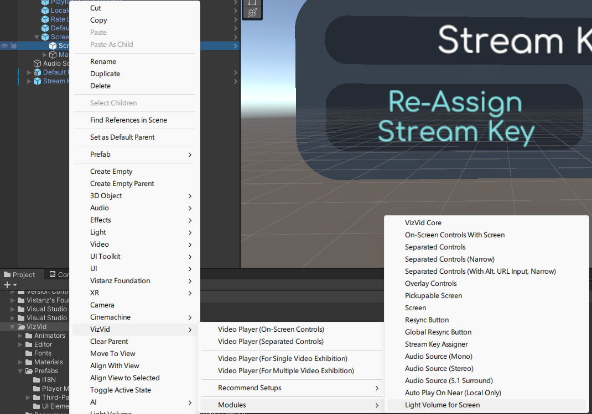  

> [!Note]
> 需注意，VRC Light Volume 需要使用支援的著色器，才可正常顯示效果。  

### 影音串流相關  
不少串流類型表演活動，為了達成低延遲，經常會使用外部 RTMP/RTSP 服務，將影音內容串流至 VRChat 中。  
VizVid 提供以下三種方式套用串流網址。  
以下以 [TopazChat](https://github.com/TopazChat/TopazChat) 舉例。  
#### Stream Key Assigner  
可自動為串流服務，生成、套用串流金鑰。
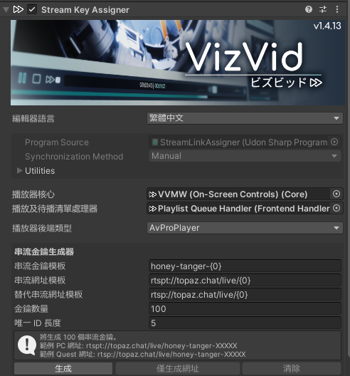
* **播放器核心**  
負責連接 `Core` 元件。  
若遺失，可點選 <kbd>自動搜尋</kbd>，串接至場景內的 `Core` 元件。  
* **播放器及播放清單處理器**  
負責連結 `Playlist Queue Handler` 元件。  
若遺失，可點選 <kbd>自動搜尋</kbd>，串接至場景內的 `Playlist Queue Handler` 元件。  
* **播放器後端類型**  
選擇指定的播放器後端。串流活動通常會使用 `AvProPlayer`。  
* **串流金鑰模板**  
串流金鑰格式。可依需求更改內容。  
* **串流網址模板**  
主要串流網址，預設使用 TopazChat 服務，可根據需求自由更動。  
* **替代串流網址模板**  
供行動平台用替代網址，預設使用 TopazChat 服務，請跟上方網址使用相同伺服器。  
> [!Note]
> `{0}` 為串流金鑰唯一 ID 套用處，請記得保留於模板中。
* **金鑰數量**  
欲產生的金鑰數量  
* **唯一 ID 長度**  
生成金鑰的字元數  

#### Saparated Controls (with Alt. URL Input, Narrow)  
可於 VRChat 端，手動輸入串流網址，及行動平台用之替代網址。  
示意圖如下：  
  

#### 播放清單編輯  
透過播放清單，使用固定 Stream Key 進行串流。  
設定示意圖如下：  
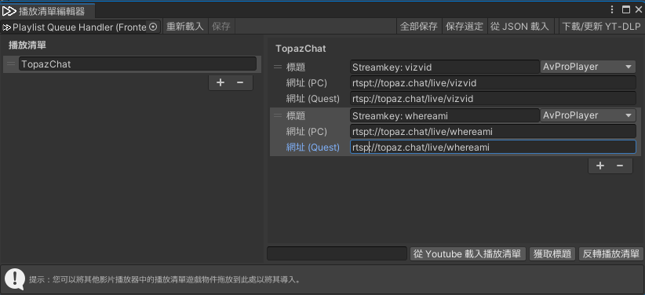  

### 聲音相關  
#### BGM Volume Control  
如果你的世界中，有 BGM、環境音等，可透過新增該元件，讓 VizVid 在播放媒體內容時，自動靜音這些 Audio Source。停止播放時則解除靜音。  
1. 選擇要自動靜音的 Audio Source。  
2. 於 Inspector 中，新增 `BGM Volume Control` 元件。  
3. 指定要使用的播放器核心。  
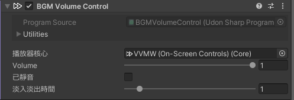  
4. 完成！  

#### 5.1 聲道配置  
VRChat 的 AVPro 後端，可以在 VRChat 提供 5.1 環繞音效的聲音輸出。  
常應用於電影院等場景。  
透過選單新增 `Audio Source (5.1 Surround)` 後，會自動對應至 VizVid。  
最後依需求調整 Audio Source 位置即可。  
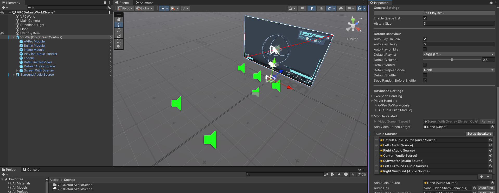  

### 反轉播放清單排序  
若使用者不習慣 VizVid 播放清單預設的倒序排列，可以透過以下方法更改：  
1. 從專案中以下路徑，找到 `Scroll View` Prefab  
`Packages > VizVid > Prefabs > UI Elements`  
2. 對 Prefab 點兩下進行編輯。  
3. 於右側 Inspector 中，找到 `Pooled Scroll View` 元件。  
4. 取消勾選 `Inverse Order`，並儲存該 Prefab。  
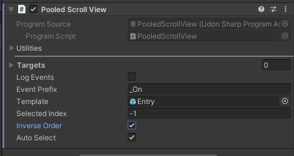  
5. 完成！  
> [!Note]
> 該操作為一次設定所有播放清單之排序，若要個別設定，請於 Hierarchy 相關 UI 物件中，找到該 Prefab 並進行更改。  

### 在地化  
VizVid 的語言管理元件，是位於 Locale 物件中的 Language Manager。  
可支援 VizVid 以外的 Text Mesh Pro UI。  
1. 於 Language Manager 中，參考 json 格式，新增自訂的 json 檔案，編輯 Language Key，並輸入對應的譯文。  
2. 將要翻譯的 Text Mesh Pro UI 物件，新增 `Language Reciver` 元件。  
3. 輸入對應的 Language Key  
4. 完成。  
> [!Tip]
> Language Manager 可獨立運作，若不需使用 VizVid，可移除相關物件 (包含 Core)。  
> 保留語言選單，語言切換功能也能正常運作。  

> [!Note]
> Language Manager 支援輸入多份 json 檔案，若擔心破壞 VizVid 內建的 json 清單，可另行製作 json 並導入至本元件。  
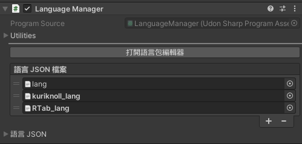  

### API Reference  
請參考[本頁面](../api/Global.html)，串接需要的功能至 VizVid。  

---
## Q&A  
(持續更新)  

---
**Q1**: LTCGI 照著說明設定了，但沒有收到訊號？  
**A1**: 你的螢幕 Shader 應該不是 VizVid 提供的，請[手動新增 LTCGI](https://ltcgi.dev/Getting%20Started/Setup/LTCGI_Screen) 螢幕。  

---
**Q2**: 我更改了 VizVid 的預設音量，但在 VRChat 中好像沒有反映出來？  
**A2**: 在 VizVid 的 Core 勾起`啟用設置存檔`，先前已加入過世界的用戶，會儲存上次離開前的音量設定。需要用戶自行重置該世界的數據。才會套用新的預設值。  
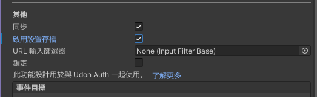  

---
**Q3**: 有些元件只顯示 `播放及待播清單`，找不到 `播放器核心` 選項。  
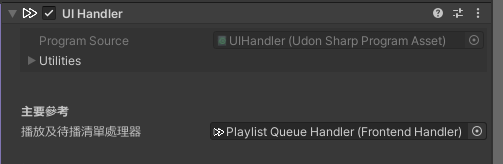  
**A3**: 在元件內刪除`播放及待播清單`元件，核心選項便會出現。  
由於 Unity 內建 Inspector 編輯器限制，若元件已先尋獲`播放及待播清單`，`播放器核心`則預設不會顯示。  

---
**Q4**: 播放時螢幕沒影像？聲音出不來？  
**A4**: 檢查 `Core` 元件，確認模組串接有沒有遺失。  
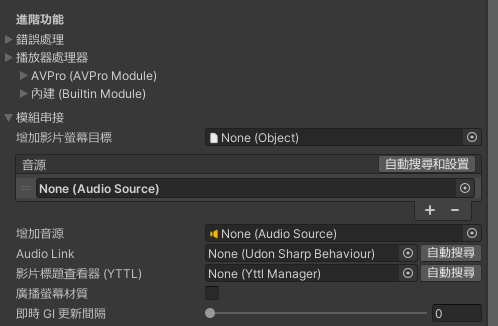  

---
> [!Note]
> 若有上述尚未記載的 Q&A，需要額外協助，  
> 歡迎造訪我們的 [Discord 伺服器](https://discord.gg/fkDueQMbj8)。  