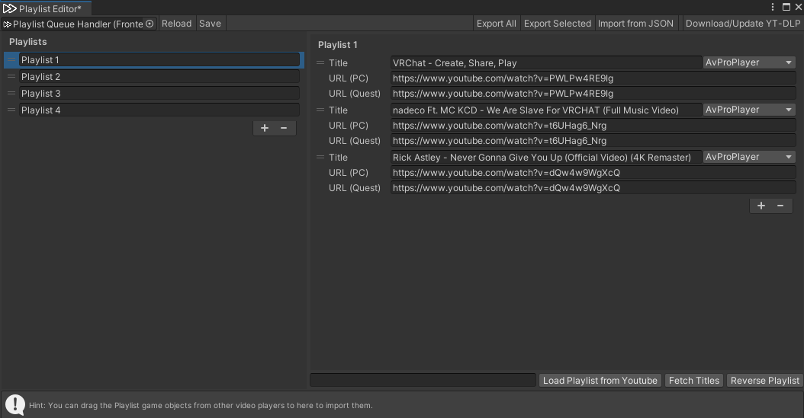

# VizVid Installation Guide  
Here's the quick guide for importing VizVid into your VRChat World.  

---
## Importing VizVid  

### Import via VCC (recommended)  
Click the link below or copy the URL, add VizVid's repository into VCC.  
[VCC import link](vcc://vpm/addRepo?url=https%3A%2F%2Fxtlcdn.github.io%2Fvpm%2Findex.json)  

### Import via UnityPackage  
Download the UnityPackage from Booth, and import it into your Unity project.  
[Booth link](https://booth.pm/ja/items/5056077)  

---
## How to Add VizVid into Your World  
1. Right-click on the hierarchy.  
2. Find VizVid in the menu.  
3. Choose the player preset you want to add.  
  

### Common Presets  
General-purpose presets for most uses.  
* **On-Screen Controls**  
The simplest version — controllers embedded on the screen. No extra spaces needed.  
* **Separated Controls**  
Controller and playlist panels can be placed independently if you didn't prefer touchscreen-like controlls.  

### Exhibition Presets  
Designed for exhibition use. VizVid runs in local mode. Includes a proximity-based autoplay feature.  
* **For Single Video Exhibition**  
Designed to play a single video with playlist module disabled.  
* **For Multiple Video Exhibition**  
Designed to play multiple videos and supports playlists.  

---
## Recommended Settings  
### Enable Playback Speed Control  
This feature depends on AVPro Stub.  
Follow the steps on the image below to install it.  
  

### Enable YTTL  
Support showing video titles for YouTube videos.  
Follow the steps on the image below to install it.  
  

### Migrate to Text Mesh Pro
Using Text Mesh Pro will make fonts on VizVid even clearer.。  
Select all VizVid prefabs in hierarchy.  
And follow the steps on the image below to migrate.  

---
## Basic Settings  
### Audio Settings  
* **Default Volume**  
The default volume level for players when they join the world.  
* **Default Muted**  
VizVid's volume are muted by default when players join the world.  

### Repeat & Shuffle Settings
* **Default Repeat Mode**  
Choose from: None, Repeat One, Repeat All.  
* **Default Shuffle**  
Shuffle is enable by default when players join the world.  

### General Settings
* **Edit Playlists...**  
Opens the playlist editor window. You can create, edit, and import playlists.  
For detailed usage, ckeck on [Editing Playlists](#editing-playlists).  

### Default Behavior  
* **Default Playlist**  
Choose a playlist to use as the default from your saved playlists.  
* **Auto Play on Join**  
Auto play the default playlist when the first player joined the world.  
* **Low-latency mode**  
Enable low latency on AVPro for less latency on stream playbacks.

### Theme Settings  
* **Collor Palette**  
Adjust color tones based on your current color settings.  
* **Color #**  
Set colors on VizVid individually.
* **Auto Apply on Build**
Toggle for auto apply current color settings into VizVid's UI.
* **Apply**
Apply color settings to VizVid's UI.  

### Display Settings  
* **Standby Screen**  
Set a static image if no video or image appears on screen.  

---
## Editing Playlists  
Here's the detailed guide for playlist editor.  
  

* **Left-side playlist column**  
    * Click <kbd>＋</kbd> or <kbd>ー</kbd> to add / remove playlists.  
    * You can store multiple playlists. Drag on the left <kbd>＝</kbd> icon to reorder playlists.  
* **Right-side playlist contents**  
    * Click <kbd>＋</kbd> or <kbd>ー</kbd> to add / remove contents.  
    * Titles can be set manually, or after entering a YouTube URL, use the <kbd>Fetch Titles</kbd> button below to auto-fill the title.  
    * Enter a PC URL, the Quest URL will be auto-filled.  
URL (PC) and URL (Quest) let you set different URLs for different platforms (useful for live streams).  
    * Choose a different backend depending on media type; `AVProPlayer` is set by default.  
    * Drag on the left <kbd>＝</kbd> icon to reorder contents.  
* **Top toolbar**  
    * <kbd>Reload</kbd>: Restore the last saved playlist.  
    * <kbd>Save</kbd>: Save the current playlist to the player.  
    * <kbd>Export All</kbd>: Export all playlists to a JSON file.  
    * <kbd>Export Selected</kbd>: Export the currently selected playlist to a JSON file.  
    * <kbd>Load from JSON</kbd>: Import an external JSON playlist.  
    * <kbd>Download/Update YT-DLP</kbd>: Install or update yt-dlp (for fetching video titles).  
* **Bottom toolbar**  
    * <kbd>Load Playlist from YouTube</kbd>: Paste a YouTube playlist URL into the left column to import it into the current playlist. Supports Public and Unlisted playlists (accessible via link); Private playlists are not supported.  
    * <kbd>Fetch Titles</kbd>: Read a YouTube link and automatically fill in the title.  
    * <kbd>Reverse Playlist</kbd>: Reverse the order of the playlist.  

---
Please refer [this documentation](index.md) for full guide of VizVid.