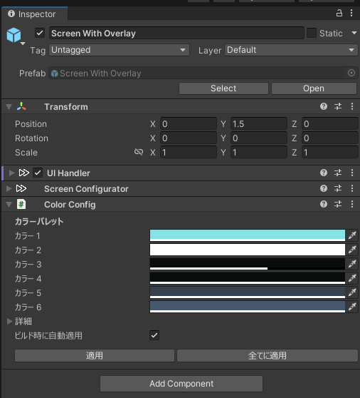

# VizVid 導入方法  
ここから、VizVid の導入について説明します。  

---
## VizVid の導入  
### VCC 経由 (推奨)  
下記のリンクをクリックするか、URL をコピーし、VCC に貼り付けると、VizVid が VCC にインポートされます。  
[VCC 用リンク](vcc://vpm/addRepo?url=https%3A%2F%2Fxtlcdn.github.io%2Fvpm%2Findex.json)

### UnityPackage 経由  
Booth にて、VizVid の UnityPackage をダウンロードし、開くと、VizVid が Unity にインポートされます。  
[Boothリンク](https://booth.pm/ja/items/5056077)

---
## VizVid の設置  
1. Unity ヒエラルキーを右クリック。  
2. VizVid の項目を展開。  
3. VizVid のプリセットから選ぶ。  

### よく使うプリセット  
汎用性の高い VizVid です。  
* **On-Screen Controls**  
最もシンプルなプリセット。コントローラーがスクリーンに内蔵されます。  
* **Separated Controls**  
他のビデオプレーヤーによく使う形式。コントローラーとスクリーンの配置が自由に調整することができます。  

### 展示会用プリセット  
展示会仕様になった VizVid です。ローカル動作で、接近すると自動再生します。  
* **For Single Video Exhibition**  
一本の動画を再生します。プレイリスト機能抜き。  
* **For Multiple Video Exhibition**  
複数の動画を再生します。プレイリスト機能付き。  

---
## おすすめ設定  
### 再生速度制御の有効化  
本機能は AVPro Stub に依存しています。  
下記の画像に参考し、設定を行ってください。  

### YTTL の有効化  
YouTube 動画を再生する場合、動画タイトルを表示させる機能です。  
下記の画像に参考し、設定を行ってください。  

### Text Mesh Pro への移行  
Text Mesh Pro に移行すると、よりきれいなテキストの表示ができます。  
VizVid 関連のプレハブを選択し、  
下記の画像に参考し、設定を行ってください。  

## 基本設定  
### よく使う設定  
* **プレイリストを編集...**  
プレイリスト編集ウィンドウが表示されます。プレイリストの作成、編集、インポートを行えます。  
詳しい情報は[プレイリストの編集](#プレイリストの編集)にご参照ください。  
* **キューリストを有効にする**  
有効にすると、入力したURLをキューリストに追加されます。  
* **履歴サイズ**  
再生した URL を記録する数を調整します。  
*※プレイリストからの再生は記録されません。*  

### デフォルト動作  
VizVid のデフォルト値を設定します。  
* **Join する時自動再生**  
プレイヤーが Join する時、デフォルトプレイリストを再生されます。  
* **自動再生遅延**  
もしワールド内に、VizVid 以外の動画プレイヤーがなかったら、`0` のままにしておいでください。  
* **アイドル時に自動再生**  
現在プレイリストの再生が終了後、デフォルトプレイリストを再生されます。  
* **デフォルトプレイリスト**  
作成済みのプレイリストから、デフォルトで再生するものを選択します。  
* **デフォルト音量**  
プレイヤーがワールドに Join 時の初期音量を設定します。  
* **デフォルトミュート**  
プレイヤーがワールドに Join 時、ミュートを設定します。  
* **デフォルトのリピートモード**  
なし、1 曲リピート、全曲リピートから選べます。  
* **デフォルトでランダム再生**  
プレーヤーの初期状態でランダム再生を有効にします。  
* **ランダム再生前シード再生成**  
プレイリストを再生するたびにシードが再生成し、ランダム性を高めます。  

---
## UI  
1. VizVid のスクリーン子オブジェクトを選択します。  
2. UI Handler と Screen Configurator を縮小表示にします。  
3. Color Config コンポーネントで VizVid の配色を自由に調整できます。  

---
## プレイリストの編集  
以下ではプレイリスト編集画面の各機能を説明します。  
  

* **左側のプレイリスト**  
    * <kbd>＋</kbd> または <kbd>ー</kbd> を押してプレイリストを追加 / 削除します。  
    * 複数のプレイリストを格納できます。左側の <kbd>＝</kbd> を押しながらドラッグして順序を変更できます。  
* **右側のリスト内容**  
    * <kbd>＋</kbd> または <kbd>ー</kbd> を押してメディアリンクを追加 / 削除します。  
    * タイトルは自由に設定できます。YouTube の URL を入力して、下の <kbd>タイトルを取得</kbd> 機能を使うと自動で入力されます。  
    * PC 用の URL を入力すると、Quest 用の URL が自動で埋められます。URL (PC)、URL (Quest) はプラットフォームごとに別の URL を設定できます（ライブ向けの機能）。  
    * タイトル右側に、バックエンドを選択できます。デフォルトは `AVProPlayer` です。URLコンテンツに応じて、調整してください。  
    * タイトル左側の <kbd>＝</kbd> を押しながらドラッグしてメディアの順序を変更できます。  
* **上部ツールバー**  
    * <kbd>リロード</kbd>：前回保存したプレイリストを読み込みます。  
    * <kbd>保存</kbd>：現在のプレイリストを VizVid に保存します。  
    * <kbd>全てエクスポート</kbd>：すべてのプレイリストを JSON ファイルにエクスポートします。  
    * <kbd>選択したものをエクスポート</kbd>：現在選択しているプレイリストを JSON ファイルにエクスポートします。  
    * <kbd>JSON からインポート</kbd>：外部の JSON プレイリストをインポートできます。  
    * <kbd>YT-DLP のダウンロード/更新</kbd>：yt-dlp（タイトル取得用ツール）をインストール、更新します。  
* **下部ツールバー**  
    * <kbd>YouTube からプレイリストを読み込む</kbd>：左側の欄に YouTube プレイリストの URL を入力すると、現在のプレイリストにインポートできます。公開リストおよび非公開リストのみ対応し、プライベートリストは対応しません。  
    * <kbd>タイトルを取得</kbd>：YouTube のリンクを読み取り、自動でタイトルを入力します。  
    * <kbd>プレイリストを反転</kbd>：プレイリストの順序を反転します。  

---
VizVid すべての機能説明について、こちらの[マニュアル](index_ja.md)にご参照ください。