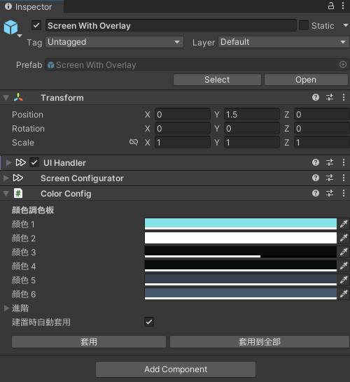

# VizVid 安裝方法  
以下會進行 VizVid 的基礎安裝說明。  

---
## 導入 VizVid  

### 透過 VCC 導入 (推薦)  
點選下方連結，或複製網址複製至 VCC，可將 VizVid 導入至 VCC。  
[VCC 導入連結](vcc://vpm/addRepo?url=https%3A%2F%2Fxtlcdn.github.io%2Fvpm%2Findex.json)  

### 透過 UnityPackage 導入  
至 Booth 頁面下載 Unity Package，開啟後即可導入。  
[Booth 連結](https://booth.pm/ja/items/5056077)  

---
## VizVid 安裝方式  
1. 在 Hierarchy 空白處點選滑鼠右鍵  
2. 找到 VizVid 的選單  
3. 選擇想新增的播放器類型  
  

### 常用預設組  
一般使用，用途最廣泛。  
* **On-Screen Controls**  
最簡單、易用的版本，螢幕就是你的控制器。
* **Separated Controls**  
傳統播放器常用的形式，控制器、播放清單等等，可分開擺放。  

### 展場用預設組  
通常為展場使用，播放器為 Local 運作，內建靠近即播放功能。  
* **For Single Video Exhibition**  
設計為播放單支影片。無播放清單功能。  
* **For Multiple Video Exhibition**  
設計為播放多支影片。有播放清單功能。  

---
## 推薦設定  
### 啟用播放速度控制  
本功能需要 AVPro Stub 才能啟用，依附圖說明操作即可安裝。  
  

### 啟用 YTTL  
在播放 YouTube 影片時，可以顯示影片標題。依附圖說明操作即可安裝。  
  

---
## 基本設定  
### 常用設定  
* **編輯播放清單...**  
點選後，會顯示播放清單的編輯視窗。可以製作、編輯、匯入播放清單。  
詳細使用說明請見[編輯播放清單](#編輯播放清單)  
* **啟用待播清單**  
啟用後，在輸入網址時，可以選擇將網址佇列至待播清單。  
* **歷史紀錄大小**  
設定播放網址歷史記錄數量，`0` 為停用。  
*請注意，來自播放清單的點播不會記錄至歷史記錄。*  

### 預設行為  
調整 VizVid 在該世界中的預設值。  
* **加入時自動播放**  
玩家加入世界時會開始播放預設播放清單  
* **自動播放延遲**  
若世界中沒有 VizVid 以外的播放器，不建議更動該數值。  
* **閒置時自動播放**  
若清單中影片播放完畢，則會播放預設播放清單。  
* **預設播放清單**  
可從製作好的播方清單中，選擇預設播放的內容。  
* **預設音量**  
玩家加入世界時的預設音量。  
* **預設靜音**  
玩家加入世界時，預設靜音。  
* **預設重複模式**  
可以選擇無、重複一次、重複全部。  
* **預設隨機播放**  
播放器預設啟用隨機播放。  
* **隨機播放前種子隨機**  
每次播放新的播放清單前，會重新打亂演算法，增加隨機度。  

---
## UI  
1. 選擇 VizVid 的螢幕子物件  
2. 縮小 UI Handler 與 Screen Configurator。  
3. 在 Color Config 元件，可以自由調整 VizVid 的配色。  

---
## 編輯播放清單  
以下說明播放清單編輯介面之各項功能。  
  

* **左側播放清單**  
    * 按 <kbd>＋</kbd> 或 <kbd>ー</kbd> 以新增 / 刪除播放清單。  
    * 可以放入不同清單，按住左側 <kbd>＝</kbd> 即可自由拖曳清單排列順序。  
* **右側清單內容**  
    * 按 <kbd>＋</kbd> 或 <kbd>ー</kbd> 以新增 / 刪除媒體連結。  
    * 標題可自由設定，或輸入 YouTube 網址後，使用下方 <kbd>獲取標題</kbd> 功能自動填入。  
    * 輸入 PC 網址，Quest 網址會自動填入。  
網址 (PC)、網址 (Quest) 可針對不同平台，設定不同網址。(直播向功能)  
    * 可根據不同媒體類型，選擇不同 Backend，預設值是 `AVProPlayer`  
    * 按住標題左側 <kbd>＝</kbd> 即可自由拖曳媒體排列順序。  
* **上方功能列**  
    * <kbd>重新載入</kbd>：恢復上次儲存的播放清單。  
    * <kbd>保存</kbd>：將目前的播放清單儲存至播放器。  
    * <kbd>全部保存</kbd>：將所有播放清單匯出至 json 檔。  
    * <kbd>保存選定</kbd>：將目前選擇之播放清單匯出至 json 檔。  
    * <kbd>從 JSON 載入</kbd>：可以導入外部 json 播放清單。  
    * <kbd>下載/更新 YT-DLP</kbd>：安裝、更新 yt-dlp (獲取標題用的工具)  
* **下方功能列**  
    * <kbd>從 Youtube 載入播放清單</kbd>：於左側欄位輸入 YouTube 播放清單網址，即可匯入至當前播放清單。  
僅支援公開 / 不公開清單 (可透過連結存取)，無法使用私人清單。  
    * <kbd>獲取標題</kbd>：讀取 YouTube 連結，自動填入標題。  
    * <kbd>反轉播放清單</kbd>：反轉播放清單排序。  
    
---
關於 VizVid 的完整功能說明，請參閱[說明文件](index_zh.html)。  